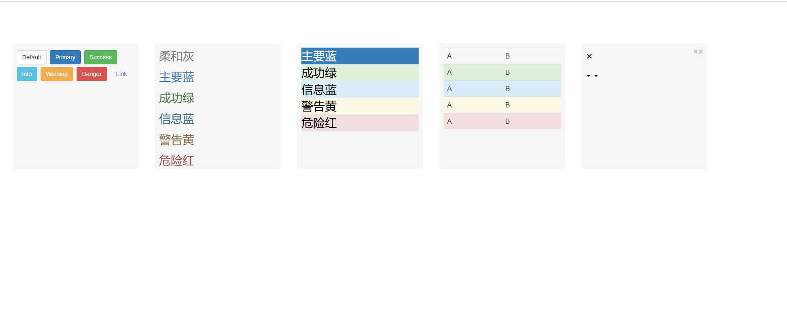

# [BootStrap 布局](https://v3.bootcss.com/css)
 ```html
  <head>
	  <link rel="stylesheet" 
		href="https://cdn.staticfile.org/twitter-bootstrap/3.3.7/css/bootstrap.min.css">
	  <script src="https://cdn.staticfile.org/jquery/2.1.1/jquery.min.js"></script>
	  <script src="https://cdn.staticfile.org/twitter-bootstrap/3.3.7/js/bootstrap.min.js"></script>
  </head>
	<style>
		.sizePosition
		{
			width:300px;
			height:300px;
			margin:100px 10px 0 30px;
			padding:10px;
			float:left;
			display:block;
			background-color:#f5f5f5;
			color:#000;
			font-size:28px
		}
		.caret-self{ /*向下箭头*/
			display: inline-block;
			width: 0; 
			height: 0;
			margin-left: 2px;
			vertical-align: middle;
			border-top: 4px solid;
			border-right: 4px solid transparent;
			border-left: 4px solid transparent;
		}
	</style>
	<body>
		<div class="sizePosition"><!-- 按钮色 -->
			<button type="button" class="btn btn-default">Default</button>
			<button type="button" class="btn btn-primary">Primary</button>
			<button type="button" class="btn btn-success">Success</button>
			<button type="button" class="btn btn-info">Info</button>
			<button type="button" class="btn btn-warning">Warning</button>
			<button type="button" class="btn btn-danger">Danger</button>
			<button type="button" class="btn btn-link">Link</button>
		</div>
		<div class="sizePosition"><!-- 字体色 -->
			<p class="text-muted">柔和灰</p>
			<p class="text-primary">主要蓝</p>
			<p class="text-success">成功绿</p>
			<p class="text-info">信息蓝</p>
			<p class="text-warning">警告黄</p>
			<p class="text-danger">危险红</p>
		</div>
		<div class="sizePosition"><!-- 背景色 -->
			<div class="bg-primary">主要蓝</div>
			<div class="bg-success">成功绿</div>
			<div class="bg-info">信息蓝</div>
			<div class="bg-warning">警告黄</div>
			<div class="bg-danger">危险红</div>
		</div>
		<div class="sizePosition"><!-- 表格行级元素样式 -->
			<table class="table table-hover"><!-- 鼠标悬停效果 -->
				<tr class="active">
					<td>A<td>
					<td>B<td>
				</tr>
				<tr class="success">
					<td>A<td>
					<td>B<td>
				</tr>
				<tr class="Info">
					<td>A<td>
					<td>B<td>
				</tr>
				<tr class="warning">
					<td>A<td>
					<td>B<td>
				</tr>
				<tr class="danger">
					<td>A<td>
					<td>B<td>
				</tr>
			</table>
		</div>
		<div class="sizePosition"><!-- 辅助图标 -->
			<button type="button" class="close">&times;</button>
			<a class="close">&times;</a>
			<p>&times;</p>
			<p class="caret"></p>
			<p class="caret-self"></p>
		</div>
	</body>
  ```
  ---
  
