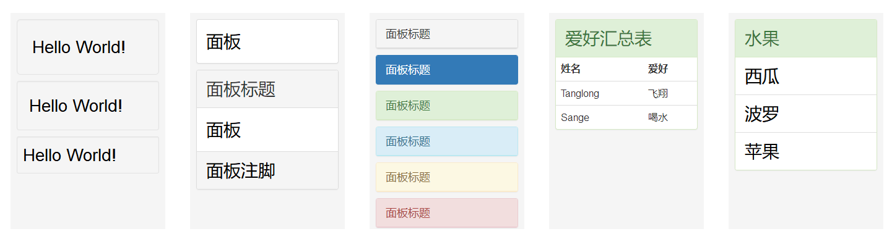

# [BootStrap组件](https://v3.bootcss.com/components)
+ 图标
```html
	<head>
	<link 
	  rel="stylesheet" 
	      href="https://cdn.staticfile.org/twitter-bootstrap/3.3.7/css/bootstrap.min.css">
	  <script 
             src="https://cdn.staticfile.org/jquery/2.1.1/jquery.min.js"></script>
	  <script 
	     src="https://cdn.staticfile.org/twitter-bootstrap/3.3.7/js/bootstrap.min.js"></script>
	</head>
	<style>
		.sizePosition
		{
			width:325px;
			height:330px;
			margin:100px 10px 0 30px;
			padding:10px;
			float:left;
			display:block;
			background-color:#f5f5f5;
			color:#000;
			font-size:28px
		}
	</style>
	<body>
		<div class="sizePosition"><!-- 小图标 -->
			<!-- <i class="glyphicon glyphicon-align-left"></i> -->
        	<span class="glyphicon glyphicon-align-left"></span>
        	<i class="glyphicon glyphicon-align-right"></i>
        	<i class="glyphicon glyphicon-align-center"></i>
        	<i class="glyphicon glyphicon-align-justify"></i>
        	<i class="glyphicon glyphicon-adjust"></i>
        	<i class="glyphicon glyphicon-arrow-up"></i>
        	<i class="glyphicon glyphicon-arrow-down"></i>
        	<i class="glyphicon glyphicon-arrow-left"></i>
			<i class="glyphicon glyphicon-arrow-right"></i>
        	<i class="glyphicon glyphicon-bell"></i>
        	<i class="glyphicon glyphicon-bookmark"></i>
        	<i class="glyphicon glyphicon-briefcase"></i>
        	<i class="glyphicon glyphicon-camera"></i>
        	<i class="glyphicon glyphicon-chevron-left"></i>
        	<i class="glyphicon glyphicon-chevron-up"></i>
        	<i class="glyphicon glyphicon-chevron-down"></i>
        	<i class="glyphicon glyphicon-chevron-right"></i>
        	<i class="glyphicon glyphicon-certificate"></i>
        	<i class="glyphicon glyphicon-circle-arrow-right"></i>
        	<i class="glyphicon glyphicon-circle-arrow-left"></i>
        	<i class="glyphicon glyphicon-circle-arrow-up"></i>
			<i class="glyphicon glyphicon-circle-arrow-down"></i>
        	<i class="glyphicon glyphicon-collapse-up"></i>
        	<i class="glyphicon glyphicon-download-alt"></i>
        	<i class="glyphicon glyphicon-envelope"></i>
        	<i class="glyphicon glyphicon-export"></i>
        	<i class="glyphicon glyphicon-fast-backward"></i>
        	<i class="glyphicon glyphicon-fast-forward"></i>
        	<i class="glyphicon glyphicon-floppy-save"></i>
        	<i class="glyphicon glyphicon-floppy-saved"></i>
        	<i class="glyphicon glyphicon-floppy-disk"></i>
        	<i class="glyphicon glyphicon-floppy-open"></i>
        	<i class="glyphicon glyphicon-floppy-remove"></i>
        	<i class="glyphicon glyphicon-home"></i>
        	<i class="glyphicon glyphicon-indent-right"></i>
        	<i class="glyphicon glyphicon-link"></i>
        	<i class="glyphicon glyphicon-log-in"></i>
        	<i class="glyphicon glyphicon-minus"></i>
        	<i class="glyphicon glyphicon-new-window"></i>
        	<i class="glyphicon glyphicon-ok-sign"></i>
        	<i class="glyphicon glyphicon-pencil"></i>
        	<i class="glyphicon glyphicon-plane"></i>
        	<i class="glyphicon glyphicon-plus-sign"></i>
        	<i class="glyphicon glyphicon-question-sign"></i>
        	<i class="glyphicon glyphicon-registration-mark"></i>
        	<i class="glyphicon glyphicon-repeat"></i>
        	<i class="glyphicon glyphicon-resize-vertical"></i>
        	<i class="glyphicon glyphicon-resize-horizontal"></i>
        	<i class="glyphicon glyphicon-send"></i>
        	<i class="glyphicon glyphicon-signal"></i>
        	<i class="glyphicon glyphicon-sort-by-attributeds"></i>
        	<i class="glyphicon glyphicon-sort"></i>
			<i class="glyphicon glyphicon-sort-by-attributeds-alt"></i>
        	<i class="glyphicon glyphicon-sound-stereo"></i>
        	<i class="glyphicon glyphicon-step-backward"></i>
        	<i class="glyphicon glyphicon-step-forward"></i>
        	<i class="glyphicon glyphicon-text-width"></i>
        	<i class="glyphicon glyphicon-text-height"></i>
        	<i class="glyphicon glyphicon-tower"></i>
        	<i class="glyphicon glyphicon-three-deciduous"></i>
        	<i class="glyphicon glyphicon-user"></i>
        	<i class="glyphicon glyphicon-warning-sign"></i>
        	<i class="glyphicon glyphicon-wrench"></i>
        	<i class="glyphicon glyphicon-tag"></i>
        	<i class="glyphicon glyphicon-tags"></i>
        	<i class="glyphicon glyphicon-paperclip"></i>
        	<i class="glyphicon glyphicon-paperclip"></i>
		</div>
		<div class="sizePosition">
			<i class="glyphicon glyphicon-unchecked"></i>
			<i class="glyphicon glyphicon-transfer"></i>
			<i class="glyphicon glyphicon-thumbs-down"></i>
			<i class="glyphicon glyphicon-thumbs-up"></i>
			<i class="glyphicon glyphicon-star"></i>
			<i class="glyphicon glyphicon-star-empty"></i>
			<i class="glyphicon glyphicon-sound-5-1"></i>
        	<i class="glyphicon glyphicon-sound-6-1"></i>
        	<i class="glyphicon glyphicon-sound-7-1"></i>
			<i class="glyphicon glyphicon-screenshot"></i>
			<i class="glyphicon glyphicon-retweet"></i>
			<i class="glyphicon glyphicon-resize-full"></i>
			<i class="glyphicon glyphicon-remove"></i>
			<i class="glyphicon glyphicon-random"></i>
			<i class="glyphicon glyphicon-print"></i>
			<i class="glyphicon glyphicon-play"></i>
			<i class="glyphicon glyphicon-phone"></i>
			<i class="glyphicon glyphicon-open"></i>
			<i class="glyphicon glyphicon-off"></i>
			<i class="glyphicon glyphicon-minus-sign"></i>
			<i class="glyphicon glyphicon-import"></i>
			<i class="glyphicon glyphicon-headphones"></i>
			<i class="glyphicon glyphicon-hand-up"></i>
			<i class="glyphicon glyphicon-hand-left"></i>
			<i class="glyphicon glyphicon-hand-right"></i>
        	<i class="glyphicon glyphicon-hand-down"></i>
			<i class="glyphicon glyphicon-folder-close"></i>
			<i class="glyphicon glyphicon-folder-open"></i>
			<i class="glyphicon glyphicon-forward"></i>
			<i class="glyphicon glyphicon-filter"></i>
			<i class="glyphicon glyphicon-eye-close"></i>
			<i class="glyphicon glyphicon-eye-open"></i>
			<i class="glyphicon glyphicon-earphone"></i>
			<i class="glyphicon glyphicon-cutlery"></i>
			<i class="glyphicon glyphicon-comment"></i>
			<i class="glyphicon glyphicon-credit-card"></i>
			<i class="glyphicon glyphicon-barcode"></i>
        	<i class="glyphicon glyphicon-asterisk"></i>
			<i class="glyphicon glyphicon-backward"></i>
			<i class="glyphicon glyphicon-bold"></i>
			<i class="glyphicon glyphicon-bullhom"></i>
			<i class="glyphicon glyphicon-check"></i>
			<i class="glyphicon glyphicon-cloud-download"></i>
        	<i class="glyphicon glyphicon-cloud-upload"></i>
			<i class="glyphicon glyphicon-cog"></i>
			<i class="glyphicon glyphicon-compressed"></i>
			<i class="glyphicon glyphicon-dashboard"></i>
			<i class="glyphicon glyphicon-edit"></i>
			<i class="glyphicon glyphicon-exclamation-sign"></i>
		    <i class="glyphicon glyphicon-euro"></i>
			<i class="glyphicon glyphicon-file"></i>
			<i class="glyphicon glyphicon-flag"></i>
		    <i class="glyphicon glyphicon-glass"></i>
			<i class="glyphicon glyphicon-fire"></i>
			<i class="glyphicon glyphicon-gbp"></i>
			<i class="glyphicon glyphicon-globe"></i>
			<i class="glyphicon glyphicon-fullscreen"></i>
			<i class="glyphicon glyphicon-hd-video"></i>
			<i class="glyphicon glyphicon-heart"></i>
			<i class="glyphicon glyphicon-heart-empty"></i>
			<i class="glyphicon glyphicon-italic"></i>
			<i class="glyphicon glyphicon-list-alt"></i>
			<i class="glyphicon glyphicon-magnet"></i>
			<i class="glyphicon glyphicon-move"></i>
			<i class="glyphicon glyphicon-ok"></i>
		</div>
		<div class="sizePosition">
			<i class="glyphicon glyphicon-phone-alt"></i>
			<i class="glyphicon glyphicon-play-circle"></i>
			<i class="glyphicon glyphicon-pushpin"></i>
			<i class="glyphicon glyphicon-record"></i>
			<i class="glyphicon glyphicon-remove-circle"></i>
		    <i class="glyphicon glyphicon-saved"></i>
			<i class="glyphicon glyphicon-road"></i>
			<i class="glyphicon glyphicon-sd-video"></i>
			<i class="glyphicon glyphicon-share-alt"></i>
			<i class="glyphicon glyphicon-sort-by-alphabet"></i>
			<i class="glyphicon glyphicon-sort-by-order"></i>
			<i class="glyphicon glyphicon-share"></i>
			<i class="glyphicon glyphicon-stop"></i>
			<i class="glyphicon glyphicon-tasks"></i>
			<i class="glyphicon glyphicon-th-large"></i>
			<i class="glyphicon glyphicon-time"></i>
			<i class="glyphicon glyphicon-trash"></i>
			<i class="glyphicon glyphicon-upload"></i>
			<i class="glyphicon glyphicon-volume-down"></i>
			<i class="glyphicon glyphicon-volume-off"></i>
			<i class="glyphicon glyphicon-volume-up"></i>
			<i class="glyphicon glyphicon-volume-"></i>
			<i class="glyphicon glyphicon-zoom-in"></i>
			<i class="glyphicon glyphicon-zoom-out"></i>
			<i class="glyphicon glyphicon-usd"></i>
			<i class="glyphicon glyphicon-tree-conifer"></i>
			<i class="glyphicon glyphicon-tint"></i>
			<i class="glyphicon glyphicon-th-list"></i>
            <i class="glyphicon glyphicon-th"></i>
			<i class="glyphicon glyphicon-subtitles"></i>
			<i class="glyphicon glyphicon-stats"></i>
			<i class="glyphicon glyphicon-sound-dolby"></i>
			<i class="glyphicon glyphicon-sort-by-order-alt"></i>
			<i class="glyphicon glyphicon-sort-by-alphabet-alt"></i>
			<i class="glyphicon glyphicon-shopping-cart"></i>
			<i class="glyphicon glyphicon-search"></i>
			<i class="glyphicon glyphicon-save"></i>
			<i class="glyphicon glyphicon-resize-small"></i>
			<i class="glyphicon glyphicon-remove-sign"></i>
			<i class="glyphicon glyphicon-refresh"></i>
			<i class="glyphicon glyphicon-qrcode"></i>
			<i class="glyphicon glyphicon-plus"></i>
			<i class="glyphicon glyphicon-pause"></i>
			<i class="glyphicon glyphicon-picture"></i>
			<i class="glyphicon glyphicon-ok-circle"></i>
			<i class="glyphicon glyphicon-music"></i>
			<i class="glyphicon glyphicon-map-marker"></i>
			<i class="glyphicon glyphicon-lock"></i>
			<i class="glyphicon glyphicon-leaf"></i>
			<i class="glyphicon glyphicon-indent-left"></i>
			<i class="glyphicon glyphicon-inbox"></i>
			<i class="glyphicon glyphicon-hdd"></i>
			<i class="glyphicon glyphicon-gift"></i>
			<i class="glyphicon glyphicon-font"></i>
			<i class="glyphicon glyphicon-header"></i>
			<i class="glyphicon glyphicon-flash"></i>
			<i class="glyphicon glyphicon-film"></i>
			<i class="glyphicon glyphicon-facetime-video"></i>
			<i class="glyphicon glyphicon-expand"></i>
			<i class="glyphicon glyphicon-eject"></i>
			<i class="glyphicon glyphicon-download"></i>
			<i class="glyphicon glyphicon-copyright-mark"></i>
			<i class="glyphicon glyphicon-collapse-down"></i>
			<i class="glyphicon glyphicon-cloud"></i>
			<i class="glyphicon glyphicon-calendar"></i>
		</div>
		<div class="sizePosition">
			<i class="glyphicon glyphicon-book"></i>
			<i class="glyphicon glyphicon-ban-circle"></i>
		</div>
	</body>
```
---

+ awesome图标
```html
	<head>
	  <link rel="stylesheet" 
	  href="https://use.fontawesome.com/releases/v5.6.1/css/all.css" 
	  integrity="sha384-gfdkjb5BdAXd+lj+gudLWI+BXq4IuLW5IT+brZEZsLFm++aCMlF1V92rMkPaX4PP" 
	  crossorigin="anonymous">
	</head>
	<style>
		.sizePosition
		{
			width:96%;
			height:250px;
			margin:10px 10px 10px 10px;
			padding:10px;
			float:left;
			display:block;
			background-color:#f5f5f5;
			color:#000;
			font-size:28px
		}
		.sizePosition>p{font-size:15px;position:relative;left:0;top:0;margin-bottom:0;}
	</style>
	<body><!-- font-awesome图标 -->
		<div class="sizePosition" style="height:160px;"><!-- 图标类型-->
			<p>图标类型</p>
			<i class="fab fa-android" style="font-size:4em;"></i>
			<i class="fab fa-apple" style="font-size:4em;"></i>
			<i class="fab fa-alipay" style="font-size:4em;"></i>
			<i class="fab fa-amazon" style="font-size:4em;"></i>
			<i class="fas fa-apple-alt" style="font-size:4em;"></i>
			<i class="fas fa-angry" style="font-size:4em;"></i>
			<i class="fas fa-acorn" style="font-size:4em;"></i>
			<i class="fas fa-bell" style="font-size:4em;"></i>
			<i class="fas fa-bomb" style="font-size:4em;"></i>
			<i class="fas fa-brain" style="font-size:4em;"></i>
			<i class="fas fa-cat" style="font-size:4em;"></i>
			<i class="fas fa-dog" style="font-size:4em;"></i>
			<i class="fas fa-comment" style="font-size:4em;"></i>
			<i class="fas fa-comments" style="font-size:4em;"></i>
			<i class="fas fa-comment-dots" style="font-size:4em;"></i>
			<a href="https://fontawesome.com/icons?d=gallery">更多图标</a>
		</div>
		<div class="sizePosition" style="height:300px;"><!-- 大小设置 -->
			<p>大小设置</p>
			<i class="fab fa-android" style="font-size:.1em;"></i>
			<i class="fab fa-android" style="font-size:.5em;"></i>
			<i class="fab fa-android" style="font-size:1em;"></i>
			<i class="fab fa-android" style="font-size:2em;"></i>
			<i class="fab fa-android" style="font-size:3em;"></i>
			<i class="fab fa-android" style="font-size:4em;"></i>
			<i class="fab fa-android" style="font-size:5em;"></i>
			<i class="fab fa-android" style="font-size:6em;"></i>
			<i class="fab fa-android" style="font-size:7em;"></i>
			<i class="fab fa-android" style="font-size:8em;"></i>
			<i class="fab fa-android" style="font-size:9em;"></i>
			<i class="fab fa-android" style="font-size:10em;"></i>
		</div>
		<div class="sizePosition"><!-- 颜色设置 -->
			<p>颜色设置</p>
			<i class="fab fa-android" style="font-size:4em;color:#f00;"></i>
			<i class="fab fa-android" style="font-size:4em;color:#0f0;"></i>
			<i class="fab fa-android" style="font-size:4em;color:#00f;"></i>
			<i class="fab fa-android" style="font-size:4em;color:#ff0;"></i>
			<i class="fab fa-android" style="font-size:4em;color:#f0f;"></i>
			<i class="fab fa-android" style="font-size:4em;color:#0ff;"></i>
			<i class="fab fa-android" style="font-size:4em;color:#000;"></i>
			<i class="fab fa-android" style="font-size:4em;color:#fff;"></i>
			<i class="fab fa-android" style="font-size:4em;color:#49b8c7;"></i>
			<i class="fab fa-android" style="font-size:4em;color:#e74724;"></i>
			<i class="fab fa-android" style="font-size:4em;color:#ffbf34;"></i>
			<i class="fab fa-android" style="font-size:4em;color:#ff9800;"></i>
			<i class="fab fa-android" style="font-size:4em;color:#4c9424;"></i>
			<i class="fab fa-android" style="font-size:4em;color:#0e88eb;"></i>
			<i class="fab fa-android" style="font-size:4em;color:#1cd248;"></i>
			<i class="fab fa-android" style="font-size:4em;color:#201f1f;"></i>
			<i class="fab fa-android" style="font-size:4em;color:#21fcc4;"></i>
			<i class="fab fa-android" style="font-size:4em;color:#d94fbf;"></i>
			<i class="fab fa-android" style="font-size:4em;color:#204424;"></i>
			<i class="fab fa-android" style="font-size:4em;color:#aaa;"></i>
			<i class="fab fa-android" style="font-size:4em;color:#660e7a;"></i>
		</div>
	</body>
```
---

+ 图标与其它CSS结合
```html
	<head>
	  <link rel="stylesheet" 
	  href="https://use.fontawesome.com/releases/v5.6.1/css/all.css" 
	  integrity="sha384-gfdkjb5BdAXd+lj+gudLWI+BXq4IuLW5IT+brZEZsLFm++aCMlF1V92rMkPaX4PP" 
	  crossorigin="anonymous">
	</head>
	<style>
		.sizePosition
		{
			width:96%;
			height:250px;
			margin:10px 10px 10px 10px;
			padding:10px;
			float:left;
			display:block;
			background-color:#f5f5f5;
			color:#000;
			font-size:28px
		}
		.sizePosition>p{font-size:15px;position:relative;left:0;top:0;margin-bottom:0;}
		.fa-spinner{animation: loading 1.5s infinite linear;}
		@keyframes loading
		{
			0%   {transform:rotate(0deg);}
			100% {transform:rotate(360deg);}
		}
	</style>
	<body lang="zh-cn"><!-- font-awesome图标 -->
		<div class="sizePosition" style="height:160px;">
			<p>css样式</p>
			<!-- 背景色 -->
			<i class="fab fa-android" style="font-size:4em;background-color:#ff0;"></i>
			<!--顺时针旋转30度  -->
			<i class="fab fa-android" style="font-size:4em;transform:rotate(30deg);"></i>
			<i class="fab fa-twitter" style="font-size:4em;"></i>
			<i class="fas fa-spinner" style="font-size:4em;"></i><!-- 动画实现loading -->
		</div>
	</body>
```
---

+ [cikonss](http://www.bootcss.com/p/cikonss/)
```html
  <head><link rel="stylesheet" href="cikonss.css"/></head>
	<style>
		.sizePosition
		{
			width:90%;
			height:250px;
			margin:10px 10px 10px 10px;
			padding:10px;
			float:left;
			display:block;
			background-color:#f5f5f5;
			color:#000;
			font-size:28px
		}
		.sizePosition>span{margin:10px 10px 10px 10px;}
	</style>
	<body>
		<div class="sizePosition">
			<span class="icon icon-mid"><span class="icon-home"></span></span>
			<span class="icon icon-mid"><span class="icon-mail"></span></span>
			<span class="icon icon-mid"><span class="icon-plus"></span></span>
			<span class="icon icon-mid"><span class="icon-minus"></span></span>
			<span class="icon icon-mid"><span class="icon-file"></span></span>
			<span class="icon icon-mid"><span class="icon-folder"></span></span>
			<span class="icon icon-mid"><span class="icon-tag"></span></span>
			<span class="icon icon-mid"><span class="icon-desktop"></span></span>
			<span class="icon icon-mid"><span class="icon-tablet"></span></span>
			<span class="icon icon-mid"><span class="icon-phone"></span></span>
			<span class="icon icon-mid"><span class="icon-menu"></span></span>
			<span class="icon icon-mid"><span class="icon-calendar"></span></span>
			<span class="icon icon-mid"><span class="icon-comment"></span></span>
			<span class="icon icon-mid"><span class="icon-comment-text"></span></span>
			<span class="icon icon-mid"><span class="icon-arrowUp"></span></span>
			<span class="icon icon-mid"><span class="icon-arrowDown"></span></span>
			<span class="icon icon-mid"><span class="icon-arrowLeft"></span></span>
			<span class="icon icon-mid"><span class="icon-arrowRight"></span></span>
			<span class="icon icon-mid"><span class="icon-download"></span></span>
			<span class="icon icon-mid"><span class="icon-upload"></span></span>
			<span class="icon icon-mid"><span class="icon-tpl-full"></span></span>
			<span class="icon icon-mid"><span class="icon-tpl-side-r"></span></span>
			<span class="icon icon-mid"><span class="icon-tpl-side-l"></span></span>
			<span class="icon icon-mid"><span class="icon-list-view"></span></span>
			<span class="icon icon-mid"><span class="icon-grid-view"></span></span>
			<span class="icon icon-mid"><span class="icon-camera"></span></span>
			<span class="icon icon-mid"><span class="icon-image"></span></span>
			<span class="icon icon-mid"><span class="icon-play"></span></span>
			<span class="icon icon-mid"><span class="icon-stop"></span></span>
			<span class="icon icon-mid"><span class="icon-pause"></span></span>
			<span class="icon icon-mid"><span class="icon-forward"></span></span>
			<span class="icon icon-mid"><span class="icon-rewind"></span></span>
			<span class="icon icon-mid"><span class="icon-next"></span></span>
			<span class="icon icon-mid"><span class="icon-prev"></span></span>
			<span class="icon icon-mid"><span class="icon-stats"></span></span>
			<span class="icon icon-mid"><span class="icon-battery-empty"></span></span>
			<span class="icon icon-mid"><span class="icon-battery-1_4"></span></span>
			<span class="icon icon-mid"><span class="icon-battery-half"></span></span>
			<span class="icon icon-mid"><span class="icon-battery-3_4"></span></span>
			<span class="icon icon-mid"><span class="icon-battery-full"></span></span>
			<span class="icon icon-mid"><span class="icon-sound-mute"></span></span>
			<span class="icon icon-mid"><span class="icon-sound-normal"></span></span>
			<span class="icon icon-mid"><span class="icon-sound-loud"></span></span>
		</div>
	</body>
```
---

+ 下拉菜单
```html
<head>
  <link 
rel="stylesheet" href="https://cdn.staticfile.org/twitter-bootstrap/3.3.7/css/bootstrap.min.css">
  <script src="https://cdn.staticfile.org/jquery/2.1.1/jquery.min.js"></script>
  <script src="https://cdn.staticfile.org/twitter-bootstrap/3.3.7/js/bootstrap.min.js"></script>
</head>
<style>
	.sizePosition
	{
		width:325px;
		height:330px;
		margin:115px 10px 0 30px;
		padding:10px;
		float:left;
		display:block;
		background-color:#f5f5f5;
		color:#000;
		font-size:28px
	}
	.sizePosition>div{float:left;}
	.sizePosition>div + div{margin-left:10px;}
</style>
<body>
	<div class="sizePosition"><!-- 向下弹出 -->
		<div class="dropdown">
		  <button class="btn btn-default dropdown-toggle" type="button" id="dropdownMenu1" 
			  data-toggle="dropdown" aria-haspopup="true" aria-expanded="true">
			  水果<span class="caret"></span></button>
		  <ul class="dropdown-menu" aria-labelledby="dropdownMenu1">
		  	<li><a href="#">苹果</a></li>
		    <li><a href="#">香蕉</a></li>
		    <li role="separator" class="divider"></li><!-- 分割线 -->
		    <li><a href="#">番茄</a></li>
		  </ul>
		</div>

		<div class="dropup"><!-- 向上弹出 -->
		  <button class="btn btn-default dropdown-toggle" type="button" id="dropdownMenu1" 
			  data-toggle="dropdown" aria-haspopup="true" aria-expanded="true">
			  水果<span class="caret"></span></button>
		  <ul class="dropdown-menu" aria-labelledby="dropdownMenu1">
		  	<li><a href="#">苹果</a></li>
		    <li><a href="#">香蕉</a></li>
		    <li role="separator" class="divider"></li>
		    <li><a href="#">番茄</a></li>
		  </ul>
		</div>

		<div class="dropdown">
		  <button class="btn btn-default dropdown-toggle" type="button" id="dropdownMenu1" 
			  data-toggle="dropdown" aria-haspopup="true" aria-expanded="true">
			  水果<span class="caret"></span></button>
		  <!-- 菜单项右边界与父元素右边界对齐(默认左对齐) -->
		  <ul class="dropdown-menu dropdown-menu-right" aria-labelledby="dropdownMenu1">
		  	<li><a href="#">苹果</a></li>
		    <li class="disabled"><a href="#">香蕉</a></li><!-- 禁用 -->
		    <li role="separator" class="divider"></li>
		    <li><a href="#">番茄</a></li>
		  </ul>
		</div>
	</div>
</body>
```
---

+ 按钮组
```html
	<head>
  <link 
rel="stylesheet" href="https://cdn.staticfile.org/twitter-bootstrap/3.3.7/css/bootstrap.min.css">
  <script src="https://cdn.staticfile.org/jquery/2.1.1/jquery.min.js"></script>
  <script src="https://cdn.staticfile.org/twitter-bootstrap/3.3.7/js/bootstrap.min.js"></script>
</head>
<style>
	.sizePosition
	{
		width:500px;
		height:330px;
		margin:115px 10px 0 30px;
		padding:10px;
		float:left;
		display:block;
		background-color:#f5f5f5;
		color:#000;
		font-size:28px
	}
	.sizePosition>div + div{margin-top:10px;}
</style>
<body>
	<div class="sizePosition">
		<div class="btn-group" role="group"><!-- 按钮组 -->
			<button type="button" class="btn btn-default">很好</button>
		  	<button type="button" class="btn btn-default">一般</button>
		  	<button type="button" class="btn btn-default">不好</button>
		</div>

		<div class="btn-toolbar" role="toolbar"><!-- 与toolbar结合 -->
			<div class="btn-group btn-group-lg" role="group">
				<button type="button" class="btn btn-default">很好</button>
			  	<button type="button" class="btn btn-default">一般</button>
			  	<button type="button" class="btn btn-default">不好</button>
			</div>

		 	<div class="btn-group" role="group">
				<button type="button" class="btn btn-default">很好</button>
			  	<button type="button" class="btn btn-default">一般</button>
			</div>

			<div class="btn-group btn-group-sm" role="group">
				<button type="button" class="btn btn-default">很好</button>
			</div>

			<div class="btn-group btn-group-xs" role="group">
				<button type="button" class="btn btn-default">很好</button>
			</div>
		</div>

		<div class="btn-group" role="group"><!-- 与dropdown结合 -->
			<button type="button" class="btn btn-default">很好</button>
		  	<div class="btn-group" role="group">
				<button class="btn btn-default dropdown-toggle" type="button" 
				id="dropdownMenu1" data-toggle="dropdown" aria-haspopup="true" 
				aria-expanded="true">其它<span class="caret"></span></button>
			  	<ul class="dropdown-menu" aria-labelledby="dropdownMenu1">
			  		<li><a href="#">一般</a></li>
			    	<li><a href="#">不好</a></li>
			  	</ul>
			</div>
		</div>

		<div class="btn-group-vertical" role="group"><!-- 垂直按钮 -->
			<button type="button" class="btn btn-default">很好</button>
		  	<button type="button" class="btn btn-default">一般</button>
		  	<button type="button" class="btn btn-default">不好</button>
		</div>

		<div class="btn-group" role="group"><!-- 按钮颜色 -->
			<button type="button" class="btn">原色</button>
			<button type="button" class="btn btn-default">默认</button>
		  	<button type="button" class="btn btn-primary">一般</button>
		  	<button type="button" class="btn btn-info">信息</button>
		  	<button type="button" class="btn btn-warning">警告</button>
		  	<button type="button" class="btn btn-danger">危险</button>
		  	<button type="button" class="btn btn-success">成功</button>
		</div>

		<div class="btn-group" role="group"><!-- 分裂式按钮下拉菜单 -->
			<button type="button" class="btn btn-success">颜色</button>
			<button type="button" class="btn btn-success dropdown-toggle" 
				id="dropdownMenu1" data-toggle="dropdown" aria-haspopup="true" 
				aria-expanded="false">
			<span style="visibility:hidden;">&nbsp;</span><span class="caret"</span>
			</button>
		  	<ul class="dropdown-menu" aria-labelledby="dropdownMenu1">
		  		<li><a href="#">红色</a></li>
		    	<li><a href="#">绿色</a></li>
		    	<li><a href="#">蓝色</a></li>
		  	</ul>
		</div>
	</div>
</body>
```
---

+ 输入框组
```html
	<head>
	<link 
rel="stylesheet" href="https://cdn.staticfile.org/twitter-bootstrap/3.3.7/css/bootstrap.min.css">
<script src="https://cdn.staticfile.org/jquery/2.1.1/jquery.min.js"></script>
<script src="https://cdn.staticfile.org/twitter-bootstrap/3.3.7/js/bootstrap.min.js"></script>
	</head>
	<style>
		.sizePosition
		{
			width:500px;
			height:330px;
			margin:115px 10px 0 30px;
			padding:10px;
			float:left;
			display:block;
			background-color:#f5f5f5;
			color:#000;
			font-size:28px
		}
		.sizePosition>div + div{margin-top:10px;}
	</style>
	<body>
		<div class="sizePosition"><!-- 输入组 -->
			<div class="input-group">
				<span class="input-group-addon">姓名</span>
				<input type="text" class="form-control">
			</div>

			<div class="input-group">
				<span class="input-group-addon">邮箱</span>
				<input type="text" class="form-control">
				<span class="input-group-addon">@</span>
				<input type="text" class="form-control">
				<span class="input-group-addon">.com</span>
			</div>

			<div class="input-group input-group-lg"><!-- 大小 -->
				<span class="input-group-addon">姓名</span>
				<input type="text" class="form-control">
			</div>

			<div class="input-group">
				<span class="input-group-addon">姓名</span>
				<input type="text" class="form-control">
			</div>

			<div class="input-group input-group-sm">
				<span class="input-group-addon">姓名</span>
				<input type="text" class="form-control">
			</div>

			<div class="input-group">
			<input type="text" class="form-control">
		<span class="input-group-btn"><button class="btn btn-success">搜索</button></span>
			</div>

			<div class="input-group">
				<input type="text" class="form-control">
				<span class="input-group-btn">
				<div class="btn-group" role="group">
					  <div class="btn-group" role="group">
					<button class="btn btn-default dropdown-toggle" 
						type="button" id="dropdownMenu1" 
						data-toggle="dropdown" aria-haspopup="true" 
						aria-expanded="true">条件<span class="caret">
						</span></button>
					<ul class="dropdown-menu" aria-labelledby="dropdownMenu1">
						  <li><a href="#">科技</a></li>
						    <li><a href="#">娱乐</a></li>
						    <li><a href="#">音乐</a></li>
						  </ul>
					</div>
					</div>
					<button class="btn btn-success">搜索</button>
				</span>
			</div>
		</div>
	</body>
```
---

+ 进度条
```html
	<head>
	<link 
rel="stylesheet" href="https://cdn.staticfile.org/twitter-bootstrap/3.3.7/css/bootstrap.min.css">
<script src="https://cdn.staticfile.org/jquery/2.1.1/jquery.min.js"></script>
<script src="https://cdn.staticfile.org/twitter-bootstrap/3.3.7/js/bootstrap.min.js"></script>
	</head>
	<style>
		.sizePosition
		{
			width:250px;
			height:350px;
			margin:115px 10px 0 30px;
			padding:10px;
			float:left;
			display:block;
			background-color:#f5f5f5;
			color:#000;
			font-size:28px
		}
		.sizePosition>div + div{margin-top:-10px;}
	</style>
	<body><!-- 进度条 -->
		<div class="sizePosition">
		<div class="progress">
	  	<div class="progress-bar" style="width:80%;"></div>
		</div>
	<div class="progress"><!-- 带提示标签并设置样式 -->
	  <div class="progress-bar" style="width:66.66%;background-color:#0f0;color:#000;">66.66%</div>
	</div>
	</div>

		<div class="sizePosition"><!-- 情景进度条 -->
			<div class="progress">
	  		<div class="progress-bar" style="width:80%;">80%</div>
			</div>

			<div class="progress">
	  		<div class="progress-bar progress-bar-success" style="width:80%;">80%</div>
			</div>

			<div class="progress">
	  		<div class="progress-bar progress-bar-info" style="width:80%;">80%</div>
			</div>

			<div class="progress">
	  		<div class="progress-bar progress-bar-danger" style="width:80%;">80%</div>
			</div>

			<div class="progress">
	  		<div class="progress-bar progress-bar-warning" style="width:80%;">80%</div>
			</div>

			<div class="progress"><!-- 条纹 -->
	  		<div class="progress-bar progress-bar-striped" style="width:80%;">80%</div>
			</div>

		<div class="progress"><!-- 动画 -->
	  	<div class="progress-bar progress-bar-striped active" style="width:80%;">80%</div>
		</div>

		<div class="progress"><!-- 堆叠效果 -->
	  	<div class="progress-bar progress-bar-success" style="width:33.33%;"></div>
	  	<div class="progress-bar progress-bar-danger" style="width:33.33%;">99.99%</div>
	  	<div class="progress-bar progress-bar-info" style="width:33.33%;"></div>
		</div>
		</div>
	</body>
```
---

+ 列表组
```html
	<head>
	<link 
rel="stylesheet" href="https://cdn.staticfile.org/twitter-bootstrap/3.3.7/css/bootstrap.min.css">
<script src="https://cdn.staticfile.org/jquery/2.1.1/jquery.min.js"></script>
<script src="https://cdn.staticfile.org/twitter-bootstrap/3.3.7/js/bootstrap.min.js"></script>
	</head>
	<style>
		.sizePosition
		{
			width:250px;
			height:350px;
			margin:115px 10px 0 30px;
			padding:10px;
			float:left;
			display:block;
			background-color:#f5f5f5;
			color:#000;
			font-size:28px
		}
		.sizePosition>div + div{margin-top:-10px;}
		#sm-ul>li{height:48px;font-size:20px;}
	</style>
	<body><!--列表组-->
		<div class="sizePosition">
			<ul class="list-group">
		  		<li class="list-group-item active">西瓜</li>
		  		<li class="list-group-item">波罗</li>
		  		<li class="list-group-item">苹果</li>
		  	</ul>
		</div>

		<div class="sizePosition"><!--情景颜色  -->
			<ul class="list-group" id="sm-ul">
		  		<li class="list-group-item active">选中</li>
		  		<li class="list-group-item disabled">禁用</li><!-- 禁用 -->
		  		<li class="list-group-item list-group-item-default">默认</li>
		  		<li class="list-group-item list-group-item-success">成功</li>
		  		<li class="list-group-item list-group-item-info">信息</li>
		  		<li class="list-group-item list-group-item-danger">危险</li>
		  		<li class="list-group-item list-group-item-warning">警告</li>
		  	</ul>
		</div>

		<div class="sizePosition"><!-- 加入徽章 -->
			<ul class="list-group">
		  		<li class="list-group-item"><span class="badge">1</span>西瓜</li>
		  		<li class="list-group-item active"><span class="badge">2</span>波罗</li>
		  		<li class="list-group-item"><span class="badge">3</span>苹果</li>
		  	</ul>
		</div>

		<div class="sizePosition"><!-- 链接 -->
			<div class="list-group">
		  		<a href="#" class="list-group-item">西瓜</a>
		  		<a href="#" class="list-group-item">波罗</a>
		  		<a href="#" class="list-group-item active">苹果</a>
		  	</div>
		</div>

		<div class="sizePosition"><!-- 按钮 -->
			<div class="list-group">
		  		<button class="list-group-item">西瓜</button>
		  		<button class="list-group-item">波罗</button>
		  		<button class="list-group-item active">苹果</button>
		  	</div>
		</div>
	</body>
```
---

+ 面板
```html
	<head>
	<link 
rel="stylesheet" href="https://cdn.staticfile.org/twitter-bootstrap/3.3.7/css/bootstrap.min.css">
<script src="https://cdn.staticfile.org/jquery/2.1.1/jquery.min.js"></script>
<script src="https://cdn.staticfile.org/twitter-bootstrap/3.3.7/js/bootstrap.min.js"></script>
	</head>
	<style>
		.sizePosition
		{
			width:250px;
			height:350px;
			margin:115px 10px 0 30px;
			padding:10px;
			float:left;
			display:block;
			background-color:#f5f5f5;
			color:#000;
			font-size:28px
		}
		.sizePosition>div + div{margin-top:-10px;}
	</style>
	<body>
		<div class="sizePosition"><!-- 嵌入效果 -->
			<div class="well well-lg">Hello World!</div>
			<div class="well well">Hello World!</div>
			<div class="well well-sm">Hello World!</div>
		</div>

		<div class="sizePosition"><!-- 面板 -->
			<div class="panel panel-default">
			  	<div class="panel-body">面板</div>
			</div>

			<div class="panel panel-default">
				<div class="panel-heading">面板标题</div>
			  	<div class="panel-body">面板</div>
			  	<div class="panel-footer">面板注脚</div>
			</div>
		</div>

		<div class="sizePosition" style="font-size:18px;"><!-- 面板标题颜色 -->
			<div class="panel panel-default">
			  	<div class="panel-heading">面板标题</div>
			</div>

			<div class="panel panel-primary">
			  	<div class="panel-heading">面板标题</div>
			</div>

			<div class="panel panel-success">
			  	<div class="panel-heading">面板标题</div>
			</div>

			<div class="panel panel-info">
			  	<div class="panel-heading">面板标题</div>
			</div>

			<div class="panel panel-warning">
			  	<div class="panel-heading">面板标题</div>
			</div>

			<div class="panel panel-danger">
			  	<div class="panel-heading">面板标题</div>
			</div>
		</div>

		<div class="sizePosition"><!-- 面板+表格 -->
			<div class="panel panel-success">
				<div class="panel-heading">爱好汇总表</div>
			  	<table class="table">
			  		<tr><th>姓名</th><th>爱好</th>
			  		<tr><td>Tanglong</td><td>飞翔</td></tr>
			  		<tr><td>Sange</td><td>喝水</td></tr>
			  	</table>
			</div>
		</div>

		<div class="sizePosition"><!-- 面板+列表组 -->
			<div class="panel panel-success">
				<div class="panel-heading">水果</div>
			  	<ul class="list-group">
			  		<li class="list-group-item">西瓜</li>
			  		<li class="list-group-item">波罗</li>
			  		<li class="list-group-item">苹果</li>
			  	</ul>
			</div>
		</div>
	</body>
```
---

+ 导航条
```html
	<head>
	<link 
 rel="stylesheet" href="https://cdn.staticfile.org/twitter-bootstrap/3.3.7/css/bootstrap.min.css">
<script src="https://cdn.staticfile.org/jquery/2.1.1/jquery.min.js"></script>
<script src="https://cdn.staticfile.org/twitter-bootstrap/3.3.7/js/bootstrap.min.js"></script>
	</head>
	<style>
		.sizePosition
		{
			width:460px;
			height:330px;
			margin:115px 10px 0 10px;
			padding:10px;
			float:left;
			display:block;
			background-color:#f5f5f5;
			color:#000;
			font-size:28px
		}
		.sizePosition>ul + ul{margin-top:10px;}
	</style>
	<body>
		<div class="sizePosition"><!-- 导航 -->
			<ul class="nav nav-tabs"><!-- 标签页 -->
				<li role="presentation" class="active"><a href="#">首页</a></li>
				<li role="presentation"><a href="#">文章</a></li>
				<li role="presentation"><a href="#">评论</a></li>
			</ul>

			<ul class="nav nav-pills"><!-- 胶囊式标签页 -->
			<li role="presentation" class="active"><a href="#">首页</a></li>
			<li role="presentation" class="disabled"><a href="#">文章</a></li><!-- 禁用 -->
			<li role="presentation"><a href="#">评论</a></li>
			</ul>

			<ul class="nav nav-pills"><!-- 与dropdown结合 -->
				<li role="presentation" class="active"><a href="#">首页</a></li>
				<li role="presentation" class="dropdown">
					<a class="dropdown-toggle" data-toggle="dropdown" href="#" 
					role="button" aria-haspopup="true" 
					aria-expanded="false">文章<span class="caret"></span></a>
				    <ul class="dropdown-menu">
				    	<li><a href="#">科技</a></li>
					    <li><a href="#">新闻</a></li>
					    <li><a href="#">美食</a></li>
				    </ul>
				</li>
				<li role="presentation"><a href="#">评论</a></li>
			</ul>
		</div>

		<div class="sizePosition">
			<nav class="navbar navbar-default">
			  <div class="container-fluid">
			    <div class="navbar-header">
			      <a class="navbar-brand" href="#">首页</a>
			    </div>

			    <div class="collapse navbar-collapse"><!-- 折叠 -->
	      			<ul class="nav navbar-nav"><!-- 列表 -->
	      				<li class="active"><a href="#">文章</a></li>
	      				<li class="disabled"><a href="#">关于</a></li>
	      				<li><a href="#">其他</a></li>
	      			</ul>

	      			<form class="navbar-form navbar-left"><!-- 表单 -->
				        <div class="form-group">
				          <input type="text" class="form-control">
				        </div>
			        	<button type="submit" class="btn btn-default">提交</button>
		      		</form>
		      		<!-- 按钮 -->
		      		<button type="button" class="btn btn-success navbar-btn">登录</button>
		      		<!-- 文本 -->
		      		<p class="navbar-text">文本</p>
      		  	</div>
			  </div>
			</nav>

			<!-- 路径导航 -->
			<ol class="breadcrumb">
				<li><a href="#">Home</a></li>
				<li><a href="#">Articles</a></li>
				<li class="active">bootstrap.pdf</li>
			</ol>
		</div>

		<div class="sizePosition">
			<!-- 固定在顶部 -->
			<nav class="navbar navbar-default navbar-fixed-top">
			  <div class="container-fluid">
			    <div class="navbar-header">
			      <a class="navbar-brand" href="#">固定在顶部</a>
			    </div>
			  </div>
			</nav>

			<!-- 静止在底部 -->
			<!-- 通过添加 .navbar-static-top 类即可创建一个与
				页面等宽度的导航条，它会随着页面向下滚动而消失。
				还可以包含一个 .container 或 .container-fluid 容器，
				用于将导航条居中对齐并在两侧添加内补（padding）。 -->
			<nav class="navbar navbar-default navbar-static-top">
			  <div class="container-fluid">
			    <div class="navbar-header">
			      <a class="navbar-brand" href="#">静止在底部</a>
			    </div>
			  </div>
			</nav>

			<!-- 固定在底部 -->
			<nav class="navbar navbar-default navbar-fixed-bottom">
			  <div class="container-fluid">
			    <div class="navbar-header">
			      <a class="navbar-brand" href="#">固定在底部</a>
			    </div>
			  </div>
			</nav>

			<!-- 反色导航条，字体颜色和背景色互换 -->
			<nav class="navbar navbar-inverse">
			  <div class="container-fluid">
			    <div class="navbar-header">
			      <a class="navbar-brand" href="#">反色导航条</a>
			    </div>
			  </div>
			</nav>
		</div>
	</body>
```
---

+ 提示框
```html
	<head>
	<link 
rel="stylesheet" href="https://cdn.staticfile.org/twitter-bootstrap/3.3.7/css/bootstrap.min.css">
<script src="https://cdn.staticfile.org/jquery/2.1.1/jquery.min.js"></script>
<script src="https://cdn.staticfile.org/twitter-bootstrap/3.3.7/js/bootstrap.min.js"></script>
	</head>
	<style>
		.sizePosition
		{
			width:250px;
			height:350px;
			margin:115px 10px 0 30px;
			padding:10px;
			float:left;
			display:block;
			background-color:#f5f5f5;
			color:#000;
			font-size:28px
		}
		.sizePosition>div{height:50px;font-size:25px;margin-bottom:8px;}
	</style>
	<body>
		<div class="sizePosition"><!-- 警告框 -->
			<div class="alert alert-success">成功</div>
			<div class="alert alert-danger">危险</div>
			<div class="alert alert-info">信息</div>
			<div class="alert alert-warning">警告</div>
			<div class="alert">默认</div>
		</div>

		<div class="sizePosition">
		<div class="alert alert-success">
	<!-- 关闭按钮 -->
	<button class="close" data-dismiss="alert"><span aria-hidden="true">&times;</span></button>
	成功
	</div>

		<div class="alert alert-success">
			<a href="#" class="alert-link">链接</a>
		</div>
		</div>

		<div class="sizePosition"><!-- 徽章 -->
			<button class="btn btn-primary" type="button">
			  未读信息<span class="badge" style="color:#fff;background-color:#f00;">4</span>
			</button>
		</div>

		<div class="sizePosition"><!-- 标签 -->
			<span class="label label-default">Default</span>
			<span class="label label-primary">Primary</span>
			<span class="label label-success">Success</span>
			<span class="label label-info">Info</span>
			<span class="label label-warning">Warning</span>
			<span class="label label-danger">Danger</span>
		</div>
	</body>
```
---

