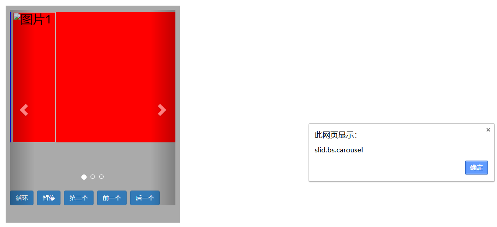

# 轮播框
```html
	<head>
	<link 
	  rel="stylesheet" href="https://cdn.staticfile.org/twitter-bootstrap/3.3.7/css/bootstrap.min.css">
	<script src="https://cdn.staticfile.org/jquery/2.1.1/jquery.min.js"></script>
	<script src="https://cdn.staticfile.org/twitter-bootstrap/3.3.7/js/bootstrap.min.js"></script>
	</head>
	<style>
		.sizePosition
		{
			width:400px;
			height:500px;
			margin:115px 10px 0 30px;
			padding:10px;
			float:left;
			display:block;
			background-color:#aaa;
			color:#000;
			font-size:28px
		}
		.sizePosition>div + div{margin-top:-10px;}
		.item>img{width:99%;margin:5px 5px 5px 5px;}
	</style>
	<body>
		<div class="sizePosition">
			<div id="carousel1" class="carousel slide">
				<!-- Indicators -->
				<ol class="carousel-indicators">
				   <li data-target="#carousel1" data-slide-to="0">0</li>
				   <!-- 选中 -->
				   <li data-target="#carousel1" data-slide-to="1" class="active">1</li>
				   <li data-target="#carousel1" data-slide-to="2">2</li>
				</ol>
			  <!-- Contents -->
			  <div class="carousel-inner">
			    <div class="item">
			      
			    </div>
			    <div class="item active"><!-- 选中 -->
			      
			      <div class="carousel-caption">caption222</div>
			    </div>
			    <div class="item">
			      
			    </div>
			  </div>

			  <!-- Controls -->
			  <a class="left carousel-control" href="#carousel1" data-slide="prev">
			    <span class="glyphicon glyphicon-chevron-left"></span>
			  </a>
			  <a class="right carousel-control" href="#carousel1" data-slide="next">
			    <span class="glyphicon glyphicon-chevron-right"></span>
			  </a>

			<div style="margin-top:100px;">
				<button class="btn btn-primary" onclick="cycle()">循环</button>
				<button class="btn btn-primary" onclick="pause()">暂停</button>
				<button class="btn btn-primary" onclick="number(1)">第二个</button>
				<button class="btn btn-primary" onclick="prev()">前一个</button>
				<button class="btn btn-primary" onclick="next()">后一个</button>
			</div>

			  <script type="text/javascript">
			  	$(function(){
			  		// 添加循环播放动作
			  		$('.carousel').carousel({
					  interval:500//轮播间隔0.5s
					})

					$('.carousel').on('slide.bs.carousel', function () {
					  	alert("slide.bs.carousel")
					})

					$('.carousel').on('slid.bs.carousel', function () {
					  	alert("slid.bs.carousel")
					})
			  	})

			  	/** 循环 */
				function cycle(){
					$('.carousel').carousel('cycle')
				}

				/** 暂停 */
				function pause(){
					$('.carousel').carousel('pause')
				}

				/** 前一个 */
				function prev(){
					$('.carousel').carousel('prev')
				}

				/** 后一个 */
				function next(){
					$('.carousel').carousel('next')
				}

				/** 第n+1个 */
				function number(n){
					$('.carousel').carousel(n)
				}
			  </script>
			</div>
		</div>
	</body>
```
---

# 事件类型
|事件|描述|
|:---:|:---:|
|slide.bs.carousel|This event fires immediately when the slide instance method is invoked|
|slid.bs.carousel|This event is fired when the carousel has completed its slide transition|
