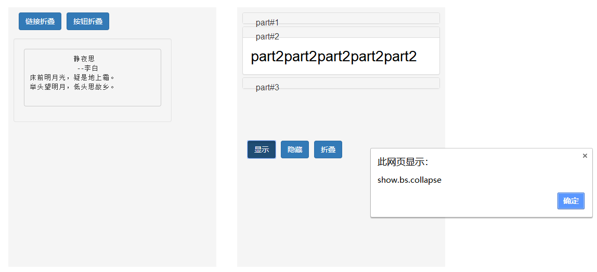

# 折叠框
```html
	<head>
	<link 
	  rel="stylesheet" href="https://cdn.staticfile.org/twitter-bootstrap/3.3.7/css/bootstrap.min.css">
	<script src="https://cdn.staticfile.org/jquery/2.1.1/jquery.min.js"></script>
	<script src="https://cdn.staticfile.org/twitter-bootstrap/3.3.7/js/bootstrap.min.js"></script>
	</head>
	<style>
		.sizePosition
		{
			width:400px;
			height:500px;
			margin:115px 10px 0 30px;
			padding:10px;
			float:left;
			display:block;
			background-color:#f5f5f5;
			color:#000;
			font-size:28px
		}
		.sizePosition>div + div{margin-top:-10px;}
		a,button{float:left;margin-left:10px;}
	</style>
	<body>
		<div class="sizePosition">
			<a class="btn btn-primary"
      href="#collapseContent" data-toggle="collapse">链接折叠</a>
			<button class="btn btn-primary" 
      data-target="#collapseContent" data-toggle="collapse">按钮折叠</button>
			<div class="collapse" id="collapseContent" style="width:80%;margin-top:50px;">
				<div class="well">
			<pre>
	    静夜思
	     --李白
床前明月光，疑是地上霜。
举头望明月，低头思故乡。
			</pre>
				</div>
			</div>
		</div>

		<div class="sizePosition">
			<div class="panel-group" id="parentNav">
			  <div class="panel panel-default">
			    <div class="panel-heading" id="head1">
			      <h4 class="panel-title">
			        <a data-toggle="collapse" data-parent="#parentNav" 
              href="#collapse1">part#1</a>
			      </h4>
			    </div>
			    <div id="collapse1" class="panel-collapse collapse">
			      <div class="panel-body">part1part1part1part1part1</div>
			    </div>
			  </div>

			  <div class="panel panel-default">
			    <div class="panel-heading" id="head2">
			      <h4 class="panel-title">
			        <a data-toggle="collapse" 
			        data-parent="#parentNav" href="#collapse2">part#2</a>
			      </h4>
			    </div><!-- .collapse默认隐藏，添加.in则显示内容 -->
			    <div id="collapse2" class="panel-collapse collapse in">
			      <div class="panel-body">part2part2part2part2part2</div>
			    </div>
			  </div>

			  <div class="panel panel-default">
			    <div class="panel-heading" id="head3">
			      <h4 class="panel-title">
			        <a data-toggle="collapse" 
			        data-parent="#parentNav" href="#collapse3">part#3</a>
			      </h4>
			    </div>
			    <!-- .collapsing is added when the transition starts
			    	, and removed when it finishes -->
			    <div id="collapse3" class="panel-collapse collapsing">
			      <div class="panel-body">Part3Part3Part3Part3Part3</div>
			    </div>
			  </div>
			</div>

			<div style="margin-top:100px;">
				<button class="btn btn-primary" onclick="show()">显示</button>
				<button class="btn btn-primary" onclick="hide()">隐藏</button>
				<button class="btn btn-primary" onclick="toggle()">折叠</button>
			</div>

			<script type="text/javascript">
				$(function(){
					// 数字编号代表执行顺序
					$('#collapse1').on('show.bs.collapse', function () {
					  alert("show.bs.collapse")//1
					})

					$('#collapse1').on('shown.bs.collapse', function () {
					  alert("shown.bs.collapse")//2
					})

					$('#collapse1').on('hide.bs.collapse', function () {
					  alert("hide.bs.collapse")//3
					})

					$('#collapse1').on('hidden.bs.collapse', function () {
					  alert("hidden.bs.collapse")//4
					})
				})

				/** 显示 */
				function show(){
					$("#collapse1").collapse('show')
				}

				/** 隐藏 */
				function hide(){
					$("#collapse1").collapse('hide')
				}

				/** 折叠 */
				function toggle(){
					$("#collapse1").collapse('toggle')
				}
			</script>
		</div>
	</body>
```
---

# tooltip事件类型
|事件类型|描述|
|:---:|:---:|
|show.bs.collapse|This event fires immediately when the show instance method is called|
|shown.bs.collapse|This event is fired when a collapse element has been made visible to the user (will wait for CSS transitions to complete)|
|hide.bs.collapse|This event is fired immediately when the hide method has been called|
|hidden.bs.collapse|This event is fired when a collapse element has been hidden from the user (will wait for CSS transitions to complete)|
