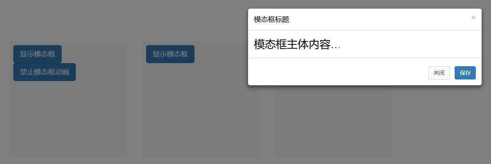
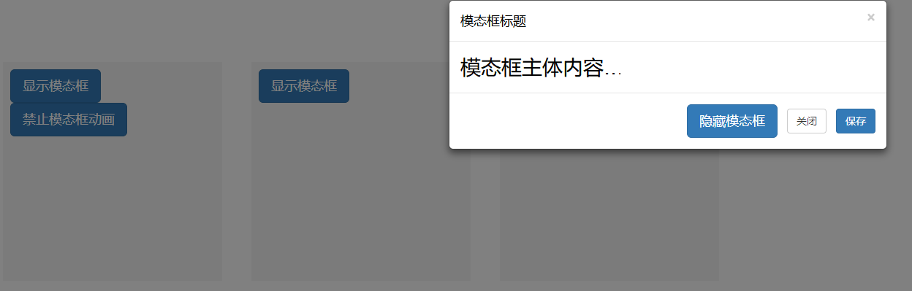
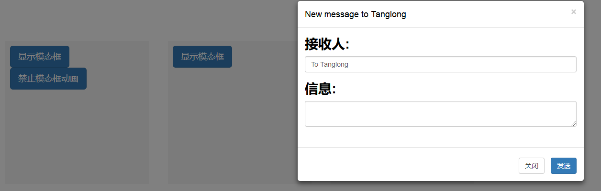

# 模态框
```html
	<head>
	<link 
	  rel="stylesheet" href="https://cdn.staticfile.org/twitter-bootstrap/3.3.7/css/bootstrap.min.css">
	<script src="https://cdn.staticfile.org/jquery/2.1.1/jquery.min.js"></script>
	<script src="https://cdn.staticfile.org/twitter-bootstrap/3.3.7/js/bootstrap.min.js"></script>
	</head>
	<style>
		.sizePosition
		{
			width:300px;
			height:300px;
			margin:115px 10px 0 30px;
			padding:10px;
			float:left;
			display:block;
			background-color:#f5f5f5;
			color:#000;
			font-size:28px
		}
		.sizePosition>div + div{margin-top:-10px;}
	</style>
	<body>
		<div class="sizePosition">
			<button class="btn btn-primary btn-lg"
      data-toggle="modal" data-target="#myModal">
				显示模态框
			</button><br/>

			<!-- Modal -->
			<div class="modal fade" id="myModal" tabindex="-1" role="dialog"
      aria-labelledby="myModalLabel">
			  <div class="modal-dialog" role="document">
			    <div class="modal-content">
			      <div class="modal-header">
			        <button class="close" data-dismiss="modal" aria-label="Close">
			        	<span aria-hidden="true">&times;</span></button>
			        <h4 class="modal-title" id="myModalLabel">模态框标题</h4>
			      </div>
			      <div class="modal-body">
			      	模态框主体内容&hellip;
			      </div>
			      <div class="modal-footer">
			        <button class="btn btn-default" data-dismiss="modal">关闭</button>
			        <button class="btn btn-primary">保存</button>
			      </div>
			    </div>
			  </div>
			</div><!-- 模态框 -->

			<button class="btn btn-primary btn-lg" data-toggle="modal" 
      data-target="#dhModal">
				禁止模态框动画
			</button><br/>

			<!-- 去除Modal显示时的动画(去除.fade类) -->
			<div class="modal" id="dhModal" tabindex="-1" 
      role="dialog" aria-labelledby="dhModalLabel">
			  <div class="modal-dialog" role="document">
			    <div class="modal-content">
			      <div class="modal-header">
			        <button class="close" data-dismiss="modal" aria-label="Close">
			        	<span aria-hidden="true">&times;</span></button>
			        <h4 class="modal-title" id="dhModalLabel">模态框标题</h4>
			      </div>
			      <div class="modal-body">
			      	模态框主体内容&hellip;
			      </div>
			      <div class="modal-footer">
			        <button class="btn btn-default" data-dismiss="modal">关闭</button>
			        <button class="btn btn-primary">保存</button>
			      </div>
			    </div>
			  </div>
			</div><!-- 模态框 -->
		</div>

		<div class="sizePosition"><!-- 手动显示与隐藏模态框 -->
			<button class="btn btn-primary btn-lg"
      onclick="showModal()">显示模态框</button><br/>
			<!-- Modal -->
			<div class="modal fade" id="shModal" tabindex="-1" 
      role="dialog" aria-labelledby="shModalLabel">
			  <div class="modal-dialog" role="document">
			    <div class="modal-content">
			      <div class="modal-header">
			        <button class="close" data-dismiss="modal" aria-label="Close">
			        	<span aria-hidden="true">&times;</span></button>
			        <h4 class="modal-title" id="shModalLabel">模态框标题</h4>
			      </div>
			      <div class="modal-body">
			      	模态框主体内容&hellip;
			      </div>
			      <div class="modal-footer">
			      	<button class="btn btn-primary btn-lg" 
              onclick="hideModal()">隐藏模态框</button>
			        <button class="btn btn-default" data-dismiss="modal">关闭</button>
			        <button class="btn btn-primary">保存</button>
			      </div>
			    </div>
			  </div>
			</div><!-- 模态框 -->
			<script type="text/javascript">
				/** 显示模态框 */
				function showModal(argument) {
					$('#shModal').modal('show')
				}

				/** 隐藏模态框 */
				function hideModal(argument) {
					$('#shModal').modal('hide')
				}
			</script>
		</div>

		<div class="sizePosition"><!-- Varying modal content based on trigger button -->
			<button class="btn btn-primary" data-toggle="modal" data-target="#testModal" 
      data-recipient="Tanglong">Open modal for Tanglong</button>
			<button class="btn btn-primary" data-toggle="modal" data-target="#testModal" 
      data-recipient="Flyingfish">Open modal for Flyingfish</button>
			<div class="modal fade" id="testModal" tabindex="-1" role="dialog" 
      aria-labelledby="testModalLabel">
			  <div class="modal-dialog" role="document">
			    <div class="modal-content">
			      <div class="modal-header">
			        <button class="close" data-dismiss="modal" aria-label="Close">
			        	<span aria-hidden="true">&times;</span></button>
			        <h4 class="modal-title" id="testModalLabel">信息发送</h4>
			      </div>
			      <div class="modal-body">
			        <form>
			          <div class="form-group">
			            <label for="recipient-name" class="control-label">接收人:</label>
			            <input type="text" class="form-control" id="recipient-name">
			          </div>
			          <div class="form-group">
			            <label for="message-text" class="control-label">信息:</label>
			            <textarea class="form-control" id="message-text"></textarea>
			          </div>
			        </form>
			      </div>
			      <div class="modal-footer">
			        <button class="btn btn-default" data-dismiss="modal">关闭</button>
			        <button class="btn btn-primary">发送</button>
			      </div>
			    </div>
			  </div>
			</div>
			<script type="text/javascript">
				$('#testModal').on('show.bs.modal', function (event) {
					var button = $(event.relatedTarget) 
					var recipient = button.data('recipient') 
					var modal = $(this)
					modal.find('.modal-title').text('New message to ' + recipient)
					modal.find('.modal-body input').val("To " + recipient)
				})
			</script>
		</div>
	</body>
``` 
---

---

---

---
# 模态框事件
|事件类型|描述|
|:---:|:---:|
|show.bs.modal|show 方法调用之后立即触发该事件。如果是通过点击某个作为触发器的元素，则此元素可以通过事件的 relatedTarget 属性进行访问|
|shown.bs.modal|此事件在模态框已经显示出来（并且同时在 CSS 过渡效果完成）之后被触发。如果是通过点击某个作为触发器的元素，则此元素可以通过事件的 relatedTarget 属性进行访问|
|hide.bs.modal|hide 方法调用之后立即触发该事件|
|hidden.bs.modal|此事件在模态框被隐藏（并且同时在 CSS 过渡效果完成）之后被触发|
|loaded.bs.modal|从远端的数据源加载完数据之后触发该事件|
# 使用方法
```js
$('#modalId').on('hidden.bs.modal', function (e) {
  // TODO
})
```
