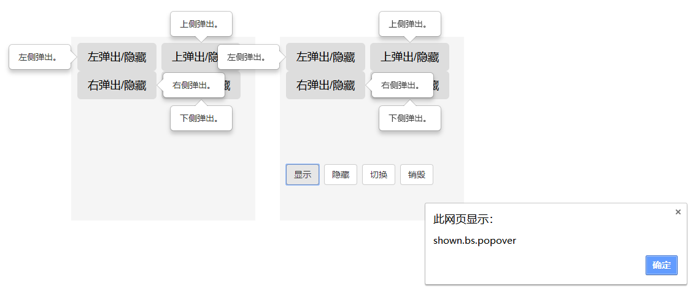

# 弹出框
```html
	<head>
	<link 
	rel="stylesheet" href="https://cdn.staticfile.org/twitter-bootstrap/3.3.7/css/bootstrap.min.css">
	<script src="https://cdn.staticfile.org/jquery/2.1.1/jquery.min.js"></script>
	<script src="https://cdn.staticfile.org/twitter-bootstrap/3.3.7/js/bootstrap.min.js"></script>
	</head>
	<style>
		.sizePosition
		{
			width:300px;
			height:300px;
			margin:115px 10px 0 30px;
			padding:10px;
			float:left;
			display:block;
			background-color:#f5f5f5;
			color:#000;
			font-size:28px
		}
		.sizePosition>div + div{margin-top:-10px;}
	</style>
	<body>
		<div class="sizePosition" style="margin-left:150px;">
			<button class="btn btn-lg btn-detail" data-toggle="popover1" 
				data-container="body"
			data-placement="left" data-content="左侧弹出。">左弹出/隐藏</button>

			<button class="btn btn-lg btn-detail" data-toggle="popover1" 
				data-container="body"
			data-placement="top" data-content="上侧弹出。">上弹出/隐藏</button>

			<button class="btn btn-lg btn-detail" data-toggle="popover1" 
				data-container="body"
			data-placement="right" data-content="右侧弹出。">右弹出/隐藏</button>

			<button class="btn btn-lg btn-detail" data-toggle="popover1"
				data-container="body"
			data-placement="bottom" data-content="下侧弹出。">下弹出/隐藏</button>

			<script type="text/javascript">
				$(function () {
					//事件绑定
	  				$('[data-toggle="popover1"]').popover()
				})
			</script>
		</div>

		<div class="sizePosition">
			<button class="btn btn-lg btn-detail" data-toggle="popover2"
				data-container="body"
			data-placement="left" data-content="左侧弹出。">左弹出/隐藏</button>

			<button class="btn btn-lg btn-detail" data-toggle="popover2" 
				data-container="body"
			data-placement="top" data-content="上侧弹出。">上弹出/隐藏</button>

			<button class="btn btn-lg btn-detail" data-toggle="popover2"
				data-container="body"
			data-placement="right" data-content="右侧弹出。">右弹出/隐藏</button>

			<button class="btn btn-lg btn-detail" data-toggle="popover2" 
				data-container="body"
			data-placement="bottom" data-content="下侧弹出。">下弹出/隐藏</button>

			<div style="margin-top: 100px;">
			<button class="btn btn-default" onclick="popoverShow()">显示</button>
			<button class="btn btn-default" onclick="popoverHide()">隐藏</button>
			<button class="btn btn-default" onclick="popoverToggle()">切换</button>
			<button class="btn btn-default" onclick="popoverDestroy()">销毁</button>
			</div>

			<script type="text/javascript">
				$(function () {
				//事件绑定
	  			$('[data-toggle="popover2"]').popover()

	  		// 数字编号代表执行顺序
				$('[data-toggle="popover2"]').on('show.bs.popover', function () {
					  alert("show.bs.popover") //1
				})

				$('[data-toggle="popover2"]').on('shown.bs.popover', function () {
					  alert("shown.bs.popover")//3
				})

				$('[data-toggle="popover2"]').on('hide.bs.popover', function () {
					  alert("hide.bs.popover")//4
				})


				$('[data-toggle="popover2"]').on('hidden.bs.popover', function () {
					  alert("hidden.bs.popover")//5
				})

			$('[data-toggle="popover2"]').on('inserted.bs.popover', function () {
				alert("inserted.bs.popover")//2
			})
			})

			/** 显示 */
			function popoverShow() {
				$('[data-toggle="popover2"]').popover('show')
			}

			/** 隐藏 */
			function popoverHide() {
				$('[data-toggle="popover2"]').popover('hide')
			}

			/** 切换 */
			function popoverToggle() {
				$('[data-toggle="popover2"]').popover('toggle')
			}

			/** 销毁 */
			function popoverDestroy() {
				$('[data-toggle="popover2"]').popover('destroy')
			}
			</script>
		</div>
	</body>
```
---

# 事件类型
|事件|描述|
|:---:|:---:|
|show.bs.popover|This event fires immediately when the show instance method is called|
|shown.bs.popover|This event is fired when the popover has been made visible to the user (will wait for CSS transitions to complete)|
|hide.bs.popover|This event is fired immediately when the hide instance method has been called|
|hidden.bs.popover|This event is fired when the popover has finished being hidden from the user (will wait for CSS transitions to complete)|
|inserted.bs.popover|This event is fired after the show.bs.popover event when the popover template has been added to the DOM|
