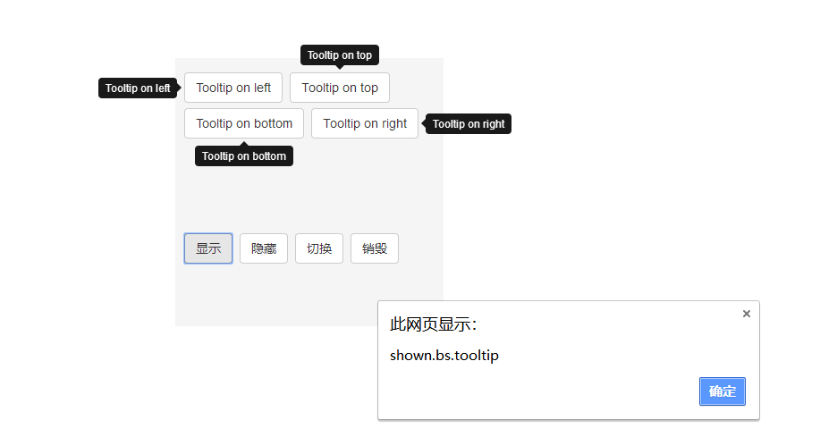

# 提示框
```html
	<head>
	<link 
	  rel="stylesheet" href="https://cdn.staticfile.org/twitter-bootstrap/3.3.7/css/bootstrap.min.css">
	<script src="https://cdn.staticfile.org/jquery/2.1.1/jquery.min.js"></script>
	<script src="https://cdn.staticfile.org/twitter-bootstrap/3.3.7/js/bootstrap.min.js"></script>
	</head>
	<style>
		.sizePosition
		{
			width:300px;
			height:300px;
			margin:115px 10px 0 30px;
			padding:10px;
			float:left;
			display:block;
			background-color:#f5f5f5;
			color:#000;
			font-size:28px
		}
		.sizePosition>div + div{margin-top:-10px;}
	</style>
	<body>
		<div class="sizePosition" style="margin-left:500px;">
			<button class="btn btn-default" data-toggle="tooltip" 
      data-placement="left" title="Tooltip on left">Tooltip on left</button>
			<button class="btn btn-default" data-toggle="tooltip" 
      data-placement="top" title="Tooltip on top">Tooltip on top</button>
			<button class="btn btn-default" data-toggle="tooltip" 
      data-placement="bottom" title="Tooltip on bottom">Tooltip on bottom</button>
			<button class="btn btn-default" data-toggle="tooltip" 
      data-placement="right" title="Tooltip on right">Tooltip on right</button>
			<div style="margin-top: 100px;">
				<button class="btn btn-default" onclick="tooltipShow()">显示</button>
				<button class="btn btn-default" onclick="tooltipHide()">隐藏</button>
				<button class="btn btn-default" onclick="tooltipToggle()">切换</button>
				<button class="btn btn-default" onclick="tooltipDestroy()">销毁</button>
			</div>
		</div>

		<script type="text/javascript">
			$(function () {
				//绑定事件
				$('[data-toggle="tooltip"]').tooltip()

				// 数字编号代表执行顺序
				$('[data-toggle="tooltip"]').on('show.bs.tooltip', function () {
				  	alert("show.bs.tooltip") //1
				})

				$('[data-toggle="tooltip"]').on('shown.bs.tooltip', function () {
				  	alert("shown.bs.tooltip")//4
				})

				$('[data-toggle="tooltip"]').on('hide.bs.tooltip', function () {
				  	alert("hide.bs.tooltip")//3
				})


				$('[data-toggle="tooltip"]').on('hidden.bs.tooltip', function () {
				  	alert("hidden.bs.tooltip")//5
				})

				$('[data-toggle="tooltip"]').on('inserted.bs.tooltip', function () {
				  	alert("inserted.bs.tooltip")//2
				})
			})

			/** 显示 */
			function tooltipShow() {
				$('[data-toggle="tooltip"]').tooltip('show')
			}

			/** 隐藏 */
			function tooltipHide() {
				$('[data-toggle="tooltip"]').tooltip('hide')
			}

			/** 切换 */
			function tooltipToggle() {
				$('[data-toggle="tooltip"]').tooltip('toggle')
			}

			/** 销毁 */
			function tooltipDestroy() {
				$('[data-toggle="tooltip"]').tooltip('destroy')
			}
		</script>
	</body>
```
---

# tooltip事件类型
|事件类型|描述|
|:---:|:---:|
|show.bs.tooltip|This event fires immediately when the show instance method is called|
|shown.bs.tooltip|This event is fired when the tooltip has been made visible to the user (will wait for CSS transitions to complete)|
|hide.bs.tooltip|This event is fired immediately when the hide instance method has been called|
|hidden.bs.tooltip|This event is fired when the tooltip has finished being hidden from the user (will wait for CSS transitions to complete)|
|inserted.bs.tooltip|This event is fired after the show.bs.tooltip event when the tooltip template has been added to the DOM|
