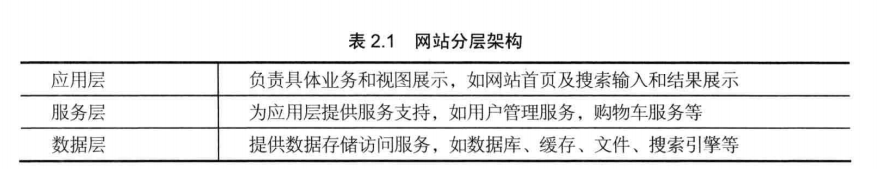

# 大型网站架构模式
+ 模式(建筑学)：每一个模式描述一个在我们周围不断重复发生的问题及该问题解决方案的核心。这样，我们就能一次又一次地使用该方案而不必做重复的工作。
+ 系统分层(MVC)
	+ 应用层(View)
	+ 服务层(Control)
	+ 数据层(Model)
	---
	
+ 系统分割：将不同的功能和服务分割开，包装成高内聚低耦合的模块单元。
+ 分布式：将不同的模块部署在不同的服务器上(服务器数量根据需要增加)。
	+ 优点
		+ CPU、内存、存储资源增多
		+ 能够处理的并发访问和数据量增大
		+ 可以服务更多的用户
	+ 缺点
		+ 网络瓶颈
		+ 服务器宕机概率加大
		+ 数据不一致
		+ 增加开发管理维护难度
	+ 分类
		+ 分布式应用和服务
		+ 分布式静态资源(动静分离)
		+ 分布式数据和存储
		+ 分布式计算
		+ 分布式配置：网站线上服务器配置实时更新
		+ 分布式文件系统
		+ 分布式锁：用于实现分布式环境下的并发和协同
+ 集群
	+ 部署相同的模块的多台服务器构成一个集群，通过负载均衡设备共同对外提供相同服务，大大提高系统可用性。
+ 缓存(将频繁使用的数据存放在距离计算最近的位置以加快处理速度)
	+ CDN：将用户访问量大的静态资源缓存在距离终端用户最近的网络服务商的中心机房。
	+ 反向代理：用户的访问请求最先到达反向代理服务器，如果命中缓存则返回缓存的资源。
	+ 本地缓存
	+ 分布式缓存(缓存海量数据资源)
+ 异步
	+ 将一个业务操作分成多个阶段(生产者-消费者模型)，每个阶段通过共享数据的方式异步执行，进行协作。
	+ 单一服务器内部通过多线程共享内存队列的方式实现异步
	+ 在分布式系统中，多个服务器集群通过分布式消息队列实现异步，分布式消息队列可以看作内存队列的分布式部署。
	+ 优点
		+ 提高系统可用性
		+ 加快网站响应速度
		+ 消除并发访问高峰
+ + 冗余
	+ 为保证在服务器宕机的情况下系统依然可用，不丢失数据，就需要一定程度的服务器冗余运行和数据冗余备份。
	+ 冷备份：数据库定期备份，存档保存
	+ 热备份：数据库主从分离，实时同步
	+ 部署灾备数据中心，对网站程序和数据进行实时同步
+ 自动化
	+ 发布过程自动化
		+ 自动代码管理
		+ 自动化测试
		+ 自动化安全检测
		+ 自动化部署
	+ 运维过程自动化
		+ 自动化监控
		+ 自动化报警
		+ 自动化失效转移
		+ 自动化失效恢复
		+ 自动化降级：通过拒绝部分请求及关闭不重要的服务经系统负载降至一个安全的水平
		+ 自动化分配资源：将空闲资源分配给重要的服务，扩大其部署规模
+ 安全
	+ 通过密码和手机验证码进行身份验证
	+ 对存储的敏感数据进行加密处理
	+ 对登陆、交易等操作对网络通信进行加密
	+ 通过验证码防止机器人程序的攻击
	+ 对常见的攻击如sql注入、XSS攻击做出相应处理
	+ 垃圾信息过滤
	+ 对重要操作如转账进行风险控制