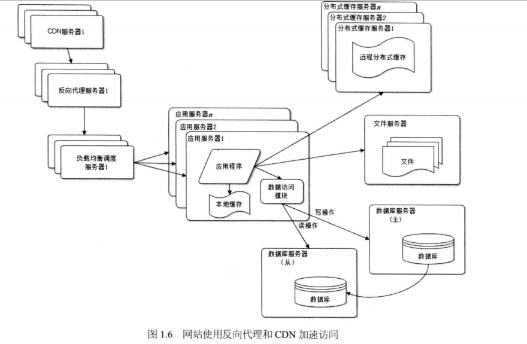

# 大型网站架构演化发展历程
+ 1初级阶段的网站架构
---

+ 2应用服务和数据服务分离
---

+ 3网站使用缓存
---

+ 4应用服务器集群部署
---

+ 5数据库读写分离
---

+ 6网站使用反向代理和CDN加速访问
---

+ 7使用分布式文件和分布式数据库系统
---

+ 8使用NoSql和搜索引擎
---

+ 9根据业务拆分应用
---

+ 10分布式服务
---

