# 大型网站的伸缩性架构
+ 网站的伸缩性：不需要改变网站的软硬件设计，仅仅通过改变部署的服务器数量就可以扩大或者缩小网站的服务处理能力
+ 网站架构的伸缩性设计
	+ 不同功能进行无力分离实现伸缩
	---
	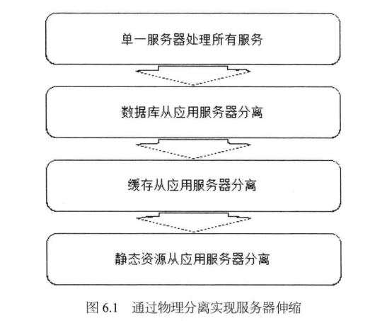
		+ 纵向分离：将业务处理流程上的不同部分分离部署
		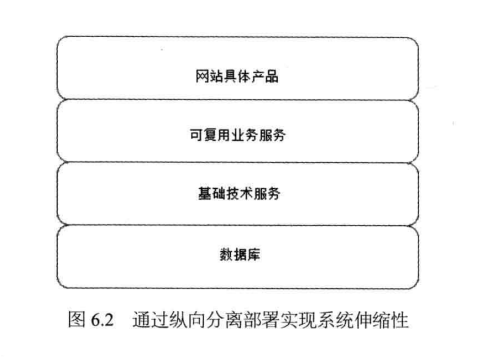
		+ 横向分离：将不同业务模块分离部署
		
	+ 单一功能通过集群规模实现伸缩
+ 应用服务器集群的伸缩性设计
	+ 含义：通过负载均衡服务器(HTTP请求分发装置)感知或者配置集群的服务器数量，及时发现集群中新上线或下线的服务器，并向新上线的服务器分发请求，停止向已下线的服务器分发请求。
	---
	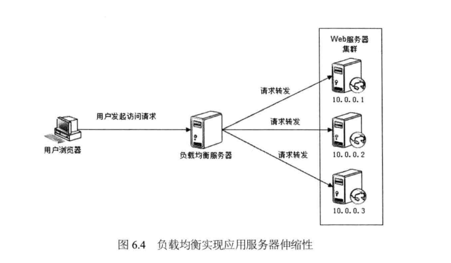
	+ 负载均衡
		+ HTTP重定向负载均衡(不常用)
		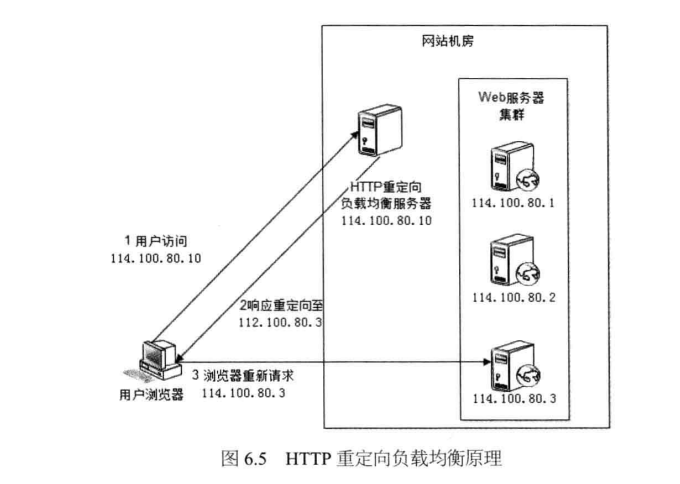
		+ DNS域名解析负载均衡(部分使用)
		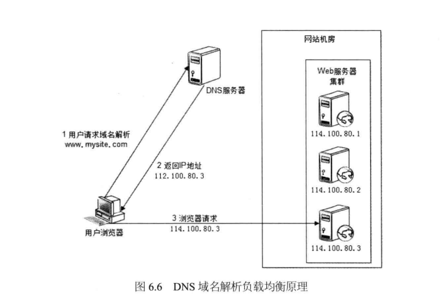
		+ 反响代理负载均衡(应用层负载均衡)
		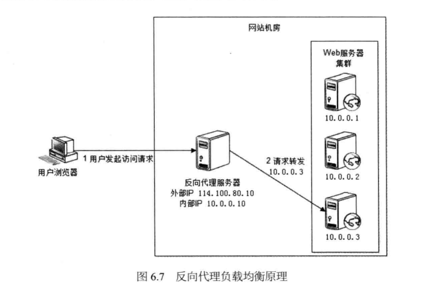
		+ IP负载均衡
		---
		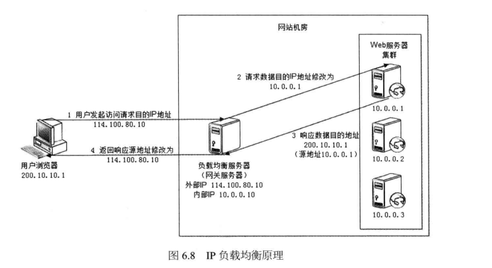
		+ 数据链数层负载均衡(最常用，开源产品：LVS(Linux Virtual Server))
		---
		
	+ 负载均衡算法
		+ 轮询(Round Robin,RR):所有服务器硬件相同
		+ 加权轮询(Weighted Round Robin,WRR)：高性能的服务器分配更多请求
		+ 随机(Random)
		+ 最少连接(Least Connections)
		+ 源地址散列(Source Hashing)
+ 分布式缓存集群的伸缩性设计
	+ MemCached分布式缓存集群的访问模型
	---
	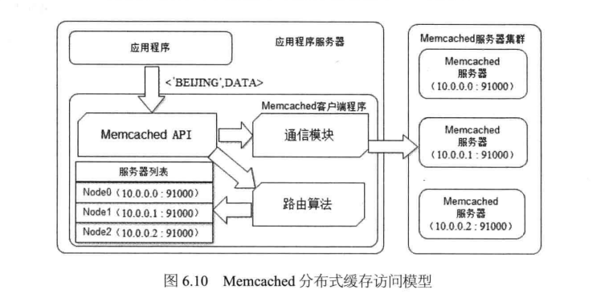
	+ Memecached分布式缓存集群的伸缩性挑战：集群扩容导致缓存命中率大大降低
	+ 分布式缓存的一致性Hash算法
	---
	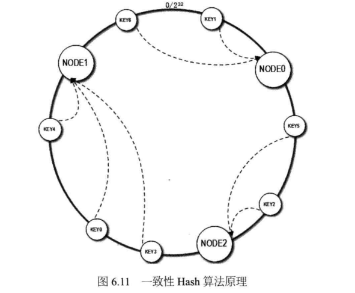
+ 数据存储服务器集群的伸缩性设计
	+ 关系型数据库集群的伸缩性设计
	---
	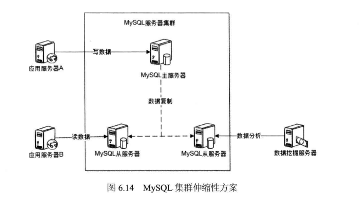
		+ 支持数据分片的分布式关系数据库产品Cobar
		---
		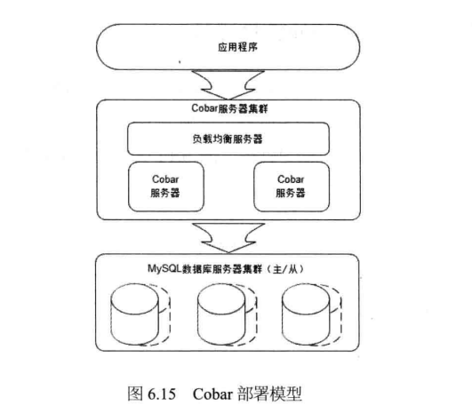
		+ Cobar系统组件模型
		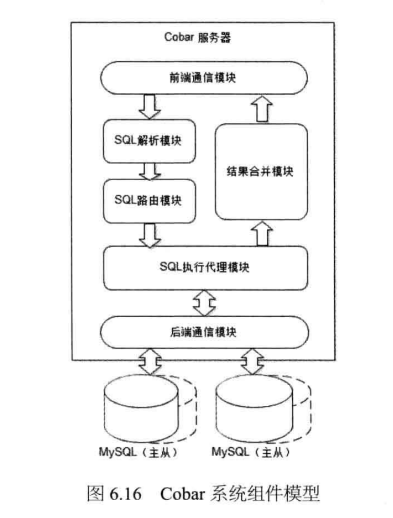
		+ Cobar集群伸缩性原理
		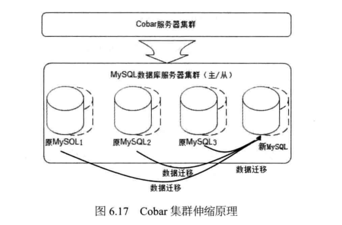
		+ 利用MySql同步机制实现Cobar集群伸缩
		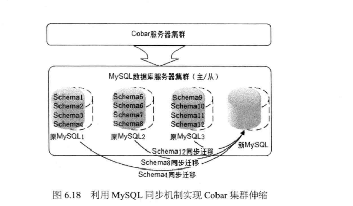
	+ NoSql数据库集群的伸缩性设计
		+ Hbase
			+ Hbase架构
			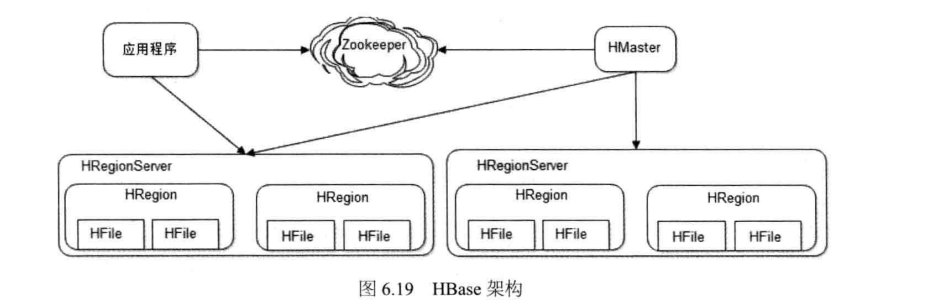
			+ Hbase数据寻址过程时序图
			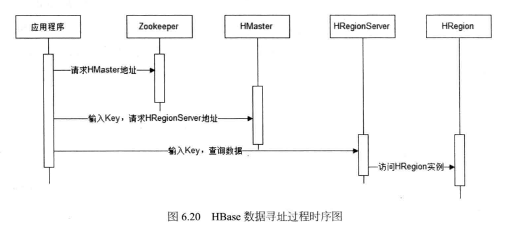