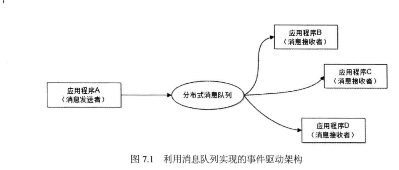
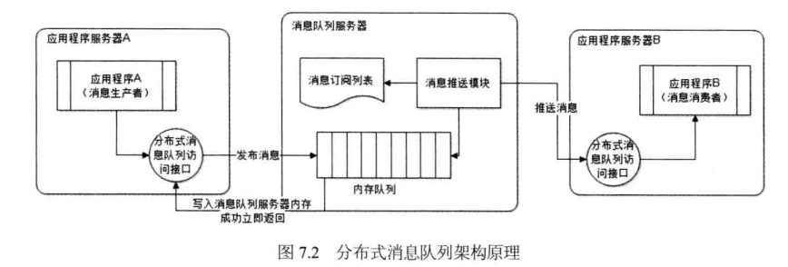
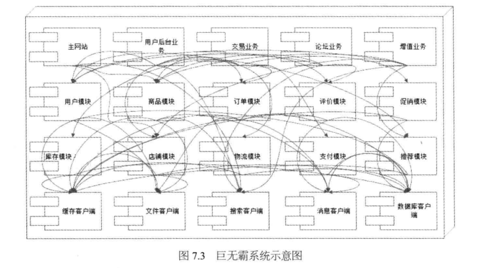
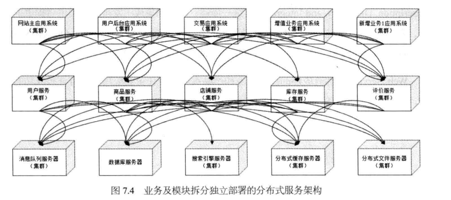
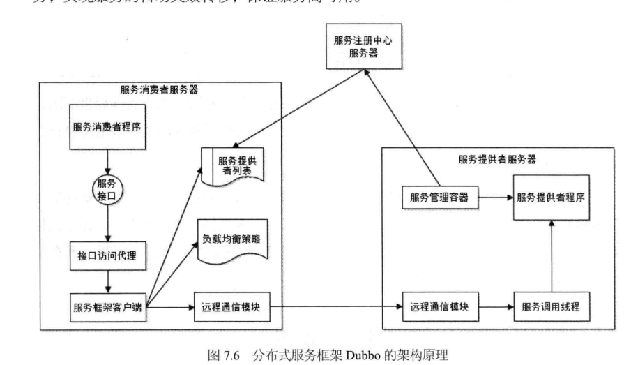
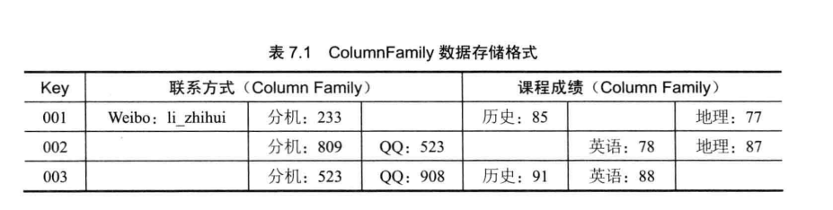
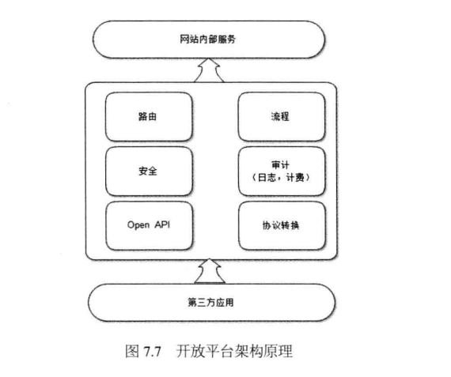

# 大型网站的可扩展架构
+ 扩展性 vs 伸缩性
	+ 扩展性(Extensibility)：指对现有系统影响最小的情况下，系统功能可持续扩展提升的能力。
	+ 伸缩性(Scalability)：指系统能够通过增加或减少自身资源规模的方式增强或减弱自己计算处理事务的能力。
+ 设计网站可扩展架构的核心思想是模块化，并在此基础上，降低模块间的耦合性，提高模块的复用性。
+ 利用分布式消息队列降低系统耦合性
	+ 事件驱动架构(Event Driven Architecture,EDA):通过在低耦合的模块之间传输事件消息，以保持模块的松散耦合，并借助事件消息的通信完成模块间合作。
	+ 利用消息队列实现的事件驱动架构
	---
	
	+ 分布式消息队列架构
	
+ 利用分布式服务打造可服用的业务平台
	+ 单一巨无霸系统 vs 分布式服务架构
		+ 单一巨无霸系统
		
		+ 分布式服务架构
		
	+ 大型网站分布式服务的需求与特点
		+ Web Service提供的服务注册与发现和服务调用
		+ 负载均衡
		+ 失效转移
		+ 高效的远程通信
		+ 整合异构系统
		+ 对应用最少侵入
		+ 版本管理
		+ 实时监控
	+ 分布式服务框架设计
		+ 开源分布式服务框架[Dubbo](http://dubbo.apache.org/en-us/)
		
+ 可扩展的数据结构
	+ NoSql数据库使用的列族(Column Family)
	
+ 利用开放平台建设网站生态圈
	+ 开放平台架构
	