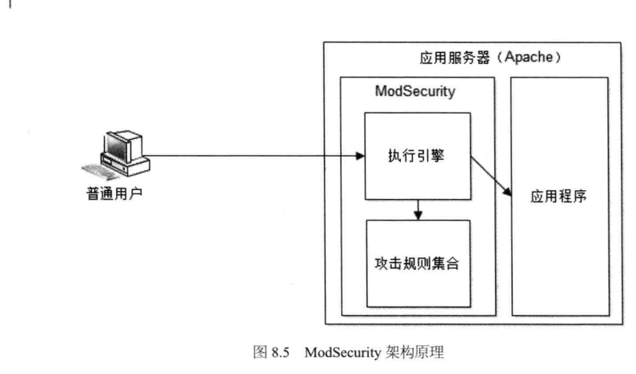

# 大型网站的安全架构
+ 网站攻击与防御
	+ XSS攻击
		+ 反射型：诱倒用户点击嵌入恶意脚本的链接
		
		+ 持久型XSS攻击：攻击者提交含有恶意脚本的请求，保存在被攻击的Web站点的数据库中，用户浏览网页时，恶意脚本被包含在正常页面中。
		
		+ 防攻击手段
			+ 消毒：对某些html字符进行转义
			+ HttpOnly：浏览器禁止页面JavaScript访问带有HttpOnly属性的Cookie，因此可以对Cookie添加HttpOnly属性
	+ 注入攻击
		+ SQL注入攻击
		---
		
			+ 攻击者获取数据库表结构信息的手段
				+ 被攻击网站使用开源软件，可以直接获取
				+ 被攻击网站开启错误回显，可以通过构造非法参数获取错误信息进行猜测。
				+ 盲注：根据页面变化情况判断SQL语句执行情况
			+ 防御手段
				+ 消毒：通过正则匹配过滤掉请求数据中可能注入的SQL语句
				+ 参数绑定：使用预编译手段，进行参数绑定。(如Mybatis,Hibernate等框架实现了预编译和参数绑定)
		+ OS注入攻击
	+ CSRF攻击
	---
	
		+ 防御手段
			+ 表单Token：在页面表单中添加一个随机数作为Token
			+ 验证码
			+ Referer check:HTTP请求头的Referer域中记录着请求来源，通过检查请求来源来验证请求合法性。
	+ 错误回显(Error Code):服务器端未处理的异常堆栈信息会直接显示到浏览器页面。
		+ 防御手段：配置服务器参数，跳转500错误到专门的错误页面
	+ HTML注释
		+ 防御手段：最终发布前进行代码Review或自动扫描，避免HTML注释漏洞
	+ 文件上传：攻击者通过上传可执行的程序，并通过改程序获得服务器段命令执行能力。
		+ 防御手段
			+ 设置上传文件白名单，只允许上传可靠的文件类型
			+ 修改文件名
			+ 使用专门的存储
	+ 路径遍历：攻击者在请求的URL中使用相对路径，遍历系统未开放的目录和文件
		+ 防御手段
			+ 将JS、CSS等资源文件部署在独立服务器
			+ 使用独立域名
			+ 其他资源不使用静态URL访问
			+ 动态参数不包含文件路径信息
	+ Web应用防火墙
		+ 开源产品:ModSecurity
		---
		
	+ 网站安全漏洞扫描
+ 信息加密技术及密钥安全管理
	+ 单项散列加密：对不同输入长度的信息进行散列计算，得到固定长度的输出，且加密过程是单向的。
	---
	
		+ 常用加密算法
			+ MD5
			+ SHA
		+ 使用场景
			+ 登陆密码加密
			+ 生成信息摘要
			+ 计算具有高离散度的随机数
	+ 对称加密：加密和解密使用同一个密钥(或者可以相互推算)
	---
	
		+ 常用加密算法
			+ DES
			+ RC
		+ 使用场景
			+ Cookie加密
			+ 通信加密
	+ 非对称加密：加密和解密使用不同的密钥，分为公钥和私钥
	---
	
		+ 常用加密算法
			+ RSA
		+ 使用场景
			+ 信息安全传输(公钥加密，私钥解密)
			+ 数字签名(私钥加密，公钥解密)
	+ 密钥安全管理
		+ 将密钥和算法放在一个独立的服务器上，甚至做成一个专门的硬件设施，对外提供加密解密服务。（成本较高，系统开销较大）
		+ 将加密算法放在应用系统中，密钥放在独立服务中，并将密钥切分为数片，加密后分别存储到不同存储介质中。
		
+ 信息过滤与反垃圾
	+ 文本匹配
		+ 正则匹配(信息内容较少时)
		+ 双数组Trie算法
		+ 构造多级Hash表进行文本匹配
		---
		
	+ 分类算法
	---
	
		+ 朴素贝叶斯算法
		+ TAN算法
		+ ARCS(Association Rule Clustering System)算法
		+ 其他用途
			+ 信息自动归类
	+ 黑名单
		+ Hash表实现(适用于黑名单列表不是太大的情况)
		+ 布隆过滤器(过滤不完全精准)
		
+ 电子商务网站风险控制
	+ 规则引擎
	---
	
	+ 统计系统
	---
	