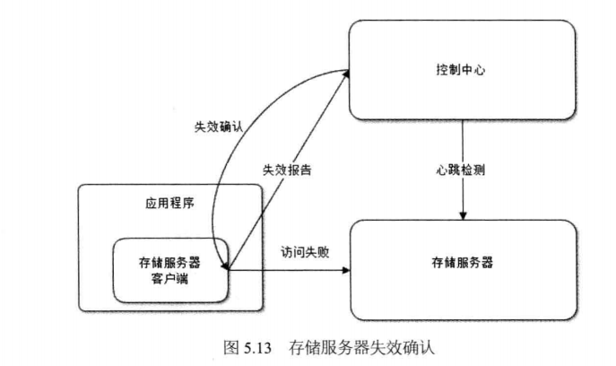
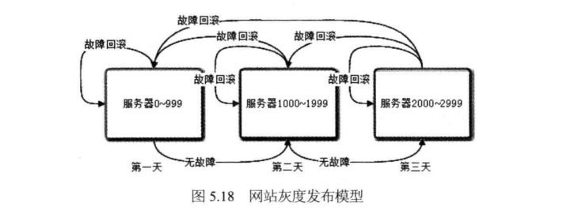

# 大型网站的高可用架构
+ 高可用的应用
	+ 通过负载均衡进行无状态服务的失效转移
	+ 应用服务器集群的Session管理
		+ Session复制：在集群中的几台服务器之间同步Session对象(适用于小规模集群)
		---
		
		+ Session绑定(会话黏滞，很少使用)：利用负载均衡的源地址hash算法实现，将Session绑定在某台特定服务器上，保证Session总能在这台服务器上获取
		---
		
		+ 利用Cookie记录Session:
		将Session记录在Cookie每次请求服务器的时候
		将Session放在请求中发送给服务器，服务器
		处理完请求后再将修改过的Session相应给客户端
		---
		
		+ Session服务器：使用独立部署的Session集群统一管理Session
		---
		
+ 高可用的服务
	+ 分级管理
		+ 运维上将服务器进行分级管理，核心应用和服务优先使用更好的硬件。
		+ 服务器部署进行必要的分离
			+ 低优先级的服务通过启动不同的线程或者部署在不同的虚拟机上
			+ 高优先级的服务部署在不同的物理机上
			+ 核心服务和数据部署在不同地域的数据中心
	+ 超时设置
	 	+ 解决因服务器宕机或线程死锁引起的用户请求长时间得不到响应的问题
	+ 异步调用
		+ 应用对服务的调用通过消息队列等异步方式完成
	+ 服务降级
		+ 拒绝服务
			+ 拒绝低优先级应用的调用，减少服务调用并发数，确保核心应用正常使用
			+ 随机拒绝部分请求调用
		+ 关闭服务
			+ 关闭部分不重要的服务
			+ 服务内部关闭部分不重要的功能
	+ 幂等性设计
		+ 幂等性：服务重复调用和调用一次产生的结果相同
+ 高可用的数据
	+ 含义
		+ 数据持久性
		+ 数据可访问性
		+ 数据一致性
			+ 数据强一致：各副本数据在物理存储中总是一致
			+ 数据用户一致：各副本数据在物理存储中可能不一致，但最终用户访问时，通过纠错和校验机制，可以确定一个一致且正确的数据返回给用户
			+ 数据最终一致：各副本数据在物理存储中可能不一致，终端用户访问到的数据可能也不一致，但系统经过一段时间的自我恢复和修正，数据最终会达到一致。
	+ CAP原理：一个提供数据服务的存储系统无法同时满足数据一致性(Consistency),
	数据可用性(Availibility),分区耐受性(Pstition Tolerance,系统具有跨网络分区的伸缩性)
	
	+ 数据备份
		+ 冷备份
		+ 热备份
			+ 异步热备份
			---
			
			+ 同步热备份
			---
			
	+ 失效转移：数据服务器集群中任何一台服务器宕机，应用程序针对这台服务器的所有读写操作都需要重新路由到其他服务器，保证数据访问不会失败
	+ 失效确认
		+ 心跳检测
		+ 应用程序访问失败报告
		---
		
	+ 访问转移
	+ 数据恢复
+ 高可用网站的软件质量保证
	+ 网站发布
	---
	
	+ 自动化测试
		+ Web自动化测试工具：Selenium
	+ 预发布验证
	+ 代码控制
	---
	
	+ 自动化发布
		+ 火车发布模型
		---
		
	+ 灰度发布
	---
	
+ 网站运行监控
	+ 监控数据采集
		+ 用户行为日志收集
			+ 服务器端日志收集
			+ 客户端浏览器日志收集
		+ 服务器性能监控
			+ 使用较为广泛的监控工具：Ganglia
		+ 运行数据报告
	+ 监控管理
		+ 系统报警
		+ 失效转移
		+ 自动优雅降级