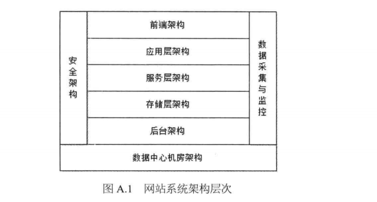

# 大型网站系统架构层次
+ 大型网站系统架构层次
---

+ 前端架构
	+ 浏览器优化技术(页面缓存、合并HTTP减少请求次数、使用页面压缩等)
	+ CDN
	+ 动静分离，静态资源(CSS、JS、图片、文件等)独立部署
	+ 图片服务(用户上传的图片：用户头像，产品图片等)
	+ 反向代理
	+ DNS
+ 应用层架构
	+ 开发框架
	+ 页面渲染
	+ 负载均衡
	+ Session管理
	+ 动态页面静态化
	+ 业务拆分
	+ 虚拟化服务器
+ 服务层架构
	+ 分布式消息
	+ 分布式服务
	+ 分布式缓存
	+ 分布式配置
+ 存储层架构
	+ 分布式文件
	+ 关系数据库
	+ NoSql数据库
	+ 数据同步
+ 后台架构
	+ 搜索引擎
	+ 数据仓库
	+ 推荐系统
+ 数据采集与监控
	+ 浏览器采集与监控(JS脚本)
	+ 服务器业务数据采集
		+ 用户请求操作日志
		+ 应用程序运行期业务数据
	+ 服务器性能数据采集(系统负载、内存使用率、网卡流量等)
	+ 系统监控
	+ 系统报警
+ 安全架构
	+ Web攻击
	+ 数据保护
+ 数据中心机房架构
	+ 机房架构
	+ 机柜架构
	+ 服务器机架构
