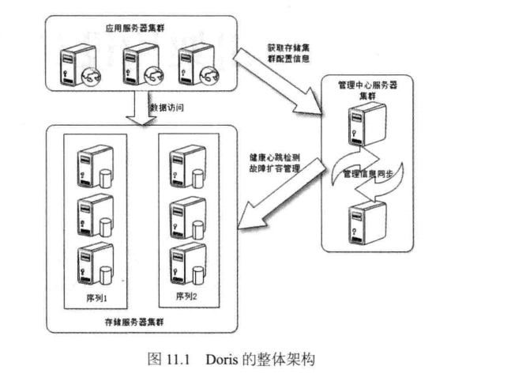

# 海量分布式存储系统[Doris](https://github.com/itisaid/Doris)的高可用架构
+ 高可用的数据存储系统
	+ 高可用的服务：任何时候，包括，机器宕机、硬盘损坏、系统升级、停机维护、集群扩容等各种情况，都可以对系统进行读写访问操作。
	+ 高可靠的数据：任何情况下，数据可靠存储，不丢失
+ 故障类型
	+ 瞬时故障
	+ 临时故障
	+ 永久故障
+ Doris架构
---

+ Doris访问模型
---

+ Doris临时故障访问模型
---

+ Doris临时故障恢复期间访问模型
---

+ Doris永久故障恢复期间访问模型
---
