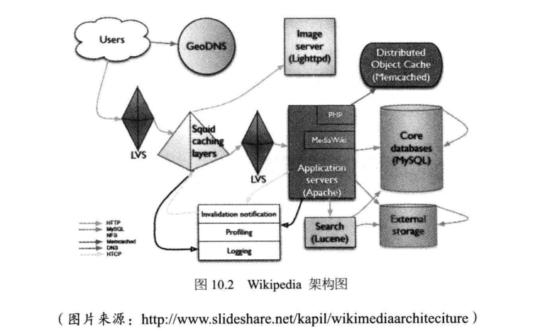

# 维基百科架构
+ 维基百科架构图
---

+ 维基百科架构的主要组成
---

+ 维基百科性能优化
	+ 维基百科前端性能优化（DNS服务，CDN，反向代理，景涛资源等)
	---
	
	+ 维基百科服务端性能优化(PHP服务器)
		+ 使用最好的服务器
		+ 使用APC,加速PHP代码执行，减少资源消耗
		+ 使用Imagemagick进行图片处理和转化
		+ 使用Tex进行文本格式化(能将科学公式内容转换成图片)
		+ 替换PHP的字符串查找函数strtr()，使用更优化的算法重构
	+ 维基百科后端性能优化(缓存、存储、数据库等)
		+ 使用缓存
			+ 热点特别集中地数据直接缓存到应用服务器的本地内存中
			+ 缓存数据的内容尽量使应用服务器直接可以使用的格式(如HTML)，以减少应用服务器解析构造数据的代价
			+ 使用缓存服务器存储session对象
			+ 相比数据库，根据需要创建更为廉价的Memcached连接
		+ MySql数据库
			+ 使用较大的服务器内存
			+ 使用RAID0磁盘阵列以加快磁盘访问
			+ 将数据库事务一致性降低在较低水平，以加快宕机恢复速度
			+ 如果Master数据库宕机，立即将应用切换到Salve数据库，同时关闭数据写服务