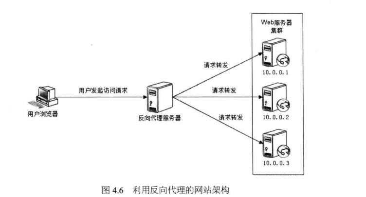
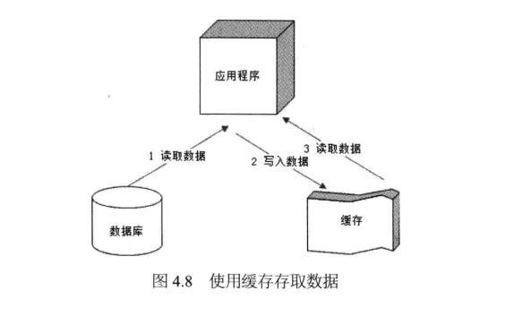
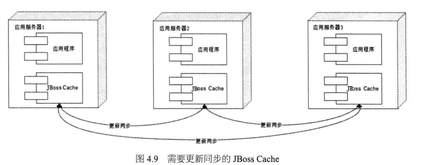
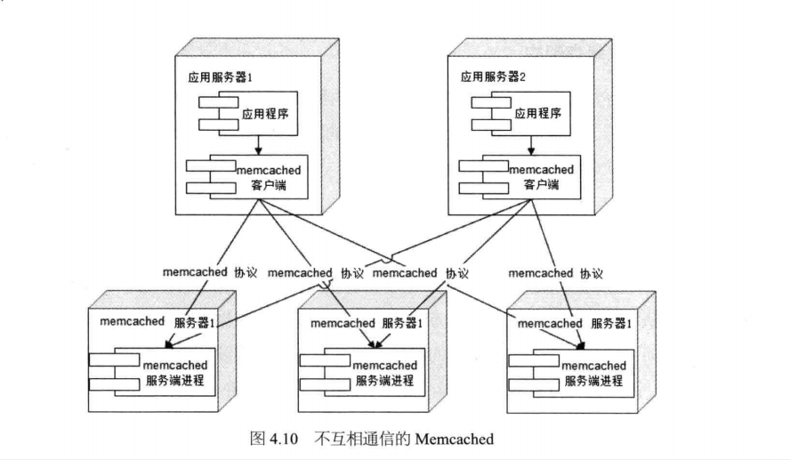
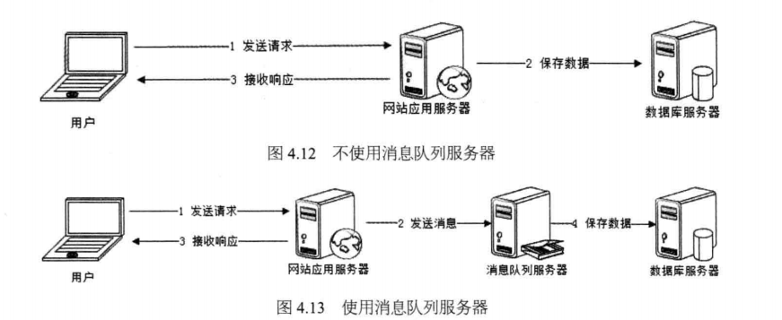
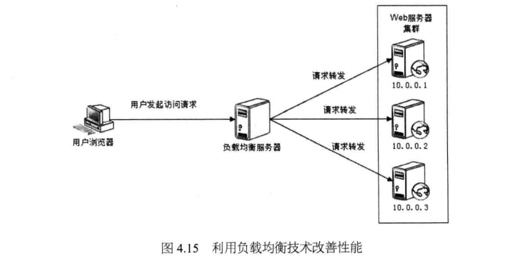
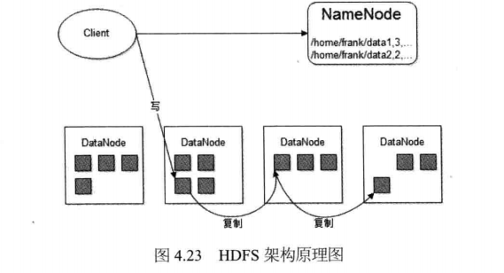

# 网站性能优化
+ Web前端性能优化
	+ 浏览器访问优化
		+ 减少http请求(合并CSS、合并JavaScript、合并图片)
		+ 使用浏览器缓存(将更新频率较低的静态资源缓存在浏览器中)
		+ 启用压缩(根据具体情况而定)
		+ CSS放在页面文件中的最上面、JavaScript放在页面文件中的最下面(根据具体情况调整)
		+ 减少Cookie中传输的数据量
	+ CDN加速：将访问频率很高的静态资源如图片、文件、CSS、Script脚本、静态网页缓存在网络服务提供商的机房
	+ 反向代理
		+ 保护网站安全
		+ 配置缓存，加速请求速度
		---
		
+ 应用服务器性能优化
	+ 缓存
		+ 将那些读写比很高(热点数据)、很少变化(静态资源)的数据存储在访问速度很快的存储介质(一般为内存)中
		---
		
	+ 分布式缓存
		+ JBoss缓存
		---
		
		+ MemCached缓存
		---
		
	+ 异步操作
		+ 通过消息队列实现异步操作
		
	+ 集群
		+ 利用负载均衡技术改善性能
		
	+ 代码优化
		+ 多线程
			+ 减少因IO阻塞而产生的处理等待时间
			+ 最大限度利用多CPU资源
			+ 多线程安全
				+ 将对象设计为无状态对象
				+ 使用局部对象
				+ 并发访问资源时使用锁
		+ 资源复用
			+ 尽量减少那些开销很大的系统资源(比如数据库连接、线程、网络通信连接)的创建和销毁
			+ 资源复用模式
				+ 单例(比如Spring构造的对象)
				+ 对象池(比如数据库连接池、服务器的线程池)
		+ 数据结构(根据具体场景选择最合适的数据结构)
		+ 垃圾回收
+ 存储性能优化
	+ 机械硬盘 vs 固态硬盘
	+ 关系数据库的B+树 vs NoSQl的LSM树
	+ RAID(Redundant Arrays of Independent Drives) vs HDFS(Hadoop Distributed File System)
	---
	