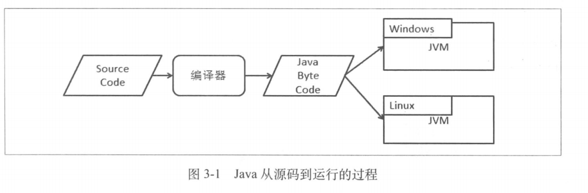
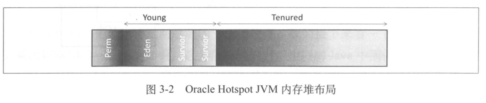
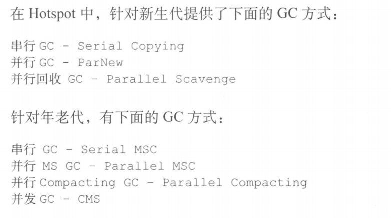
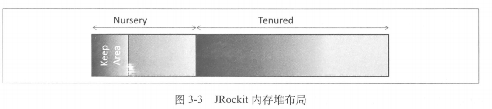
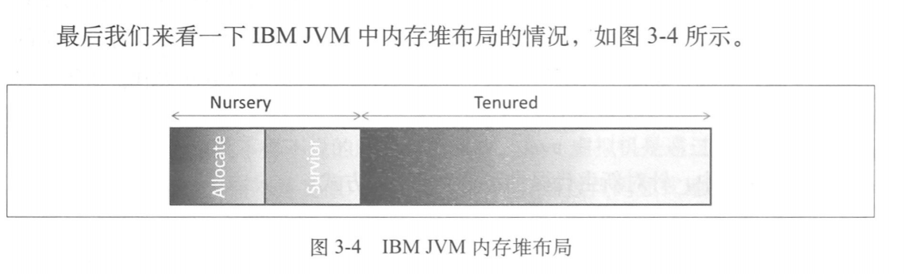

# Java中间件
```wikipedia
Middleware is computer software that provides services to software applications beyond 
those available from the operating system. It can be described as "software glue".
Middleware makes it easier for software developers to implement communication and input/output, 
so they can focus on the specific purpose of their application.
```
+ 分类
---

+ 基础知识
	+ JVM
		+ Java代码运行过程
		---
		
		+ 垃圾回收和内存堆栈
			+ HotSpot
			---
			
			---
			
			+ JRockit
			---
			
			+ IBM JVM
			---
			
	+ Java并发编程
		+ 线程池(ThreadPoolExecutor,ScheduledThreadPoolExecutor)		
		+ synchronized关键字
		+ ReetrantLock
		+ volatile
		+ Atomics
		+ wait、notify、notifyAll
		+ CountDownLatch
		+ CyclicBarrier
		+ Semephore
		+ Exchanger
		+ Future、Future Task
		+ 动态代理、反射
