# 分布式系统概述
```en
A distributed system is one in which
components located at networked computers
communicate and coordinate their actions
only by passing messages.
```
---
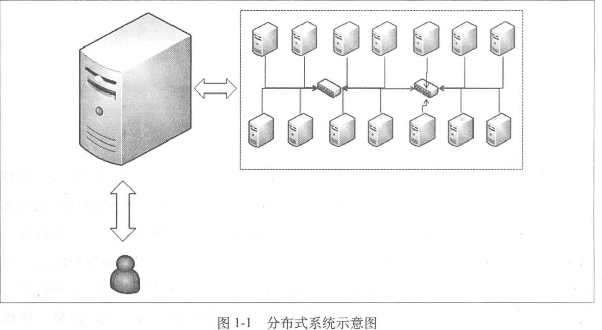
+ 计算机的组成
---
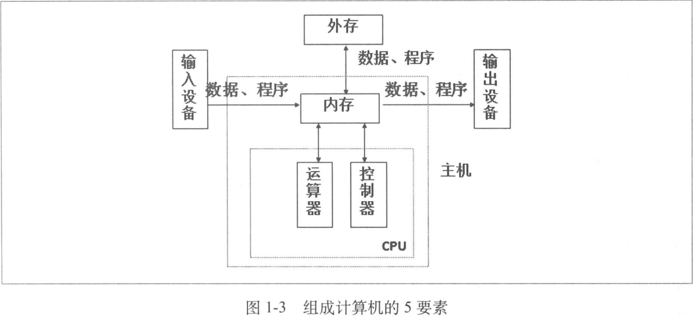
+ 阿姆达尔定律
---
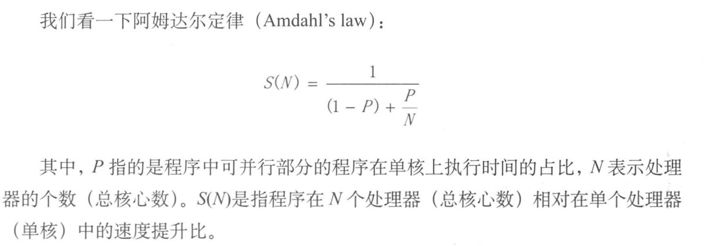
+ 网络通信基础
	+ OSI(Open System Interconnection)
	---
	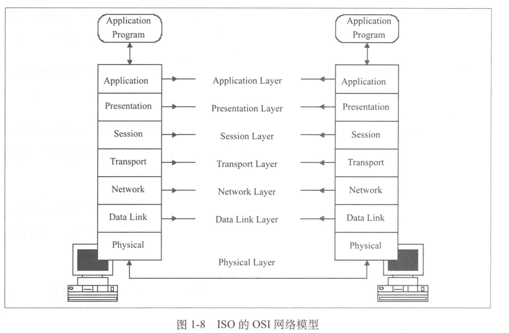
	+ OSI vs TCP/IP
	---
	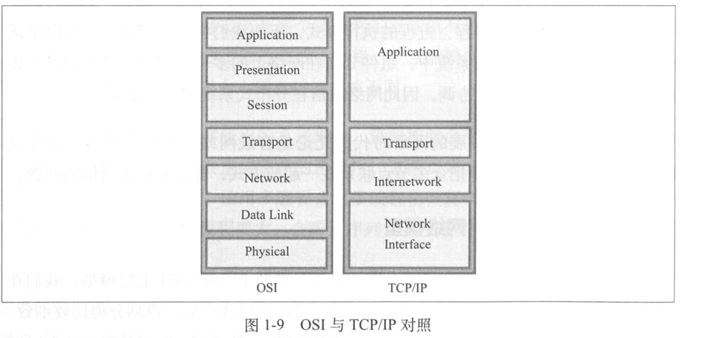
+ 网络IO
	+ BIO(Blocking IO)
	---
	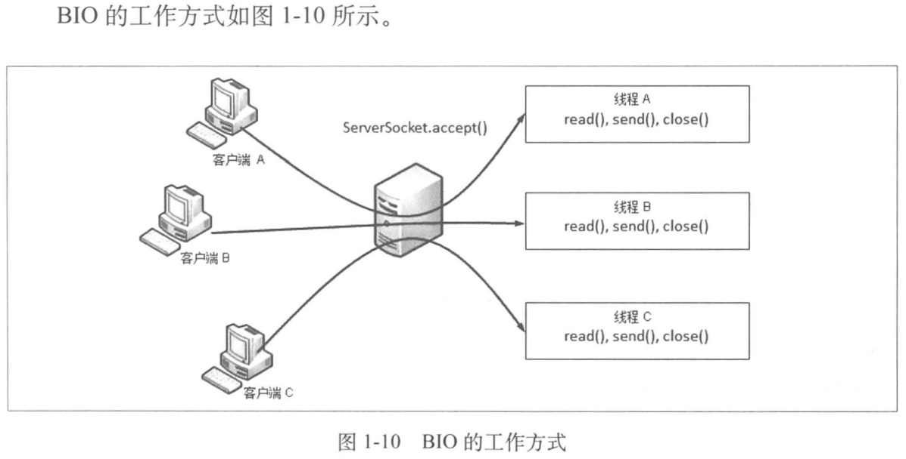
	+ NIO(Nonblocking IO)
		+ reactor模式
		---
		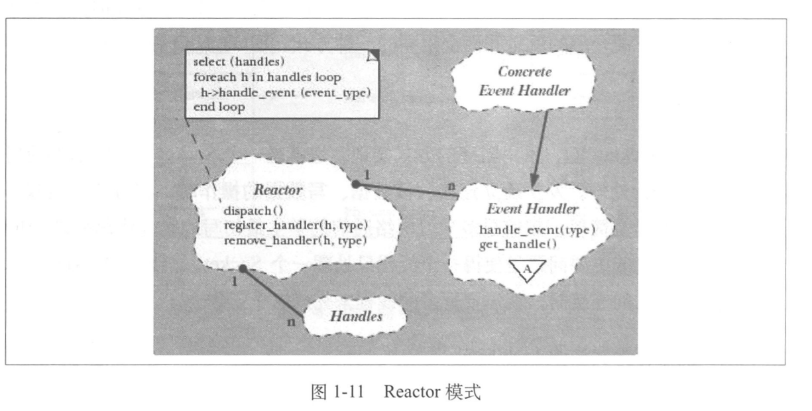
		+ reactor in BIO
		---
		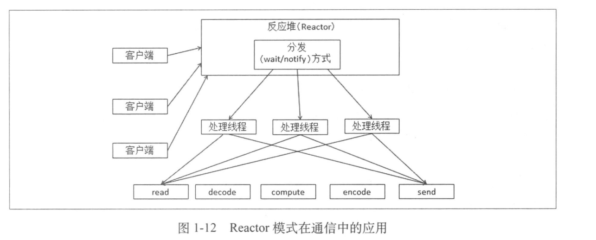
	+ AIO(Asynchronous IO)
		+ proactor模式
		---
		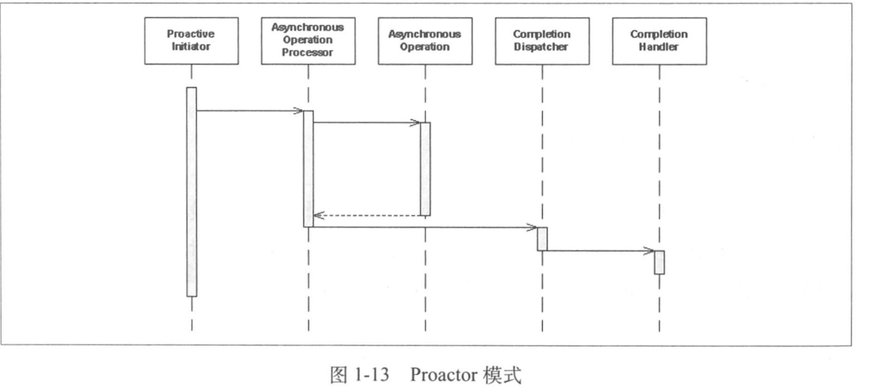
		+ proactor in BIO
+ 单机到分布式的扩展
	+ 系统中各节点的控制方式
		+ 硬件负载均衡
		---
		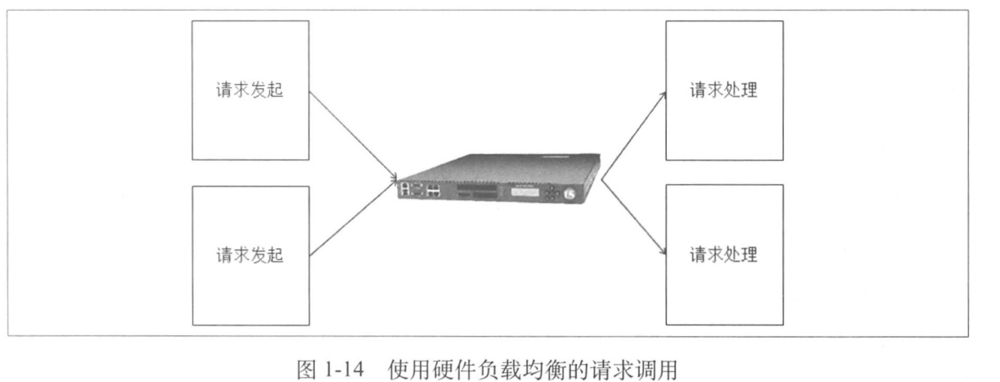
		+ 软件负载均衡
		---
		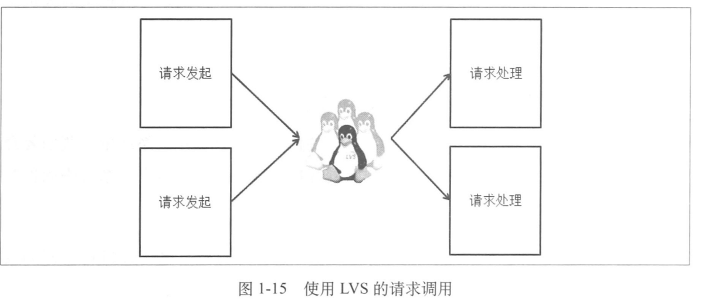
		+ 名称服务的直连方式
		---
		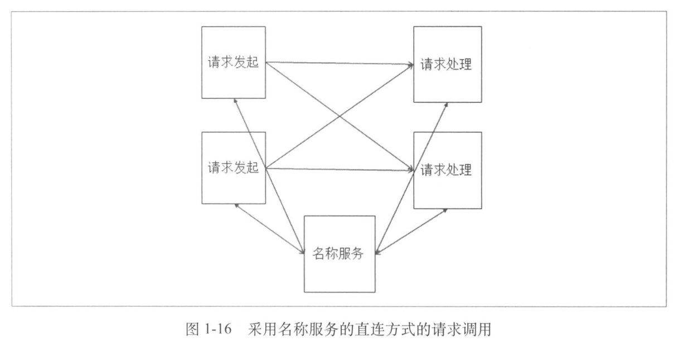
		+ 规则服务器控制路由的直连方式
		---
		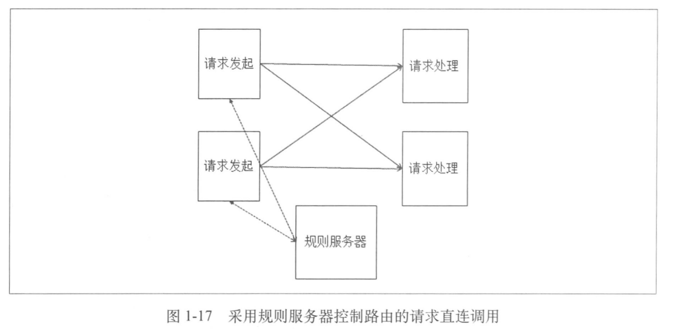
		+ 主从分配方式
		---
		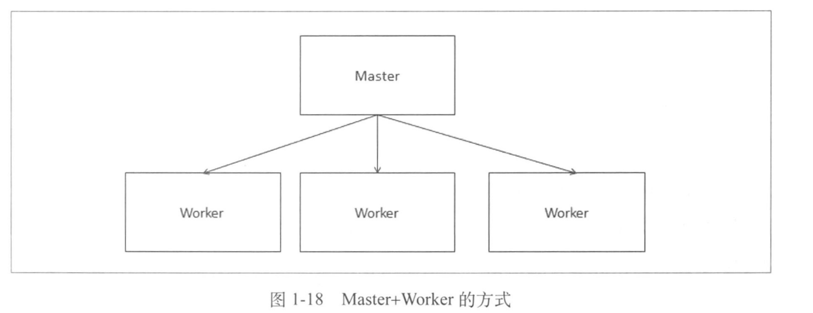
	+ 系统的运算控制
		+ DNS调度和控制
		---
		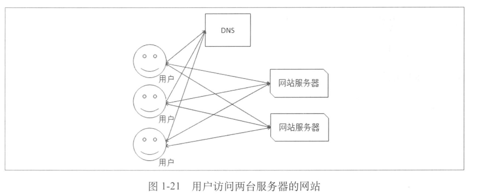
		+ 带负载均衡的DNS调度和控制
		---
		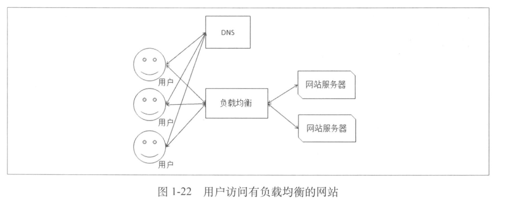
	+ 系统的存储控制
		+ 代理服务器
		---
		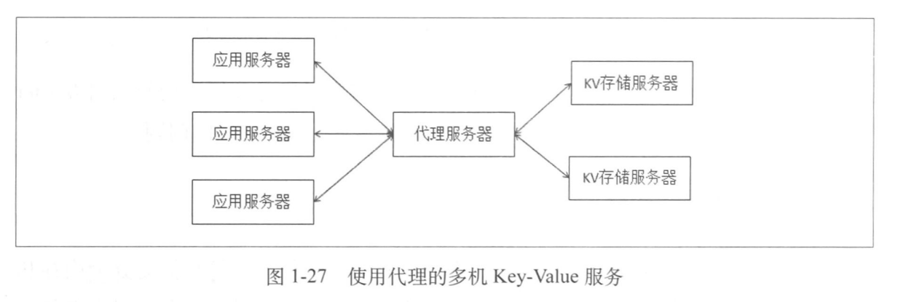
		+ 名称服务
		---
		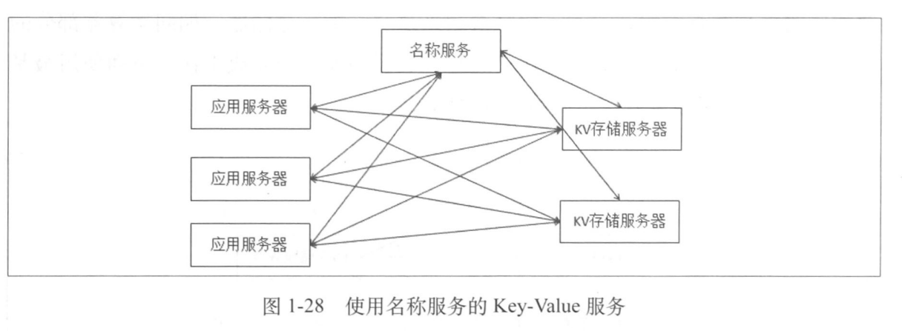
		+ 规则服务器
		---
		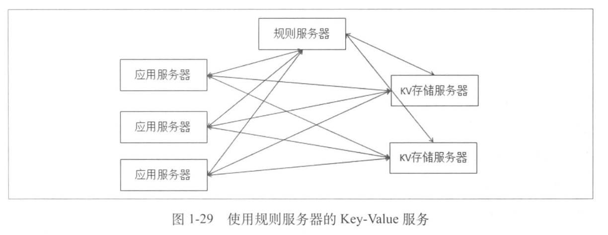
		+ Master控制
		---
		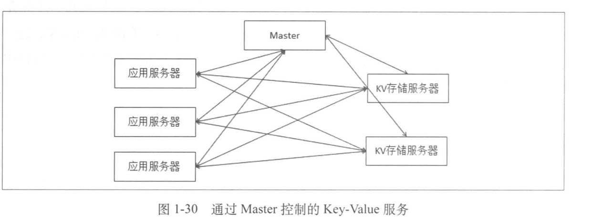
+ 难点
	+ 缺乏全局时钟
	+ 存在故障独立性
	+ 单点故障处理
		+ 给单点做备份，并可以自动恢复
		+ 降低单点故障的影响范围(如数据库拆分，但会增加故障出现的次数和持续时间)
	+ 事务操作的挑战