# 数据访问层
+ 单机数据库
---
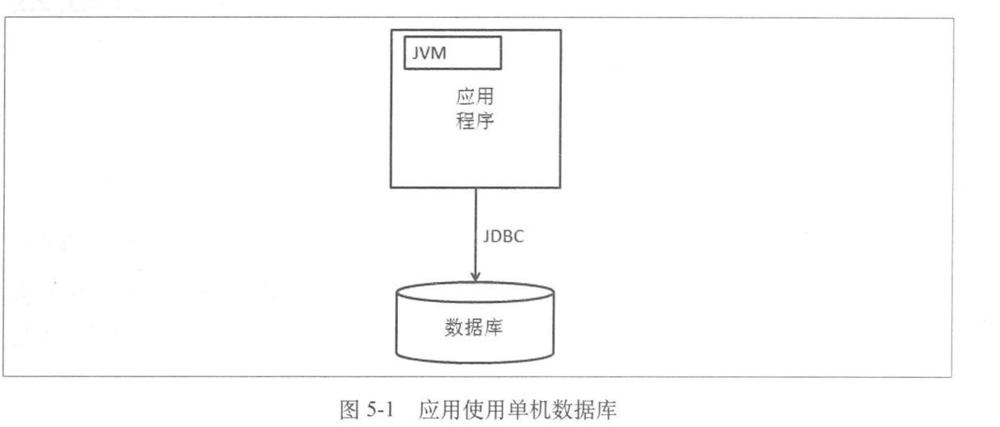
+ 数据库拆分
	+ 数据库拆分后的问题
	---
	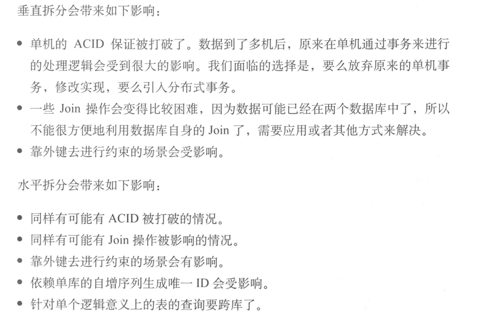
	+ 分布式事务(X/OPEN DTPM模型)
	---
	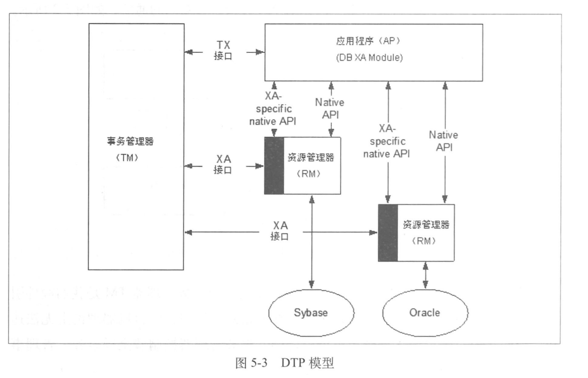
	+ 两阶段提交
	---
	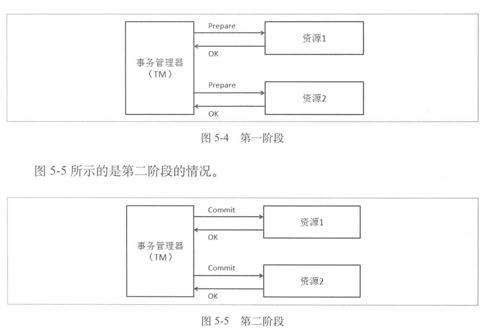
	+ CAP理论
	---
	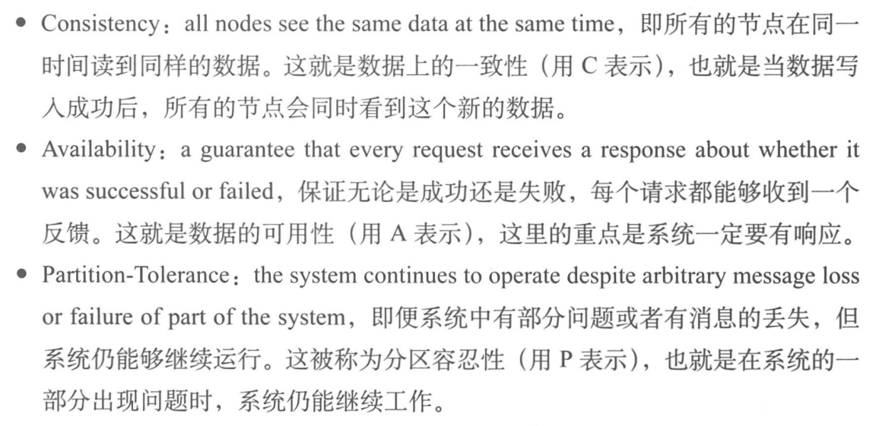
	---
	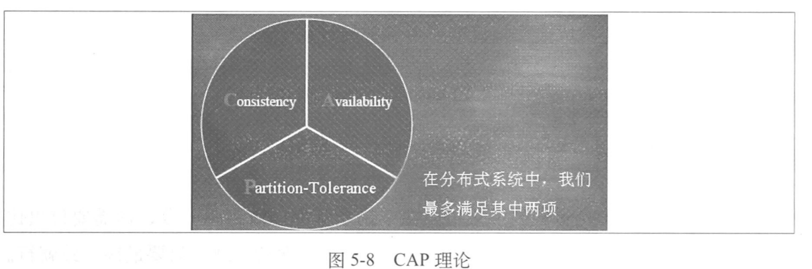
	+ Base理论
	---
	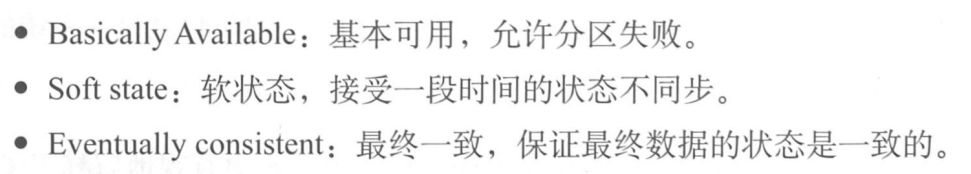
	+ Paxos理论
	---
	
	+ 独立Id生成器
	---
	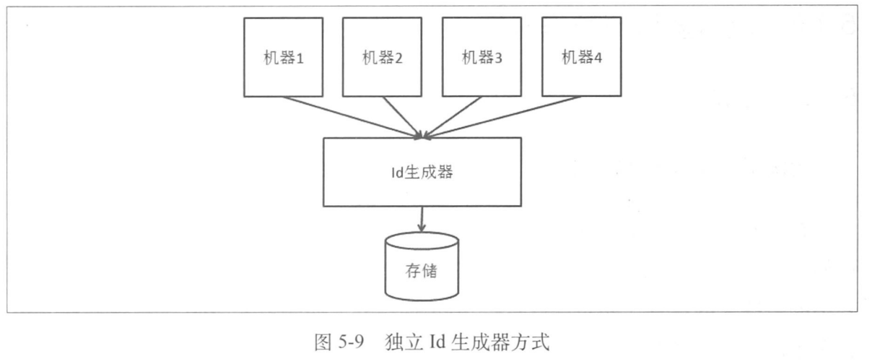
	+ 嵌入式Id生成器
	---
	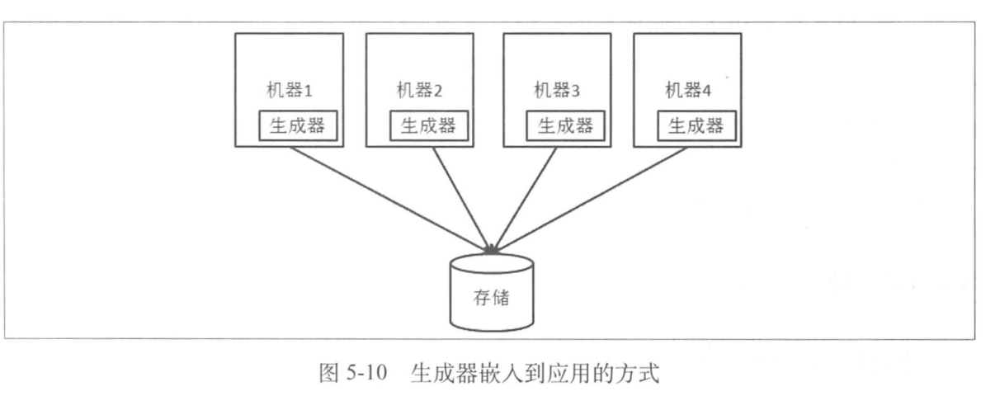
	+ 多机数据查询
		+ 跨库join
		---
		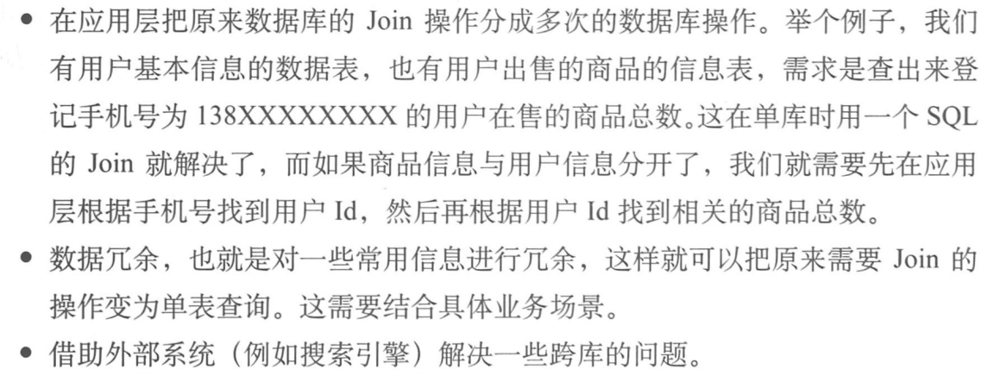
		+ 外键约束
	+ 数据层结构
	---
	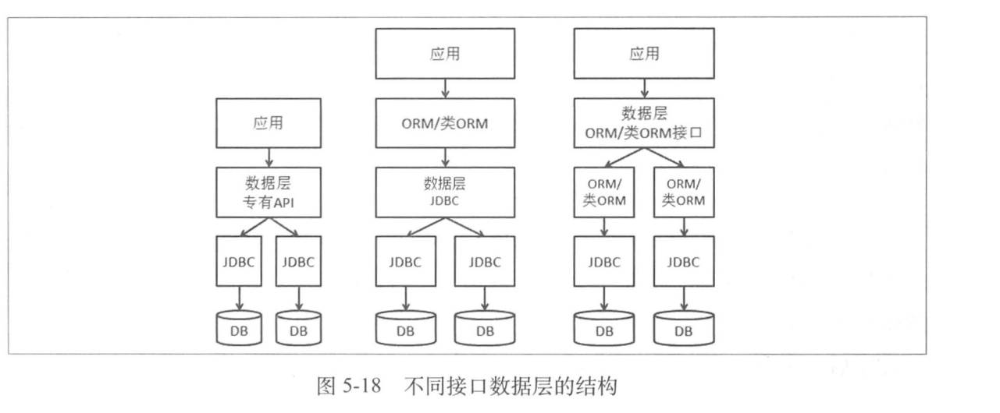
	+ 数据层处理流程
	---
	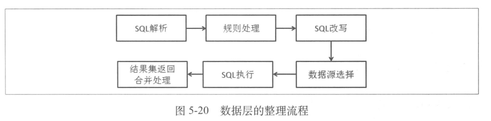
	+ 分库分表规则
		+ 固定哈希(某一字段取模)
		+ 一致性哈希
		+ 虚拟节点
+ 独立部署的数据访问层
	+ 数据访问层外部结构
	---
	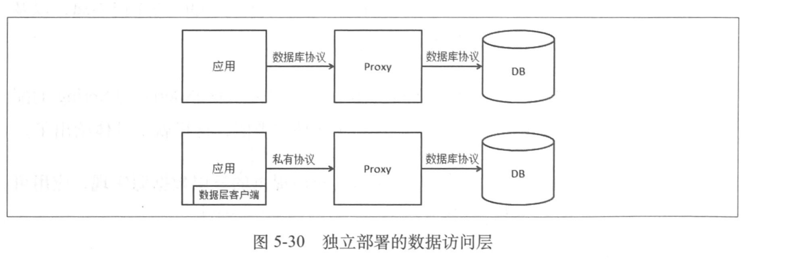
	+ 数据访问层内部结构
	---
	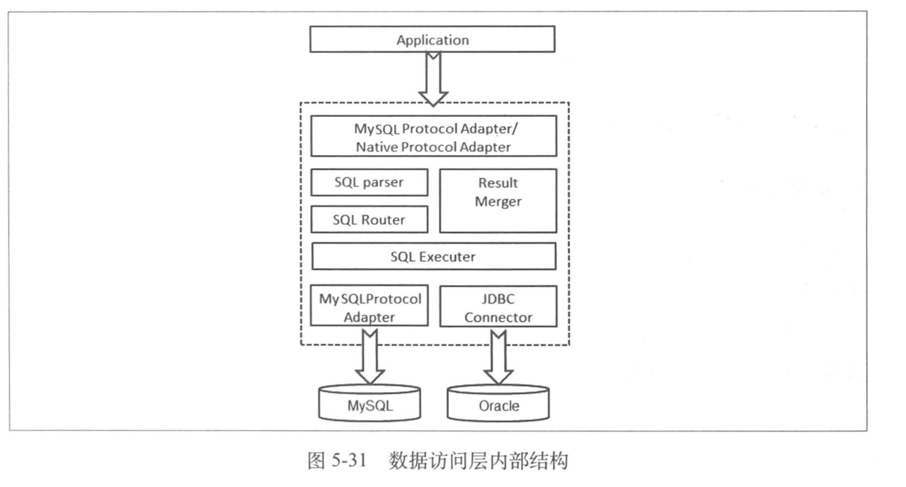
+ 读写分离
	+ 读写分离结构
	---
	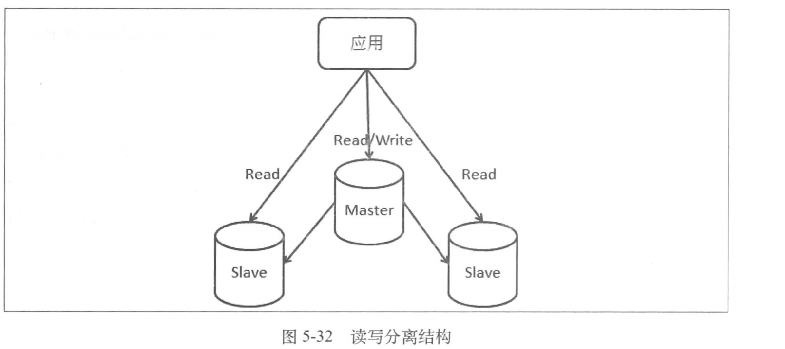
	+ 通过消息实现主从库数据同步(对称复制)
	---
	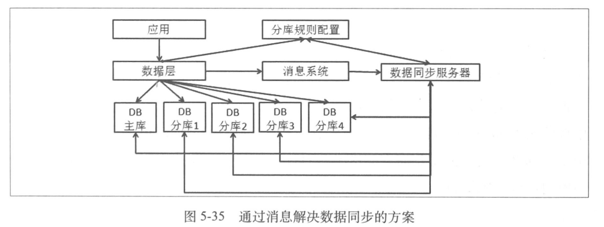
	+ 数据变更平台
	---
	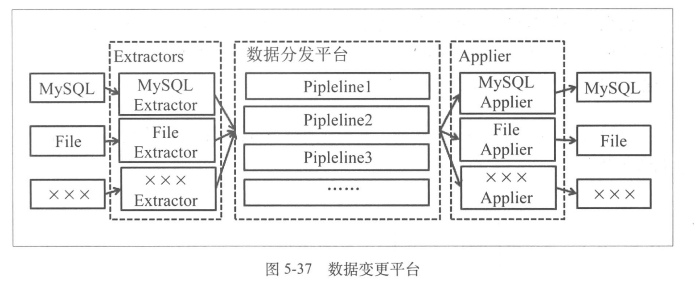
+ 数据层结构图
---
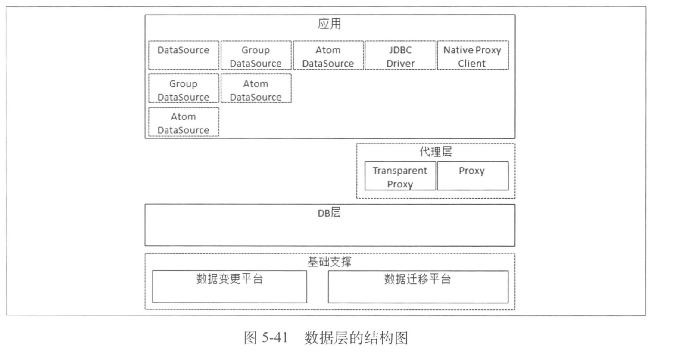
