# 服务框架
+ 架构演化
	+ 优化前的架构
	---
	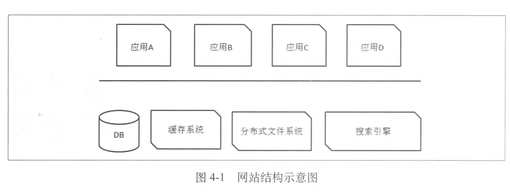
	+ 按照功能拆分
	---
	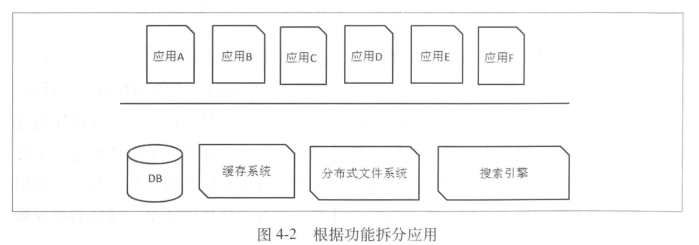
	+ 服务化方案
	---
	
+ 服务调用端处理
---
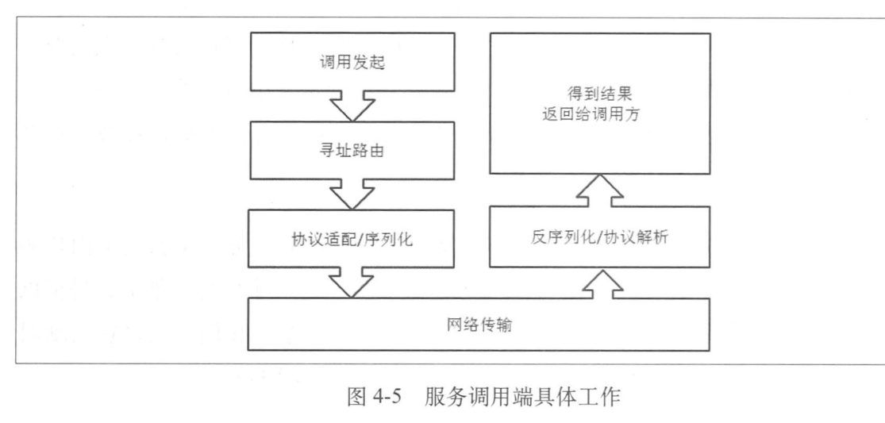
+ 服务架构的部署
	+ 把服务架构作为应用的一个依赖包与应用一起打包。
	---
	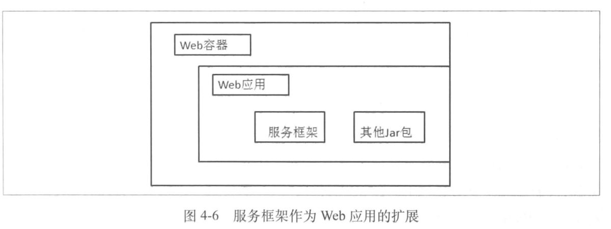
	+ 把服务架构作为容器的一部分。
	---
	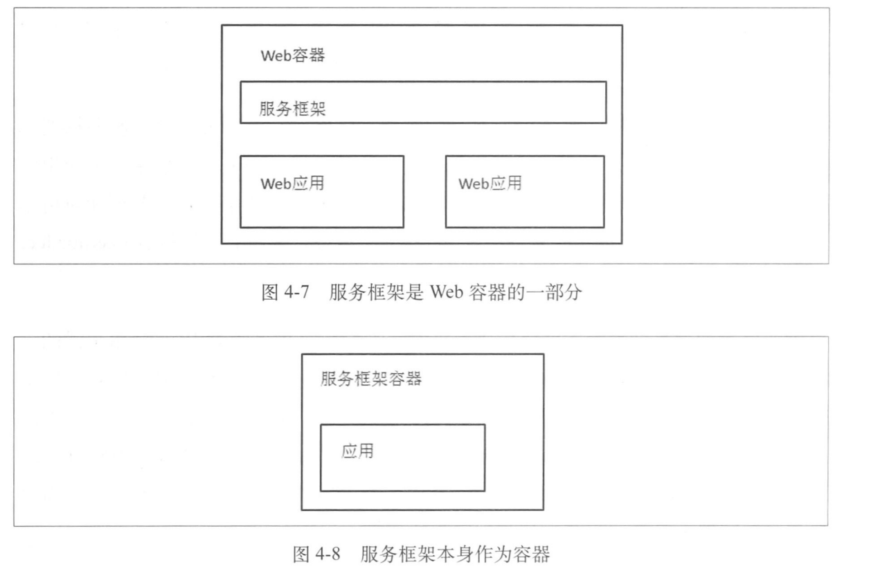
+ Java Class Loader
---
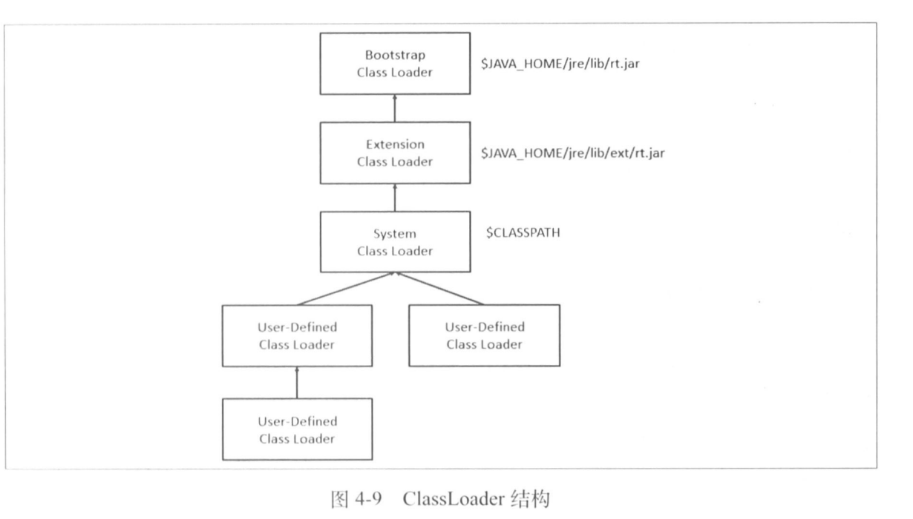
+ 调用者集群与服务提供者之间的通信
	+ 问题
	---
	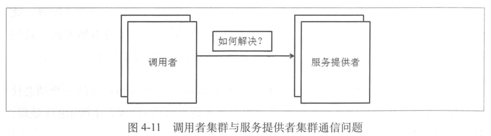
	+ 通信方式
		+ 透明代理
		---
		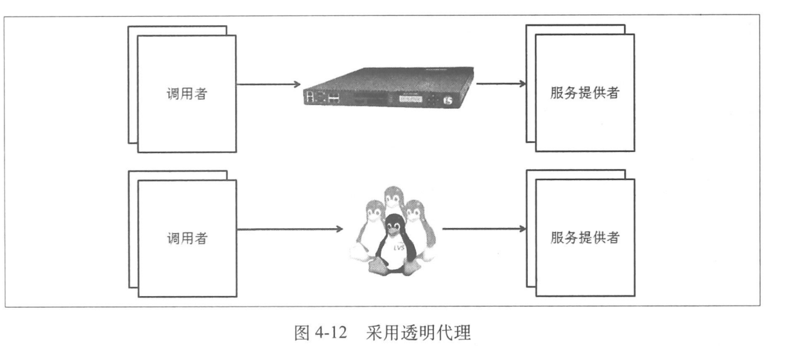
		+ 直连
		---
		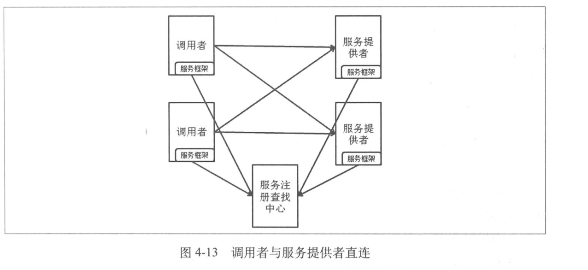
	+ 网络通信实现
		+ BIO方式
		---
		
		+ NIO方式
		---
		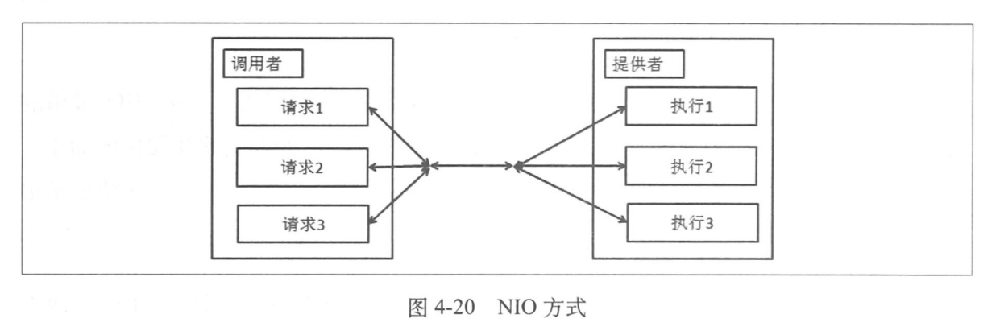
		---
		
		+ OneWay方式
		---
		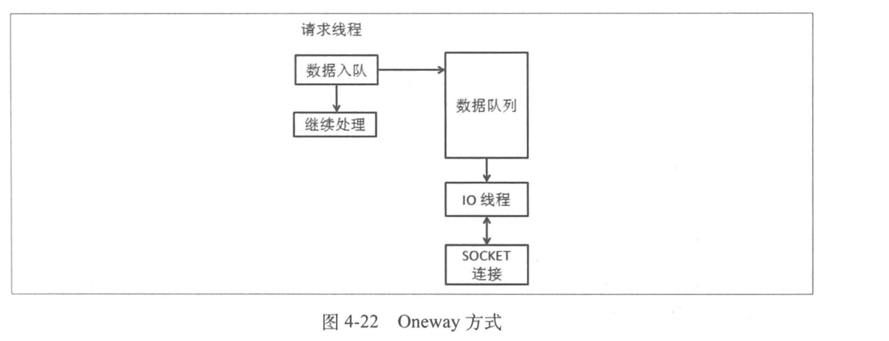
		+ callback方式
		---
		
		+ Future方式
		---
		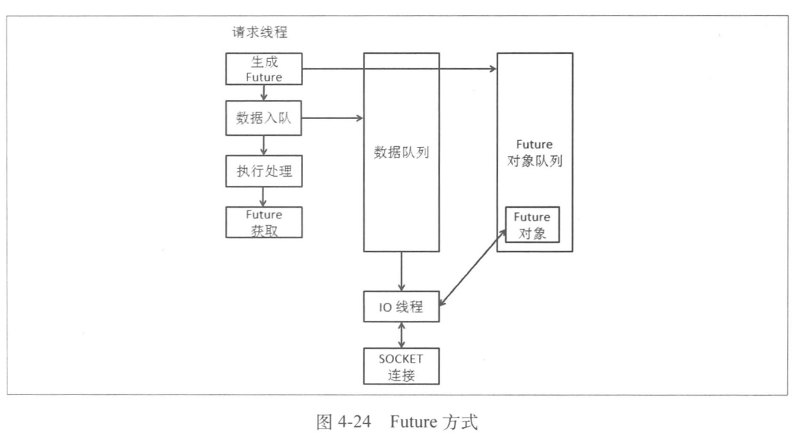
		+ 可靠异步方式
+ 服务架构
---
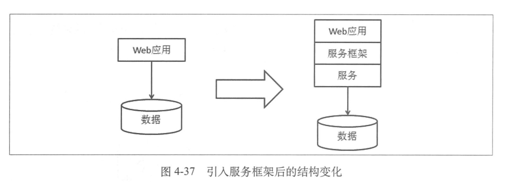