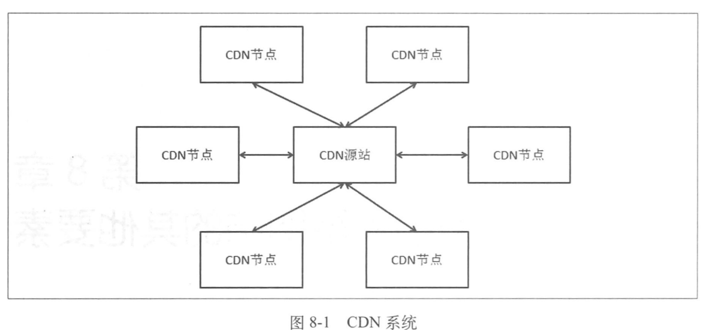
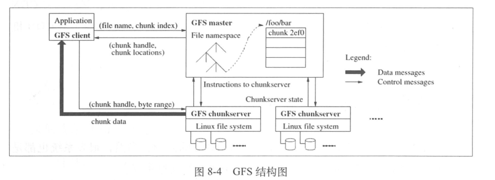
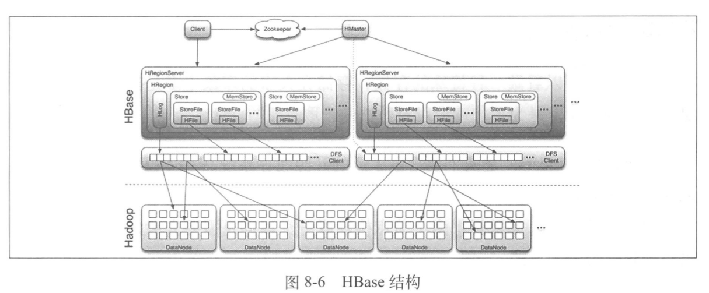
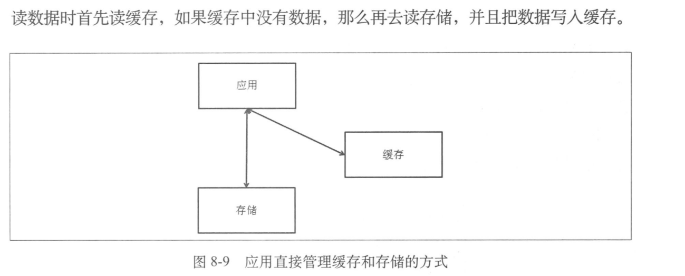
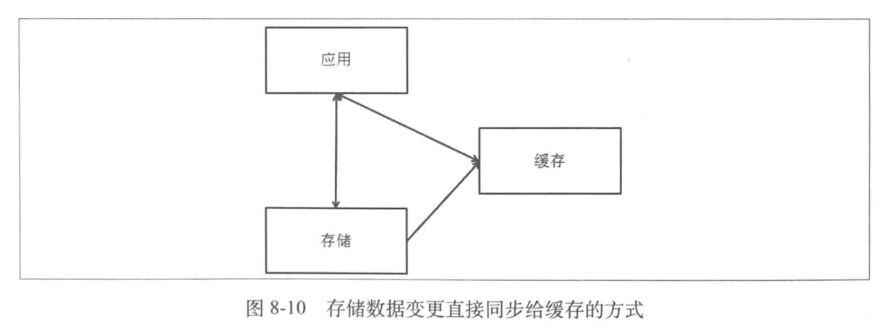
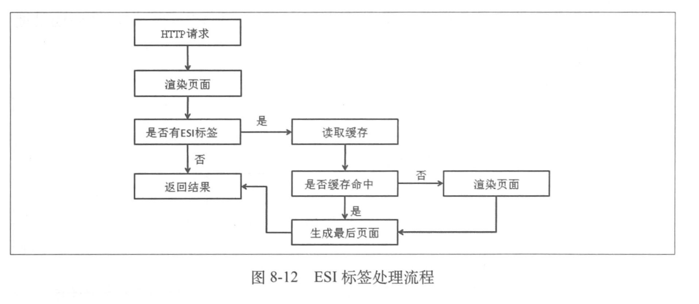
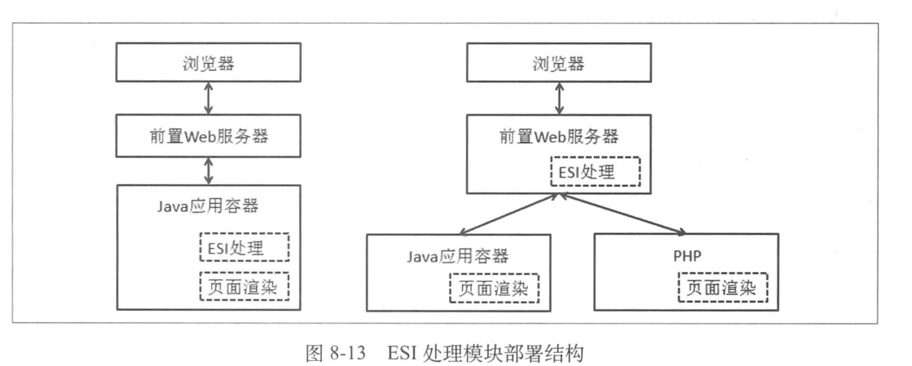
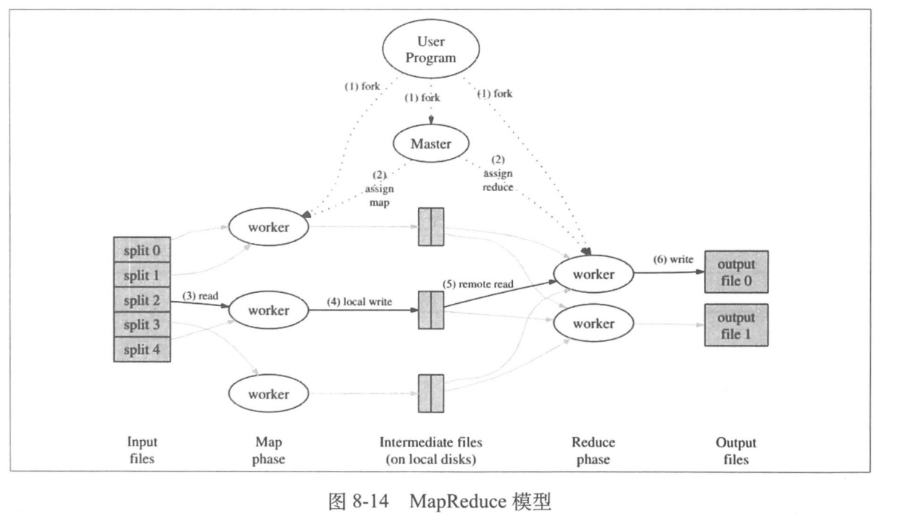
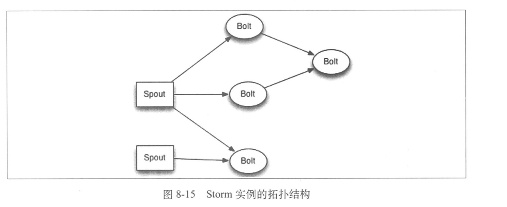
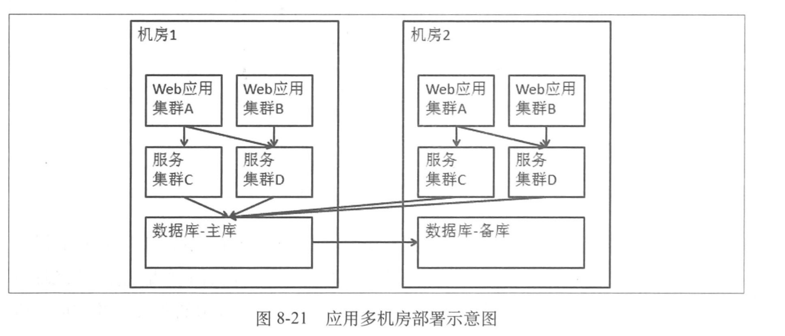

# 构建大型网站的其它要素
+ CDN(Content Delivery Network)
---

+ CDN所需技术
	+ 全局调度
	+ 缓存技术
	+ 内容分发
	+ 带宽优化
+ 存储支持
	+ 分布式文件系统
	---
	
	+ NoSql
		+ Hbase
		---
		
	+ 缓存系统
		+ 开源系统
			+ Redis
			+ Memcache
		+ 缓存与存储
		---
		
		---
		
		---
		
		+ 工作流程
		---
		
		---
		
+ 搜索系统
	+ 更新索引
		+ 从数据源定时拉取
		+ 将数据变更的消息通知搜索引擎构建索引
	+ 倒排索引
	+ 查询预处理
	+ 相关度计算
		+ 向量空间模型
		+ 概率模型
+ 数据计算支撑
	+ 离线计算
		+ MapReduce(Hadoop)
		---
		
	+ 在线计算
		+ 流式计算(Storm)
			+ storm拓扑结构
			---
			
+ 系统发布
	+ 分发应用
	+ 启动校验
	+ 灰度发布
	+ 产品改版Beta
+ 应用监控系统
	+ 数据监控
	+ 数据记录方式
	+ 数据采集方式
	+ 展现与警告
+ 依赖管理系统
+ 多机房问题分析
	+ 应用多机房部署
	---
	
+ 系统容量规划
+ 内部私有云