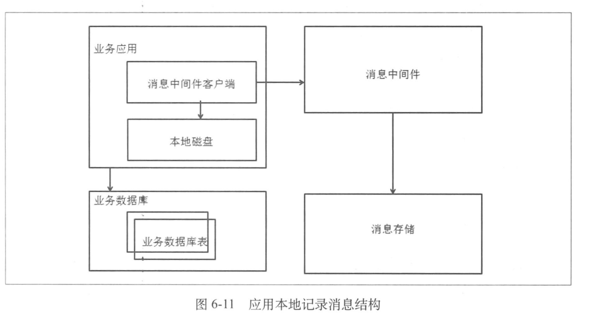

# 消息中间件
+ 消息中间件结构
---

+ 实例
	+ 无消息中间件
	---
	
	+ 使用消息中间件
	---
	
+ 消息发送一致性方案
---

---

+ 解决消息中间件与使用者之间的强依赖关系的方案
	+ 应用与消息中间件一起操作消息表
	---
	
	+ 消息中间件不直接操作消息表
	---
	
	+ 使用本地存储记录消息
	---
	
+ 消息模型
	+ JMS Queue模型(PTP模型)
	---
	
	+ JMS Topic模型(Pub/Sub模型)
	---
	
	+ 集群下的方案
		+ ClusterId
		---
		
		+ JMS级联(可用性不高)
		---
		
+ 消息订阅者订阅消息的方式
	+ 持久订阅
	---
	
	+ 非持久订阅
	---
	
+ 消息可靠性保证
	+ 消息系统
	---
	
	+ 可靠性保证
		+ 消息发送端可靠
		+ 消息存储可靠
			+ 文件消息存储
			+ 数据库消息存储
			+ 双机内存消息存储
		+ 消息投递的可靠
+ 消息局部顺序
