# 软负载中心与集中配置管理
+ 软负载中心
	+ 聚合地址信息
	---
	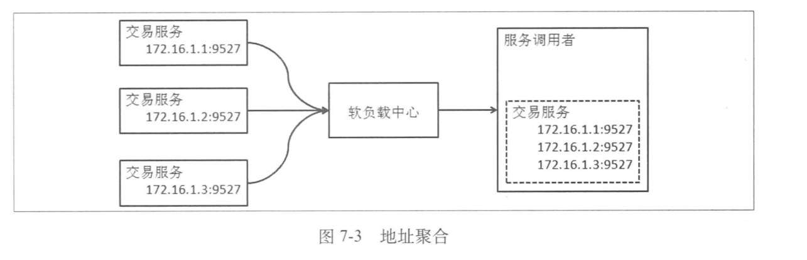
	+ 服务上下线感知
	---
	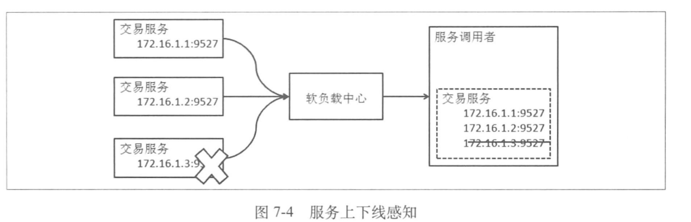
+ 软负载中心与使用者
---
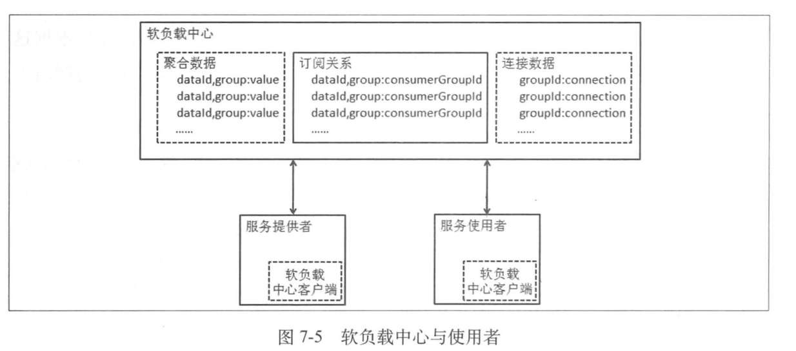
+ 内容聚合功能
	+ 作用
		+ 保证数据正确性
			+ 并发下数据正确性的保证
			+ 数据删除、更新的顺序保证
		+ 高效聚合数据
		+ 大量数据同时插入、更新时的性能保证
	+ 数据处理
		+ 多线程数据处理的竞争问题
		---
		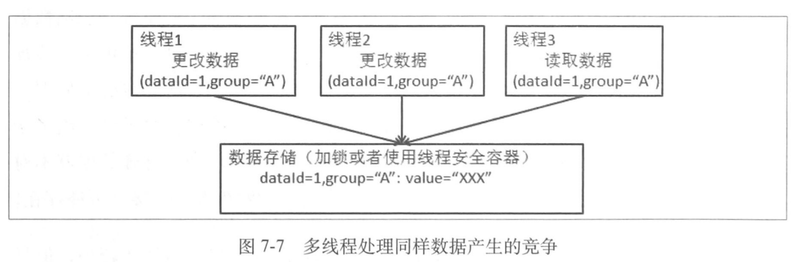
		+ 单线程数据处理
		---
		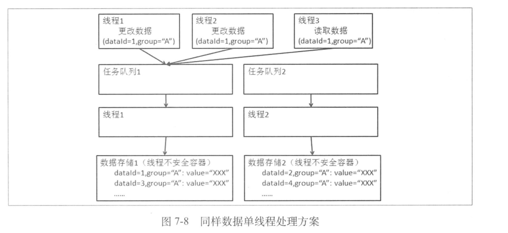
	+ 服务上下线的感知
		+ 通过客户端与服务端之间的连接感知
		+ 通过对于发布数据中提供的地址端口进行连接的验证
+ 软负载中心的数据分发
	+ 数据分发性能提升
		+ 数据压缩
		+ 全量与增量的选择
+ 针对服务化的特性支持
	+ 软负载数据分组
	+ 提供自动感知以外的上下线开关
+ 维护管理路由规则
+ 从单机到集群
	+ 数据管理
		+ 数据统一管理
		---
		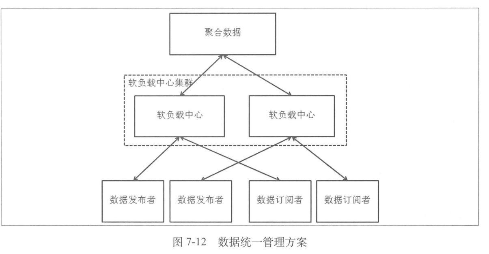
		---
		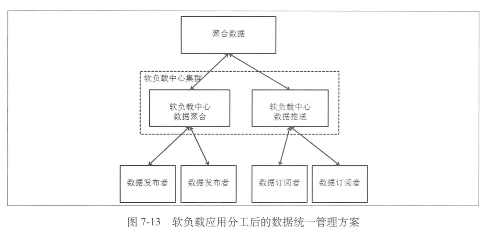
		+ 数据对等
		---
		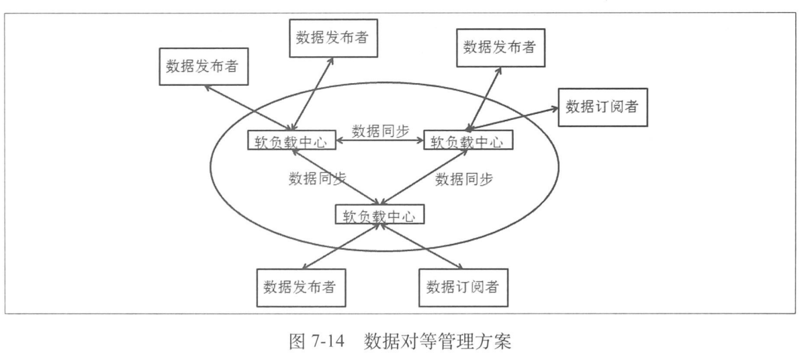
		+ 数据同步
		---
		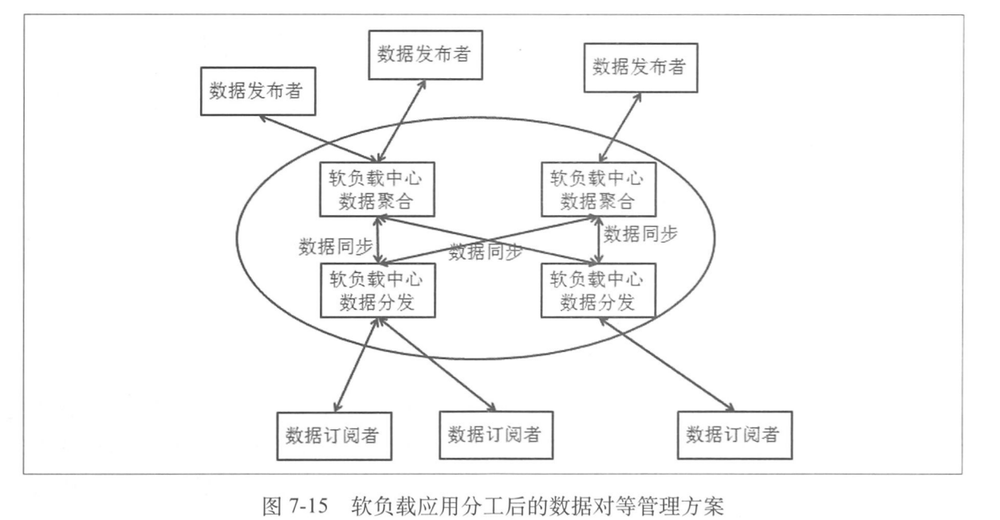
	+ 连接管理
+ 集中配置管理中心
	+ 集中配置管理中心结构
	---
	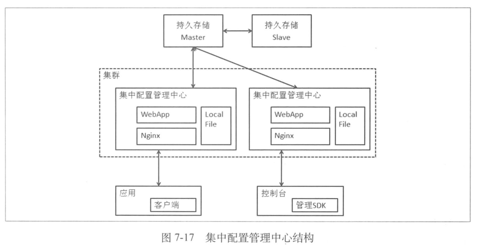
	+ 客户端与服务端通信
	---
	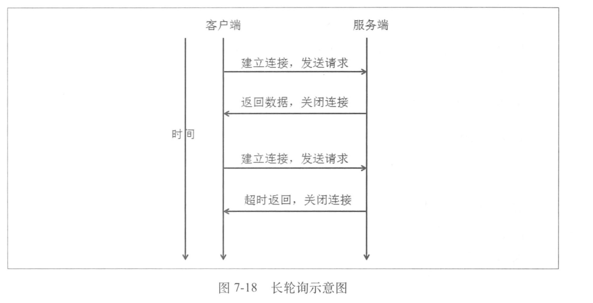
	+ 容灾策略
		+ 数据缓存
		+ 数据快照
		+ 本地配置
		+ 文件格式