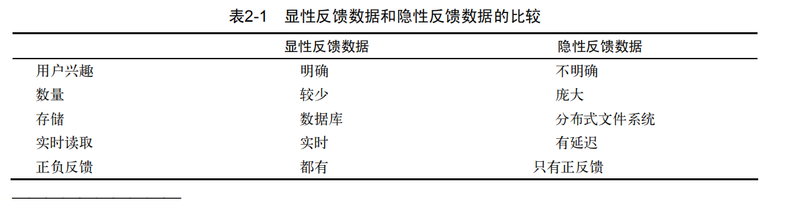
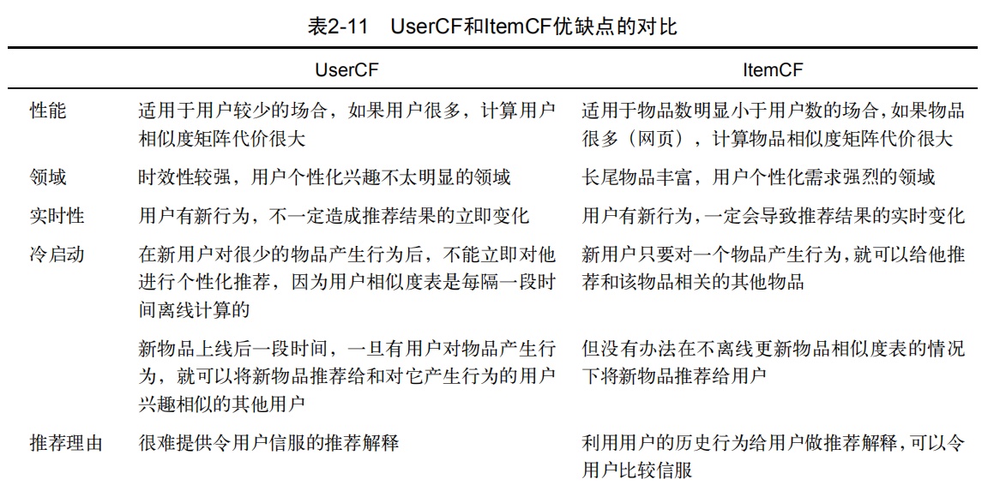

# 利用用户行为数据
+ 用户行为
	+ 显性反馈行(explicit feedback,用户明确表示对物品喜好的行为)
		+ 评分
		+ 评论
		+ 购买
		+ 打标签
	+ 隐性反馈行为(implicit feedback)
		+ 网页浏览
	+ 对比
	---
	
+ 用户行为分析
	+ 长尾分布
+ 协同过滤
```
用户齐心协力，通过不断地和网站互动，
使自己的推荐列表能够不断过滤掉自己不感兴趣的物品，从而越来越满足自己的需求
```
	+ 基于邻域的方法(neighborhood-based)
		+ 基于用户的协同过滤算法(UserCF)
			+ 找到和目标用户兴趣相似的用户集合
			+ 找到这个集合中的用户喜欢的，且目标用户没有听说过的物品推荐给目标用户
		+ 基于物品的协同过滤算法(ItemCF)
			+ 计算物品之间的相似度
			+ 根据物品的相似度和用户的历史行为给用户生成推荐列表
		+ 对比
		---
		
	+ 隐语义模型(latent factor model,通过隐含特征联系用户兴趣和物品)
		+ 隐含语义分析技术，采取基于用户行为统计的自动聚类
	+ 基于图的随机游走算法(random walk on graph)
		+ 可以把基于邻域的模型看做基于图的模型的简单形式