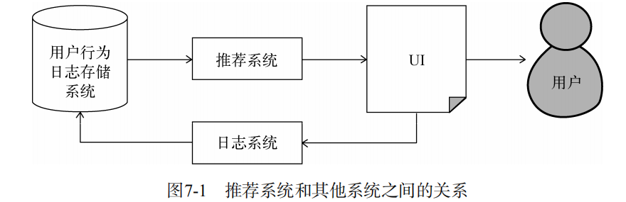
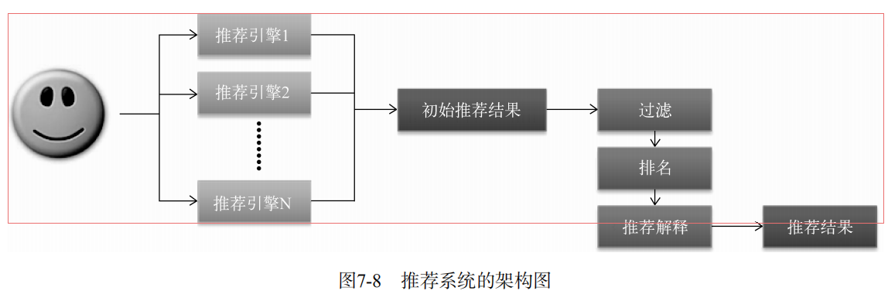
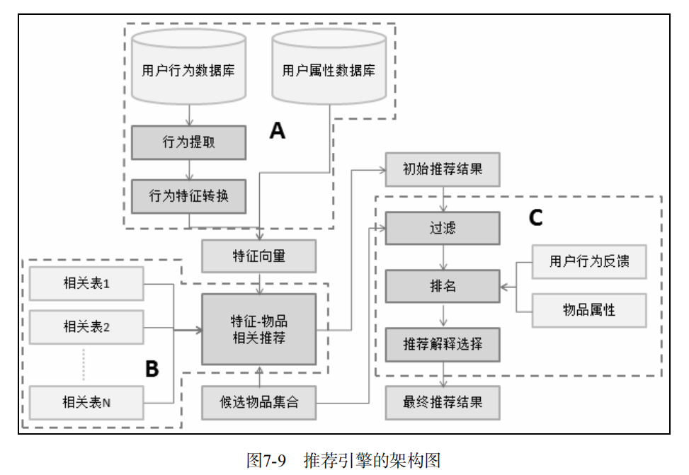

# 推荐系统实例
+ 外围架构
	+ 推荐系统和其它系统之间的关系
	
+ 推荐系统架构
---

---
+ 
	+ 用户特征
		+ 人口统计学特征:用户的年龄、性别、国籍和民族等用户在注册时提供的信息
		+ 用户的行为特征:用户浏览过什么物品、收藏过什么物品、给什么物品打过什么样的分数等用户行为相关的特征
		+ 用户的话题特征:根据用户的历史行为利用话题模型将电视剧和电影聚合成不同的话题，并且计算出每个用户对什么话题感兴趣
+ 推荐引擎架构
---

---
+ 
	+ 生成用户特征向量
		+ 用户行为的种类
		+ 用户行为产生的时间
		+ 用户行为产生的次数
		+ 物品的热门程度
	+ 特征—物品相关推荐
	+ 过滤模块
		+ 用户已经产生过行为物品
		+ 候选物品以外的物品
		+ 某些质量很差的物品
	+ 排名模块
		+ 新颖性排名
		+ 类别多样性
		+ 时间多样性
		+ 用户反馈
