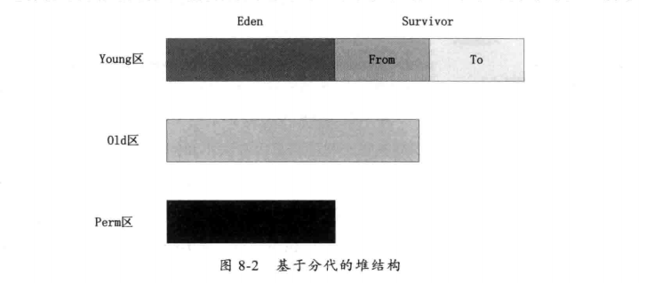
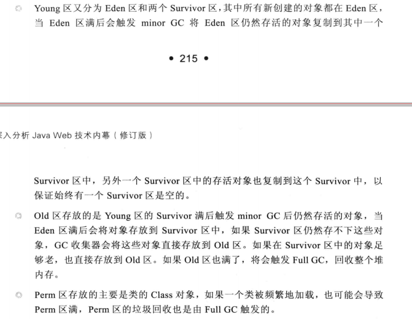

# JVM内存管理
+ 需要使用内存的Java组件
	+ Java堆(JVM启动时向操作系统申请，Xmx:最大大小,Xms:初始大小)
	+ 线程(根据CPU核数来分配创建的线程数)
	+ 类和类加载器
	+ NIO(分配本机内存而非JVM堆上的内存)
	+ JNI
+ JVM内存结构
	+ Java运行时数据
		+ PC寄存器数据(当前执行的程序的内存地址)
		+ Java栈(创建线程时由JVM创建)
		+ 堆(Java对象存储区域)
		+ 方法区(类结构信息的存储区域)
		+ 本地方法区(JVM运行Native的区域)
		+ 运行时常量池
+ HotSpot堆结构
	+ Yong区(占整个堆的1/4)
		+ Eden区
		+ Survivor区1(占整个Young区的1/8)
		+ Survivor区1
	+ Old区
	+ Perm区
	---
	
	+ GC机制
	---
	
+ HotSpot垃圾回收算法
	+ Serial Collector
	+ Parallel Collector
		+ ParNewGc
		+ ParallelGC
		+ ParallelOldGc
	+ CMS Collector