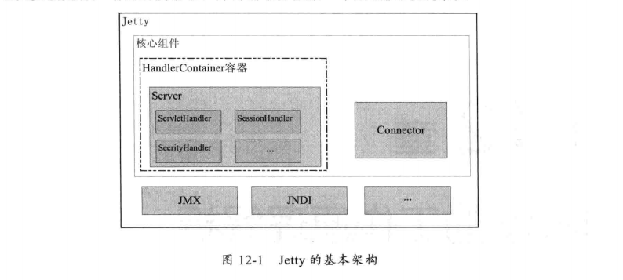
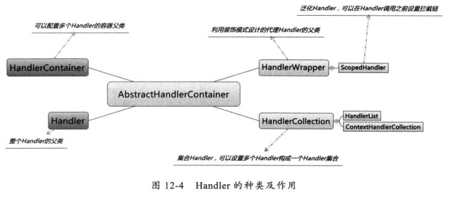
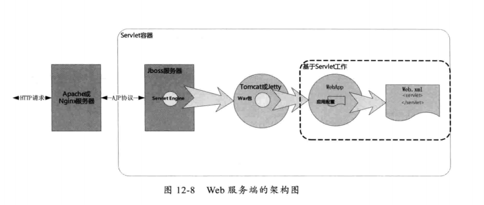

# Jetty工作原理解析
+ Jetty基本架构
---

+ Handler种类及作用
---

+ Web服务端架构图
---

+ 与JBoss集成
+ Jetty与Tomcat比较
	+ 架构比较
		+ Jetty基于Handler，架构较为简单，易于扩展
		+ Tomcat基于容器，架构较为复杂
	+ 性能比较
		+ Jetty可以同时处理大量连接并长时间保存(更适合Web聊天应用)，Jetty可以按需加载组件，默认使用NIO技术(更适合处理静态资源)
		+ Tomcat处理少数且频繁的连接时总体性能更高，Tomcat默认使用BIO技术
	+ 特性比较
		+ Jetty整体架构简单，开发社区更加活跃，对新的Servlet规范响应更快
		+ Tomcat使用更加广泛，对Servlet规范的支持更加全面，但对新的规范反应较慢