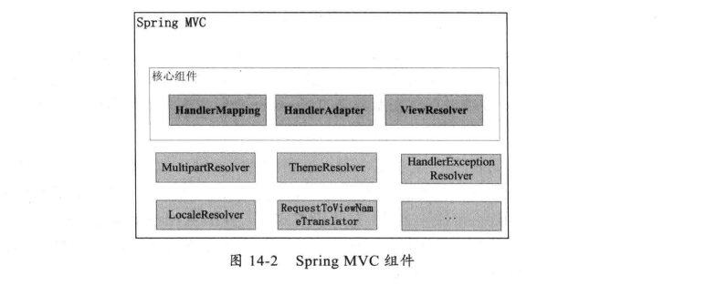
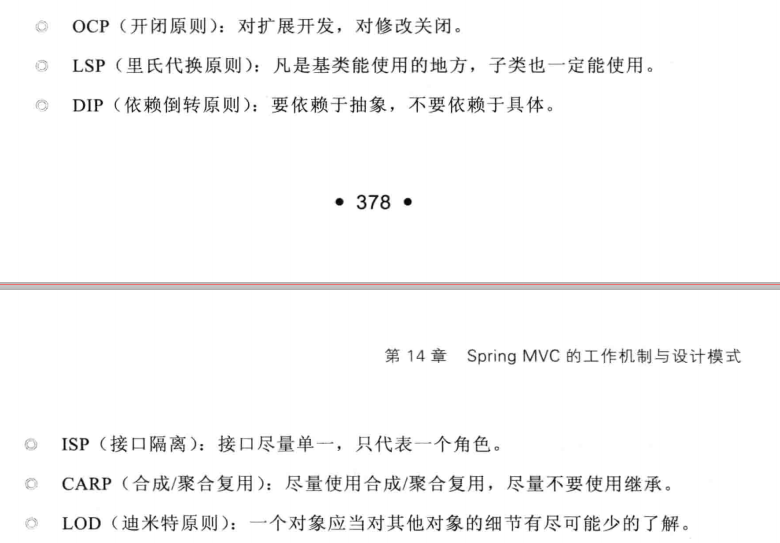

# SpringMVC的工作机制与设计模式
+ SpringMVC组件
---

+ SpringMVC设计
	+ DispatcherServlet
	+ Control设计
		+ HandlerMapping
		+ HandlerAdapter
	+ Model设计(ModelAndView对象)
	+ View设计(ViewResolver)
+ 软件设计基本原则
---

+ 设计模式
	+ 模板模式(HandlerMapping,SpringMVC中的View)
