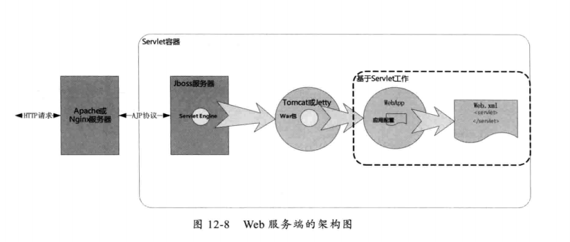
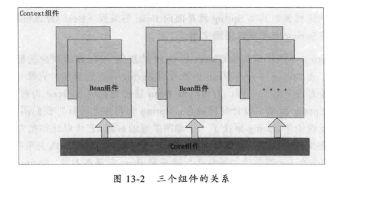

# Spring框架的设计理念与设计模式分析
+ Spring架构图
---

+ Spring设计理念(BOP Bean Oriented Programming)
	+ 使用配置文件管理对象之间的依赖关系
	+ 依赖注入
	+ Ioc容器(Bean之间的关系集合)
	+ 三大核心组件
		+ Bean组件(工厂模式)
		+ Context组件(Ioc容器：三大组件之间构建的Bean关系网)
		+ Core组件
		
+ IoC容器如何工作
	+ 创建BeanFactory工厂
	+ 创建Bean实例并构建Bean的关系网
	+ Ioc容器的扩展点
	+ Ioc容器如何使用(默认配置文件:ApplicationContext.xml)
+ Spring特性
	+ AOP(Aspect Oriented Programming，基于动态代理实现)
		+ 动态代理
		+ 实现原理：在Spring中创建对象后，调用目标对象上的方法都会被代理到InvocationHandler类的invoke()方法中执行
+ Spring中的设计模式
	+ 代理模式(JDK动态代理)
	+ 策略模式(Bean对象的创建和代理对象的创建)
