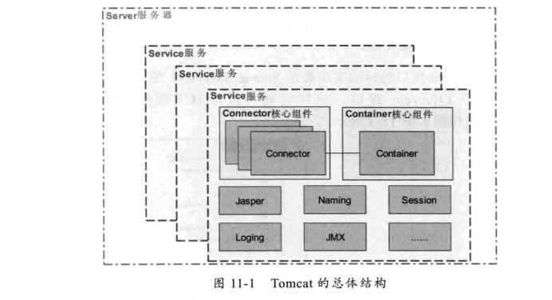

# Tomca系统架构与设计模式
+ Tomcat结构
---

	+ Connector组件(接收浏览器发过的TCP连接请求)
	+ Container(Servlet容器)
		+ Engine容器
			+ Host容器
				+ Context容器
					+ Wrapper容器
+ Tomcat中的设计模式
	+ 门面(Facade)设计模式
	+ 观察者(发布-订阅)设计模式(LifecycleListener)
	+ 命令设计模式(ConnecTor与Container之间)
	+ 责任链设计模式(Tomcat容器：Engine-Host-Context-Wrapper)