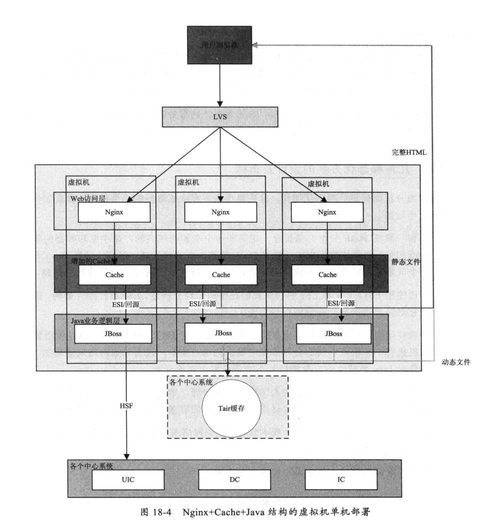

# 大浏览量系统的静态化架构设计
+ 淘宝前台系统基本结构
---

+ 淘宝前台系统结构图
---

+ 淘宝前台系统的优化历程
---

+ 大浏览量系统的静态改造
	+ 静态化系统
	---
	
	+ 静态化的优点
	---
	
	+ 如何改造动态系统
		+ 动静分离
		---
		
		+ 动态内容结构化(Json化)
		+ 如何组装动态内容
		---
		
	+ 静态化方案
		+ 采用Nginx+Cache+Java结构的虚拟机单机部署
		---
		
		+ 采用Nginx+Cache+Java结构的实体机单机部署
		---
		
		+ 统一Cache层
		---
		
	+ 缓存失效问题
		+ 被动失效
		+ 主动失效
		+ 失效中心
		---
		
	+ CDN化
		+ 面临问题
		---
		
		+ 解决方案
			+ 解决失效问题
			---
			
			+ 解决命中率问题
			---
			
