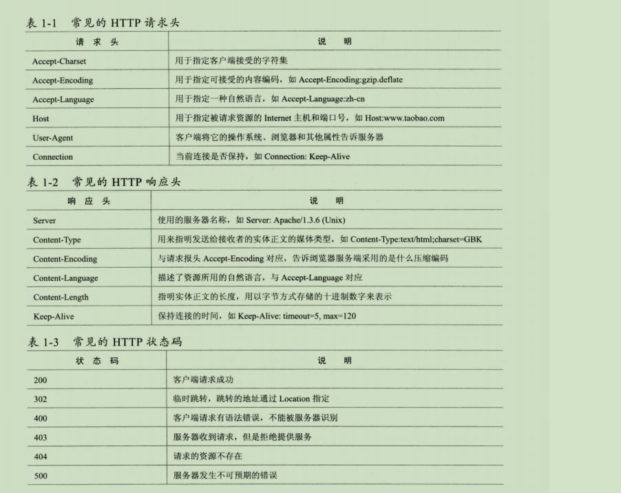

# 深入JavaWeb请求过程
+ HTTP解析
---

+ 浏览器缓存机制
	1. Ctrl+F5组合键刷新页面获取数据，	
		请求头会添加Pragma: no-cache和Cache-Control: no-cache两个参数
	2. http参数
		+ Cache-Control/Pragma:是否使用缓存
		+ Expires：缓存过期时间
		+ Last-Modified/Etag：最后修改时间，根据这个时间判断数据是否最新
+ DNS域名解析
---

+ CDN架构
---

+ 负载均衡
	+ 链路负载均衡
	---
	
	+ 集群负载均衡
		+ 硬件负载均衡
		---
		
		+ 软件负载均衡
		---
		
	+ 操作系统负载均衡
+ CDN动态加速
---

