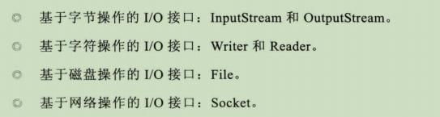
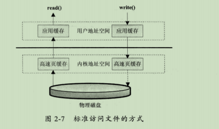
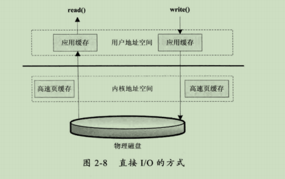
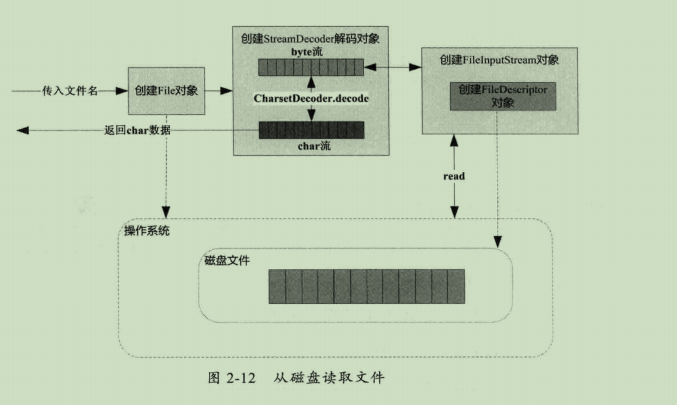
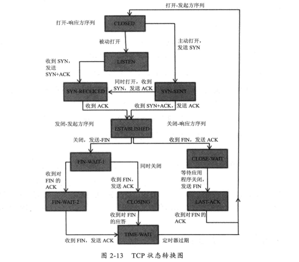
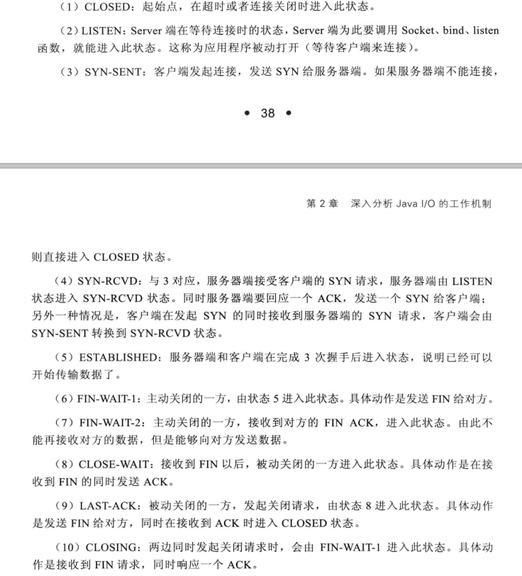
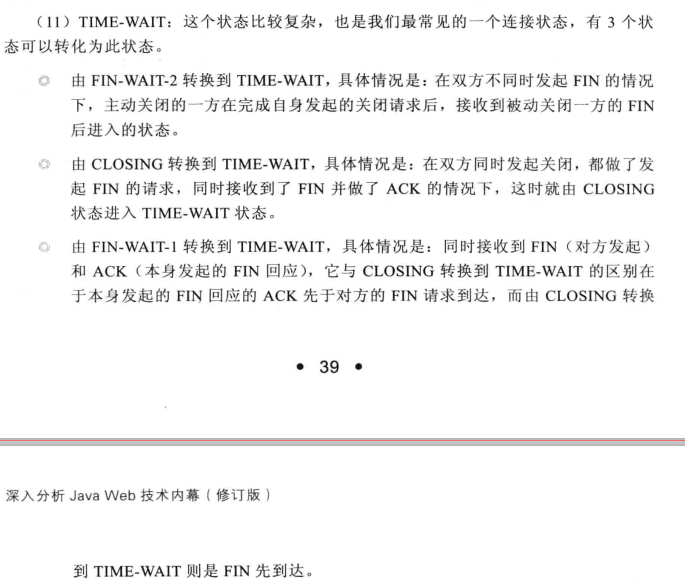
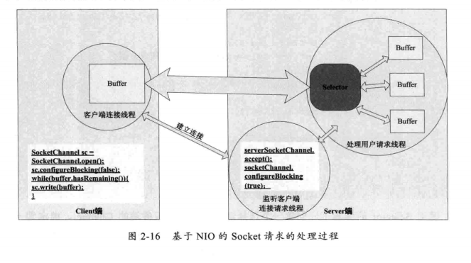

# 深入分析JavaI/O的工作机制
+ Java IO类
---

+ 磁盘IO工作机制
	+ 访问文件的方式
		+ 标准文件访问方式
		---
		
	    + 直接IO的方式(如数据库数据读写)
	    ---
	    
	    + 同步访问文件
	    + 异步访问文件
	    + 内存映射
	+ Java访问磁盘文件
	---
	
+ 网络IO工作机制
	+ TCP连接过程状态转化
	---
	
	---
	
	---
	
	+ 给于NIO的Socket请求处理过程
	---
	