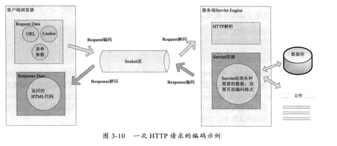

# 深入分析JavaWeb中的中文编码问题
+ 编码格式
	+ ASCII
	+ ISO-8859-1系列
	+ gbk2312
	+ GBK(扩展gbk2312)
	+ GB18030
	+ UTF-16(适合本地磁盘与内存间使用)
	+ UTF-8(适合网络传输使用)
+ Java中需要编码的场景
	+ IO操作时(字符与字节间的转换)
	+ 内存操作时
	+ 一次请求可能的编码
	---
	
