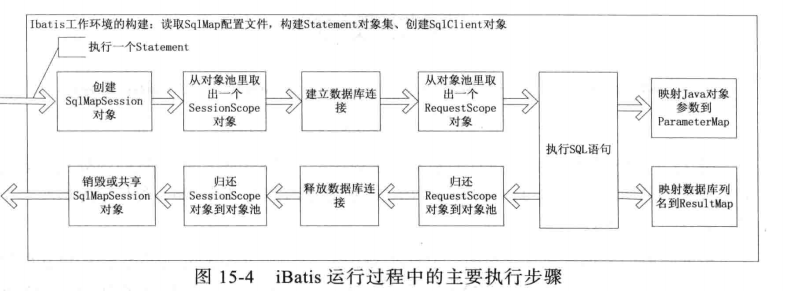
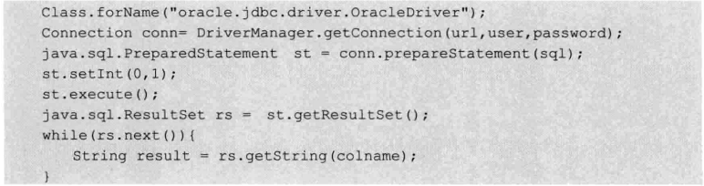

# 深入分析iBatis框架之系统架构与映射原理
+ iBatis系统结构
	+ 根据JDBC规范建立与数据库的连接
	+ 通过反射大同Java对象与数据库参数交互之间相互转化的关系
	+ SqlMap配置文件(Statement语句)
+ iBatis的运行原理
---

+ iBatis主要功能
---

+ 设计模式
	+ 简单工厂模式(DataExchangeFactory)
	+ 工厂模式(DataSourceFactory)