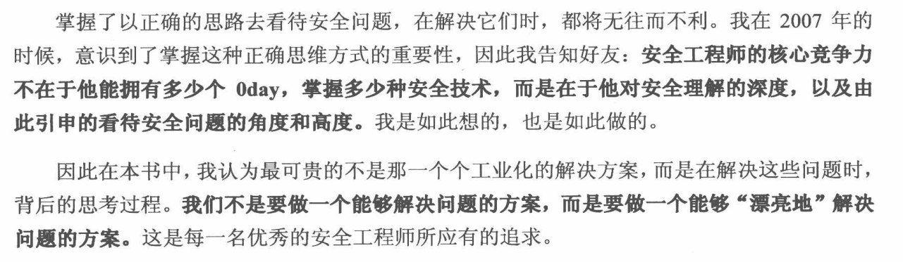

# 白帽子讲Web安全
+ [我的安全世界观](我的安全世界观.md)
+ [客户端脚本安全](客户端脚本安全.md)
+ [服务器端应用安全](服务器端应用安全.md)
+ [互联网公司安全运营](互联网公司安全运营.md)
+ 安全态度
---

+ 安全公司
	+ [奇虎360](https://www.360.cn/)
	+ [知道创宇](https://www.knownsec.com/)
	+ [乌云漏洞](http://www.wooyun.org/)
	+ [绿盟科技](http://www.nsfocus.com.cn)