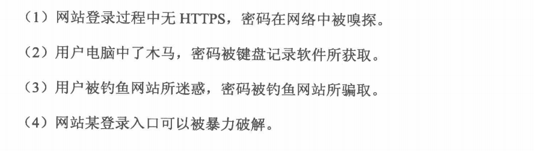
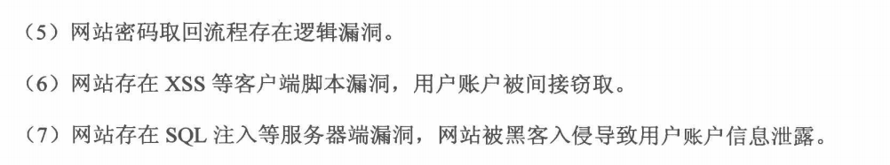
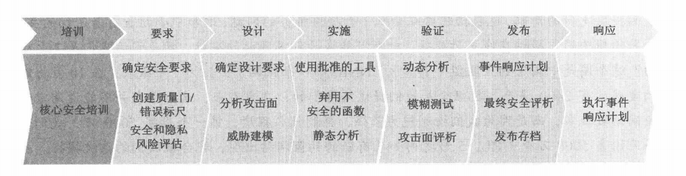
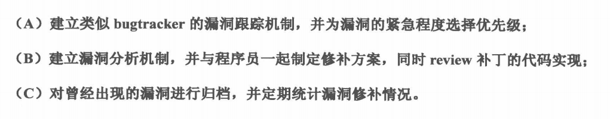
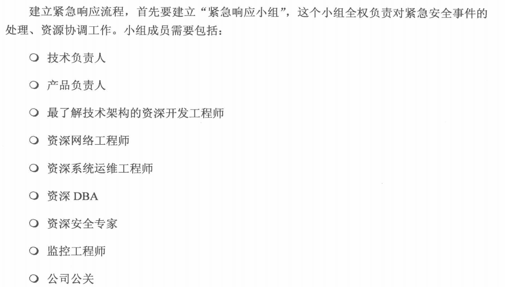

# 互联网公司安全运营
+ 互联网业务安全
	+ 安全是产品的一个特性
	+ 优秀的安全方案
		+ 良好的用户体验
		+ 优秀的性能
	+ 业务逻辑安全
	+ 账户被盗的途径
	---
	
	---
	
	+ 分析账户被盗的原因
		+ 客服是最重要和直接的渠道(大胆假设，小心求证)
		+ 从日志中寻找证据
		+ 打入敌人内部，探听最新动态
	+ 互联网的垃圾(注册)
		+ 垃圾注册几乎成为一切业务安全问题的源头
		+ 垃圾处理
			+ 垃圾的特征
				+ 内容特征(自然语言分析、关键词匹配)
				+ 行为特征(业务逻辑规则)
				+ 客户端本身的特征(人机识别[验证码、客户端解析javascript等])
			+ 识别
				+ 机器学习
			+ 拦截
				+ 冻结账户
				+ 删除账户
				+ 屏蔽垃圾内容
	+ 网络钓鱼
		+ 钓鱼网站
		+ 邮件钓鱼
		+ 钓鱼网站防控
			+ 控制钓鱼网站的传播途径
				+ 建立一个反钓鱼统一战线
				+ 浏览器是拦截钓鱼网站的关键环节(黑名单)
			+ 直接打击钓鱼网站
				+ 关停站点
			+ 用户安全教育
			+ 自动化识别钓鱼网站
		+ 网购流程钓鱼
		+ 用户隐私保护
			+ 如何保护
				+ 用户应该拥有知情权和选择权
				+ 网站应该妥善保管收集到的数据，不得将数据用于任何指定范围以外的用途
				+ Do-Not-Track
+ 安全开发流程(Security Development Lifecycle,SDL)
	+ SDL步骤
	---
	
	+ 敏捷SDL
	+ SDL实战经验
		+ 与项目经理进项充分沟通，排除足够的时间
		+ 规范公司的立项流程，，确保所有的项目都能通知到安全团队，避免遗漏
		+ 树立安全部门的权威，项目必须由安全部门审核完成后才能发布
		+ 将技术方案写入开发、测试的工作手册中
		+ 给工程师培训安全方案
		+ 记录所有的安全bug，激励程序员编写安全的代码
	+ 需求分析与设计阶段
		+ 整理checklist
	+ 开发阶段
		+ 提供安全的函数
		+ 制定安全开发规范(将安全方案写入开发规范)
	+ 代码安全审计工具
		+ 根据开发诡诞来定制代码审计工具：并非直接检查代码是否安全，而是检查开发者是否遵守了开发规范
	+ 测试阶段
		+ 自动化测试
			+ Web安全扫描器(XSS、SQL Injection、Open Redirect、PHP File Include...)
				+ IBM Rational Appscan
				+ WebInspect
				+ Acunetix WVS
				+ w3af
				+ skipfish
		+ 手动测试(CSRF、越权访问、文件上传...)
+ 安全运营
	+ Find and Fix,Defend and Defer,Secure at the Source
	+ 建立SOC(Security Operation Center，将安全日志和安全事件关联起来的系统)
	+ 漏洞修补流程
	---
	
	+ 安全监控
		+ Nagios
	+ 入侵检测
		+ IDS(Intrusion Detection System)
			+ [ModSecurity](http://www.modsecurity.org)
			+ [PHPIDS](https://www.drupal.org/project/phpids)
		+ IPS(Intrusion Protect System)
		+ DDOS监控设备
		+ Web应用防火墙(Web Application Firewall,WAF)
	+ 紧急响应流程
		+ 警报方式
			+ 邮件警报
			+ IM警报
			+ 短信警报
		+ 紧急响应小组
		---
		
		+ 问题处理注意事项
			+ 保护好安全事件的现场
			+ 以最快的速度处理完问题