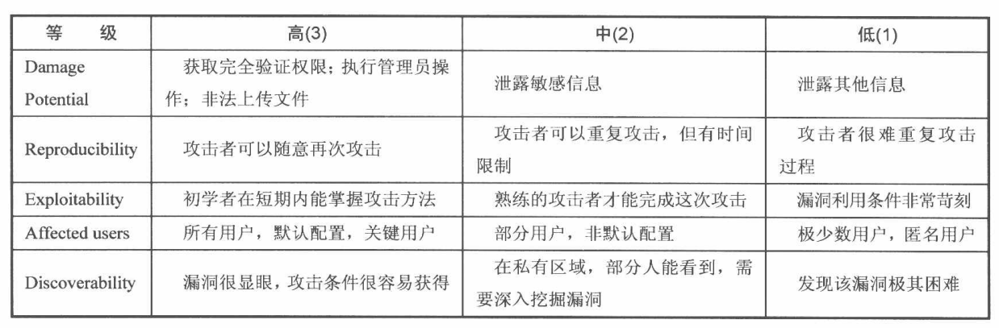
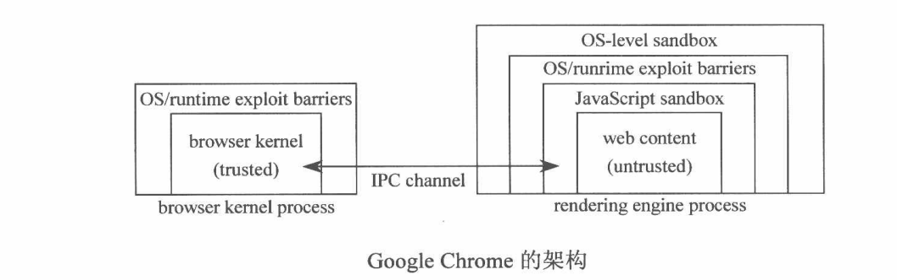
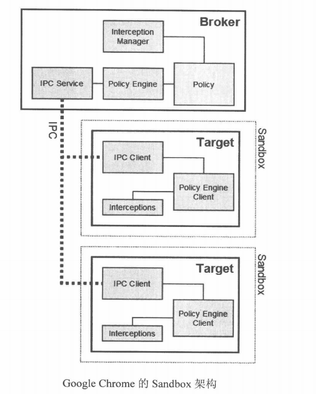
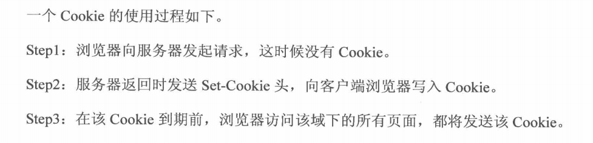
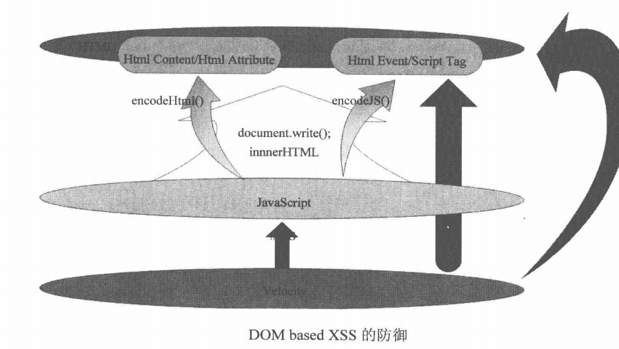
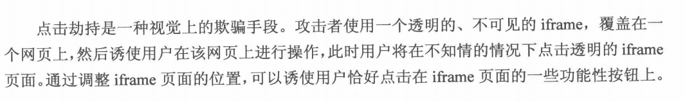
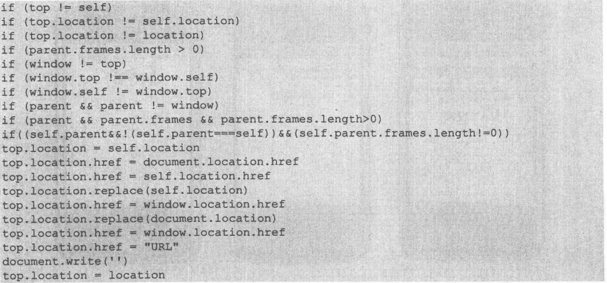
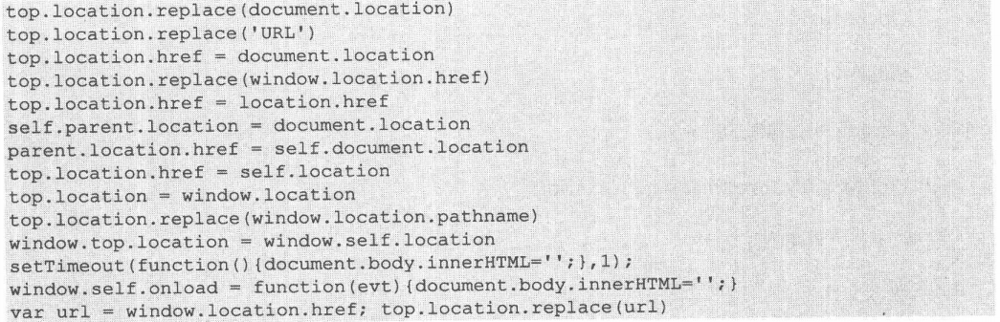

# 客户端脚本安全
+ 浏览器安全
	+ 同源策略(核心安全功能)
		+ 影响源的因素
			+ IP地址
			+ 子域名
			+ 端口
			+ 协议
		+ 可跨域加载资源的html标签
			+ <script>
			+ 
			+ <iframe>
			+ <link>...
		+ 跨域访问请求过程
		---
		
	+ 浏览器沙箱
		+ Chrome架构
		---
		
		+ Chrome沙箱架构
		---
		
	+ 恶意网站拦截
		+ 工作原理：黑名单
		+ EV SSL证书(Extended Validation SSL Certificate)
		+ 恶意网站黑名单组织
			+ [PhishTank](https://www.phishtank.com/)
	+ 高速发展的浏览器安全
		+ IE8:XSS Filter功能
		+ Firefox:Content Security Policy(CSP)
+ 跨站脚本攻击(XSS,Cross Site Script)
	+ 简介：黑客通过HTML注入篡改网页，插入恶意脚本从而在用户浏览网页时，控制用户浏览器的一种攻击方式
	+ XSS类型
		+ 反射型XSS(非持久型XSS)
			+ 只是简单地把用户输入的数据反射给浏览器(需要又是用户点击恶意链接)
		+ 存储型XSS(持久型XSS)
			+ 把用户输入的数据存储到服务器
		+ DOM Based XSS(通过修改页面的DOM节点形成的XSS)
	+ XSS PayLoad(用于完成各种功能的恶意脚本)
		+ 构造GET与POST请求
		+ XSS钓鱼
		+ 识别用户浏览器
		+ 识别用户安装的软件
		+ CSS History Hack(通过CSS来发现一个用户曾经访问过得网站)
		+ 获取用户的真是IP地址
	+ XSS攻击平台
		+ [Attack API](https://www.gnucitizen.org/)
		+ [BeEF](https://beefproject.com/)
		+ XSS-Proxy
	+ XSS Worm
		+ Samy Worm
		+  百度空间蠕虫
	+ 调试JavaScript
		+ Firebug
		+ IE8 Developer Tools
		+ Fiddler
		+ HttpWatch
	+ XSS构造技巧
		+ 利用字符编码
		+ 绕过长度限制
			+ 利用时间(Event)
			+ 利用注释
		+ 使用<base>标签
		+ window.name的妙用
	+ Mission Impossible
		+ Apache Expect Header XSS
		+ Anehta的回旋镖
	+ Flash XSS
	+ JavaScript开发框架
		+ [Dojo](https://dojotoolkit.org/)
		+ [YUI](https://yuilibrary.com/)
		+ [Jquery](https://jquery.com/)
	+ XSS的防御
		+ HttpOnly(浏览器将禁止页面js访问带有HttpOnly属性的Cookie)
			+ Cookie使用过程
			---
			
		+ 输入检查
			+ 特殊字符
			+ XSS Filter
		+ 输入检查
			+ 安全的编码函数
			+ 模板系统默认所有的变量自动编码
		+ 正确防御XSS
			+ XSS发生场景
				+ 在HTML标签中输出
				+ 在HTML属性中输出
				+ 在<script>标签中输出
				+ 在事件中输出
				+ 在CSS中输出
				+ 在地址中输出
		+ 处理富文本
			+ 使用白名单只允许安全的标签、属性、事件
			+ 尽量禁止用户自定义CSS和Style
			+ XSS Filter
				+ [Anti-Samy](https://www.owasp.org/index.php/Category:OWASP_AntiSamy_Project)
		+ 防御DOM Based XSS
		---
		
+ 跨站请求伪造(CSRF,Cross Site Request Forgery)
	+ CSRF本质
		+ 本质原因(重要操作的所有参数都是可以被攻击者猜测到)
	+ CSRF进阶
		+ 浏览器的Cookie策略
			+ Cookie分类
				+ Session Cookie(浏览器关闭后失效)
				+ Third-party Cookie(有Expire时间)
		+ [P3P](https://www.w3.org/P3P/)头的副作用
		+ GET与POST
		+ Flash CSRF
		+ CSRF Worm
	+ CSRF防御
		+ 验证码
		+ Referer Check
		+ Anti CSRF Token(更常用)
			+ Token的生成一定要足够随机
			+ Token要注意保密(表单或Ajax提交，敏感操作使用POST)
		+ 参数加密或者使用随机数作为参数
+ 点击劫持(ClickJacking)
	+ 介绍
	---
	
	+ [测试代码](clickJack.html)
	+ 种类
		+ Flash 点击劫持
		+ 图片覆盖攻击
		+ 拖曳劫持与数据窃取
		+ ClickJacking 3.0:触屏劫持
	+ 防御ClickJacking
		+ frame busting(禁止iframe嵌套)
		---
		
		
		+ [如何绕过fram Busting](http://seclab.stanford.edu/websec/framebusting/framebust.pdf)
		+ X-Frame-Options
+ HTML5安全
	+ 新标签的XSS	
		+ [HTML5 Security CheatSheet](http://html5sec.org/)
	+ iframe的sandbox
	+ Link Types:noreferrer
	+ Canvas的妙用
		+ 破解验证码
+ 其它安全问题
	+ Cross-Origin Resource Sharing
	+ postMessage--跨窗口传递消息
	+ Web Storage
		+ Session Storage
			+ window.sessionStorage
			+ window.sessionStorage.setItem("key","value")
			+ window.sessionStorage.getItem("key")
		+ Local Storage
			+ window.localStorage
			+ window.localStorage.setItem("key","value")
			+ window.localStorage.getItem("key")