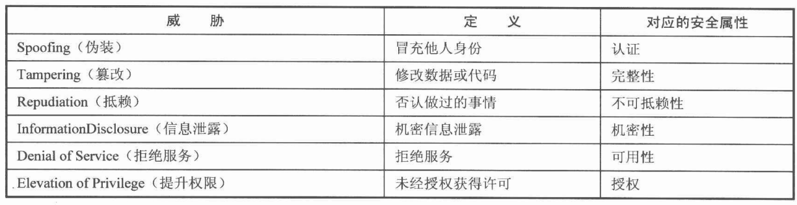
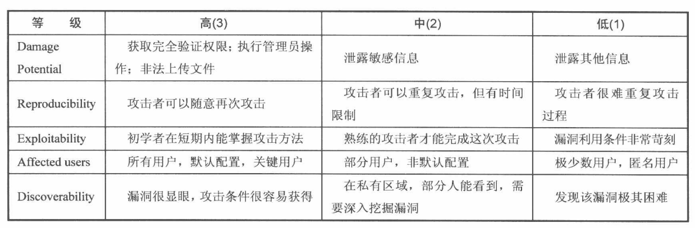

# 我的安全世界观
+ 安全的本质是信任
+ 互联网安全的核心问题是数据安全的问题(用户产生业务，业务产生数据)
+ 安全是一个持续的过程
+ 安全是一门朴素的学问，也是一种平衡的艺术
+ 漏洞：系统中可能被威胁利用已造成危害的地方
+ 很多时候，入侵是从第三方软件开始的
+ 挖掘漏洞的过程，通常需要先找到危险函数，然后晦朔函数的调用过程，最终看在整个个调用过程中用户是否有可能控制输入
+ 安全意识
	+ No Patch For Stupid
	+ 最大的漏洞就是人
+ 安全三要素(CIA)
	+ 机密性(Confidentiality，常用手段：加密)
	+ 完整性(Integrity，常用手段：数字签名)
	+ 可用性(Availability )
+ 安全评估
	+ 资产等级划分(明确要保护的目标)
	+ 威胁分析(可能造成危害的来源)
		+ STRIDE模型
		---
		
	+ 风险分析(可能会出现的损失)
		+ 影响因素
			+ 造成的损失(Damage Potential)
			+ 发生的可能性(Probability)
		+ DREAD模型
		---
		
	+ 确认解决方案
		+ 优秀安全方案的特点
			+ 能够有效解决问题
			+ 用户体验好
			+ 高性能
			+ 低耦合
			+ 易于扩展与升级
		+ 设计安全方案的方法
			+ Secure By Default原则
				+ 黑名单、白名单
				+ 最小权限原则
			+ 纵深防御原则(Defense in Depth)
				+ 在各个不同层面、不同方面实施安全方案
				+ 在解决根本问题的地方实施针对性的安全方案
			+ 数据与代码分离原则(防注入)
			+ 不可预测性原则(防篡改、伪造)
