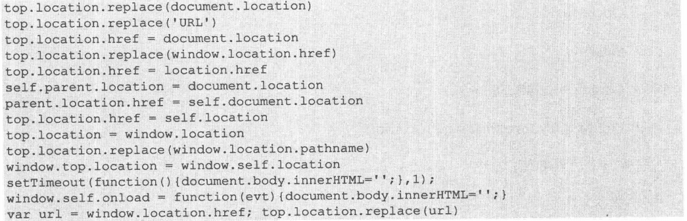
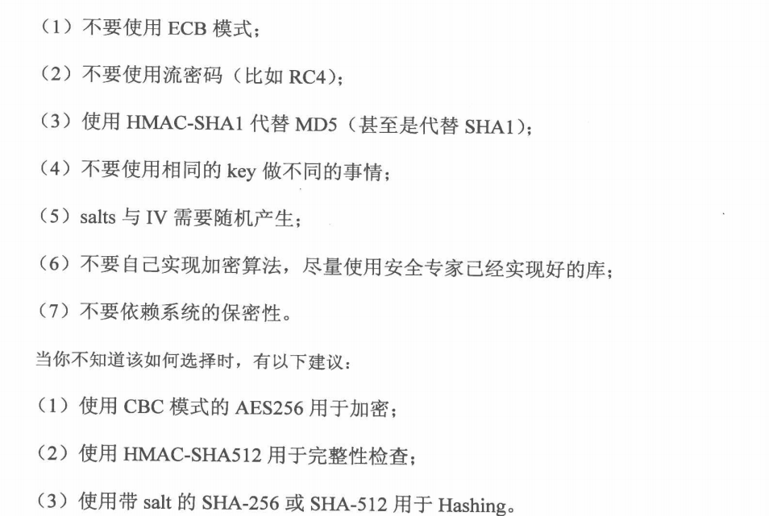
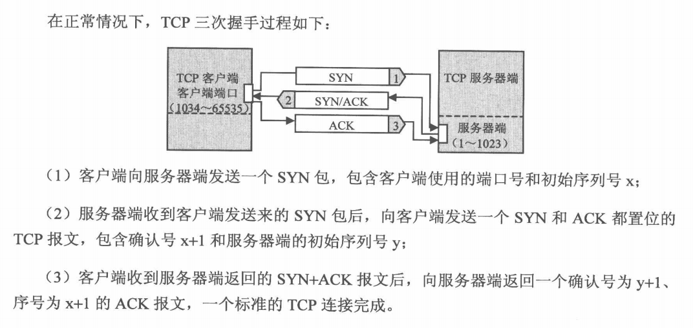

# 服务器端应用安全
+ 注入攻击
	+ 本质(把用户输入的数据当做代码执行)
		+ 用户能够控制输入
		+ 原本程序要执行的代码，拼接了用户输入的数据
	+ SQL注入
		+ 盲注(Blind Injection,在服务器没有错误回显时完成的注入攻击)
		+ Timing Attack
	+ 数据库攻击技巧
		+ 常见攻击技巧
			+ LOAD_FILE()
			+ INTO DUMPFILE
		+ 命令执行
		+ 攻击存储过程
		+ 编码问题
		+ SQL Column Truncation
		+ 正确防御SQL注入
			+ 准备
				+ 找到所有SQL注入漏洞
				+ 修补这些漏洞
			+ 只用预编译语句(PrepareStatement)
			+ 使用存储过程(对动态语句进行处理)
			+ 检查数据类型
			+ 使用安全函数
			+ 分配权限必须遵循最小权限原则
	+ 其他注入攻击
		+ XML注入
		+ 代码注入(安全编程)
		+ CRLF注入(Carriage Return & Line Feed)
			+ HTTP Response Splitting
+ 文件上传漏洞
	+ 简介：用户上传一个可执行脚本文件并通过此脚本获得执行服务端命令的能力
	+ 安全问题
	---
	
	+ 案例
		+ FCKEditor文件上传漏洞
		+ 使用%00字节绕过文件上传检查功能
		+ Apache文件解析问题(从后向前解析文件名)
		+ IIS文件解析问题(;截断文件名)
		+ PHP CGI路径解析问题
		+ 利用上传文件钓鱼
	+ 设计安全的文件上传功能
		+ 文件上传的目录设置为不可执行
		+ 判断文件类型(MIME Type、后缀检查、白名单、图片处理)
		+ 使用随机数改写文件名和文件路径
		+ 单独设置文件服务器的域名(同源策略)
+ 认证与会话管理
	+ 认证(一个验证凭证的过程)
		+ 凭证
			+ 密码
			+ 指纹
			+ ... 
		+ 类型
			+ 单因素认证
			+ 双因素认证
			+ 多因素认证
				+ 密码
				+ 指纹
				+ 验证码
				+ 安保问题
				+ 实名认证
				+ 手机绑定
				+ 手机动态口令
				+ 数字证书
				+ 第三方证书
				+ ...
	+ 密码
		+ 密码策略
			+ 密码长度
			+ 密码复杂度
			+ 不使用公开数据或个人隐私信息
		+ 密码存储
			+ 不可逆的加密算法
			+ 单向散列函数算法
		+ 密码破解
			+ 彩虹表(MD5，加密时添加salt)
	+ Session
		+ Session认证(SessionID)
		+ Session Fixation攻击
		+ Session保持攻击
			+ 间隔性刷新页面
			+ 发送带有自定义Cookie头的HTTP包
			+ 篡改Expire标签
	+ 单点登录(SSO,Single Sign On)
		+ OpenId
+ 访问控制
	+ 实例
		+ 通过路由器或防火墙设备建立基于IP的访问控制
		+ 操作系统中对文件访问的控制
	+ 分类
		+ 基于URL的访问控制
		+ 基于方法的访问控制
		+ 基于数据的访问控制
	+ 垂直权限管理(基于角色的访问控制,RBAC)
		+ Spring Security
	+ 水平权限管理(基于数据的访问控制,DBAC)
	+ OAuth(在不提供用户名和密码的情况下，授权第三方应用访问Web资源的安全协议)
		+ 角色
			+ Client
			+ Server
			+ Resource Owner
+ 加密算法与随机数
	+ 加密算法
		+ 分组加密
			+ DES 
			+ 3-DES
			+ Blowfish
			+ IDEA
			+ AES
		+ 流加密(基于异或,XOR)
			+ RC4
			+ ORYX
			+ SEAL
		+ 加密模式
			+ ECB(电码薄模式)
			+ CBC
			+ CFB
			+ OFB
			+ CTB
		+ Stream Cipher Attack
			+ Reused Ket Attack(使用同一秘钥多次加密、解密)
			+ Bit-flipping Attack
			+ 弱随机IV(初始化向量)问题
			+ WEP破解
		+ Padding Oral Attack
		+ 秘钥管理
			+ 保存在配置文件中
			+ 保存在数据库中
    + 伪随机数
    	+ 随机数并非真正随机
    	+ 使用安全的随机数
    		+ Java:java.security.SecureRandom
    		+ Limux:/dev/random,/dev/urandom
    + 安全加密实例
    ---
    
+ Web框架安全
	+ 模板引擎与XSS防御
	+ Web框架与CSRF防御
		+ 在Session中绑定token
		+ 在form表单中添加token
		+ 在Ajax请求中添加token
		+ 在服务端验证POST提交的token与Session中绑定的token是否一致，以验证CSRF攻击
	+ HTTP Header管理
	+ 数据持久层与SQL注入
	+ Web框架自身安全
		+ Struts2命令执行漏洞
			+ XWork,远程执行代码
		+ Spring MVC命令执行漏洞
			+ 客户端可以修改class.classloader加载对象的类加载器的属性
		+ Django命令执行漏洞
			+ 处理消息文件时会出现以应用程序权限执行任意命令
+ 应用层拒绝服务攻击
	+ DDOS(分布式拒绝服务，Distributed Denial of Service)
		+ SYN flood
		+ UDP flood
		+ ICMP flood
	+ 应用层DDOS
		+ CC(Challenge Collapasar)攻击
		+ 应对方法
			+ 限制IP地址的请求频率
			+ 应用代码性能优化
				+ 使用缓存
				+ 及时释放资源
			+ 网络架构优化
				+ 负载均衡分流
				+ CDN分流
				+ 镜像网站分流
			+ 验证码(CAPTCHA,Completely Automated Public Turing Test to Tell Computers and Humans Apart)
		+ 资源耗尽攻击
			+ Slowloris攻击
			+ HTTP POST DOS
			+ Server Limit DOS
			+ ReDOS(Regular Expression DOS)
	+ TCP三次握手
	---
	
+ PHP安全
	+ 文件包含漏洞
		+ 文件包含函数
			+ include()
			+ require()
			+ include_once()
			+ require_once()
	+ 本地文件包含
		+ 目录遍历
		+ 文件名截断
	+ 远程文件包含
		+ allow_url_include配置，加载远程文件
	+ 变量覆盖漏洞
		+ 全局变量覆盖
		+ extract()变量覆盖
		+ 遍历初始化变量
		+ import_request_variables变量覆盖
		+ parse_str()变量覆盖
	+ 代码执行漏洞
		+ 危险函数执行代码
			+ phpMyAdmin3.4.3.1远程代码执行漏洞
			+ MyBB 1.4远程代码执行漏洞
			+ '文件写入'执行代码
	+ 定制安全的PHP环境
		+ php.ini配置
+ Web Server配置安全
	+ Apache安全
		+ 使用最小原则安装Module
		+ 指定Apache进程以单独的用户身份运行
		+ 使用专门的用户身份运行Apache(不具备shell，只用来运行Web应用)
		+ 合理配置参数值
		+ 保护好Apache Log
	+ Nginx 安全
		+ 注意软件本身的安全，及时升级软件版本
		+ 使用单独的身份运行
		+ Nginx配置参数
    + jBoss远程命令执行
    	+ DelpymentScanner远程部署war包
    	+ JMX-Console部署war包
    + Tomcat远程命令执行
    	+ Tomcat Manager部署war包
    + HTTP Parameter Pollution