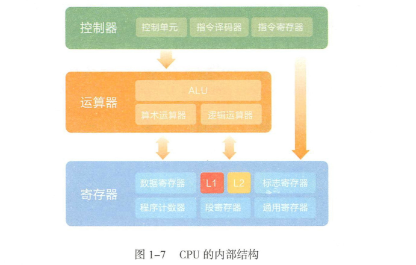
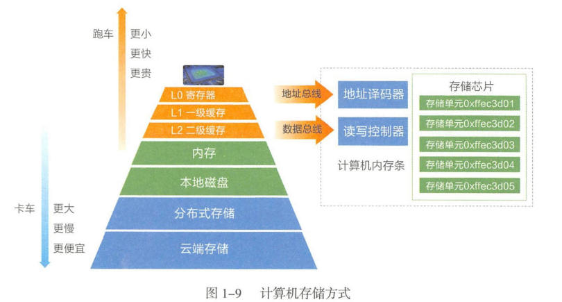
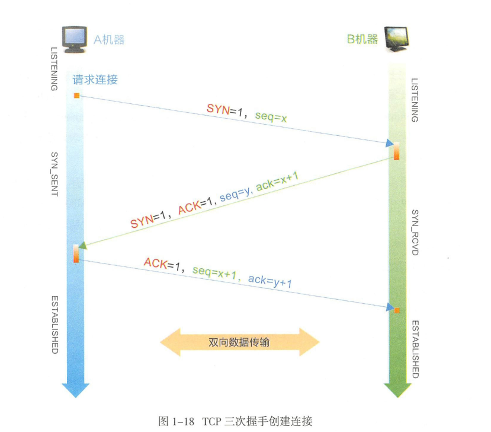
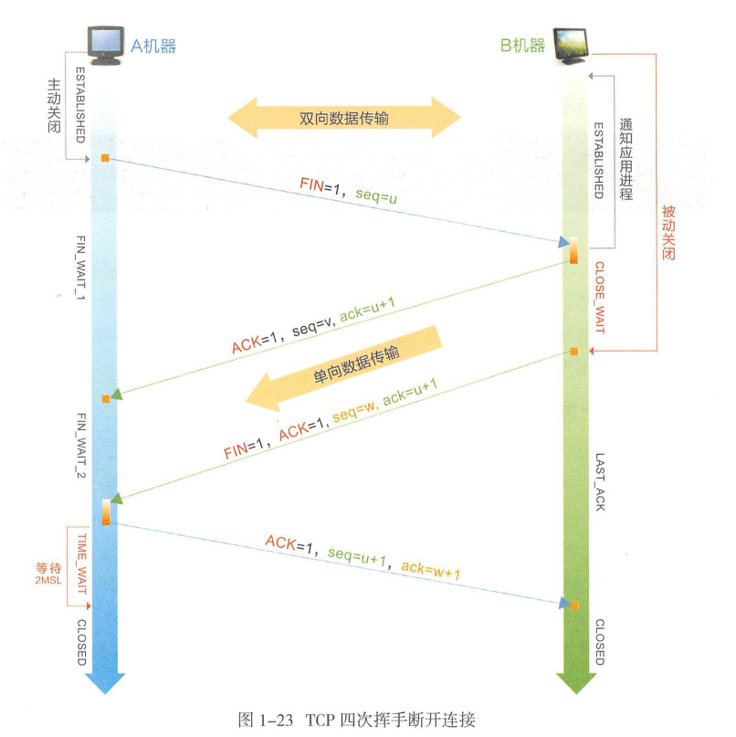
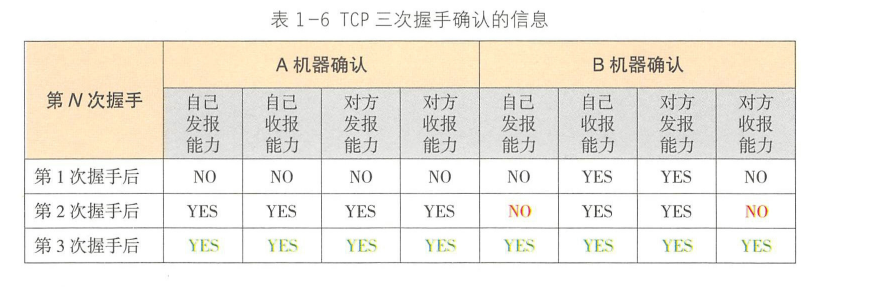
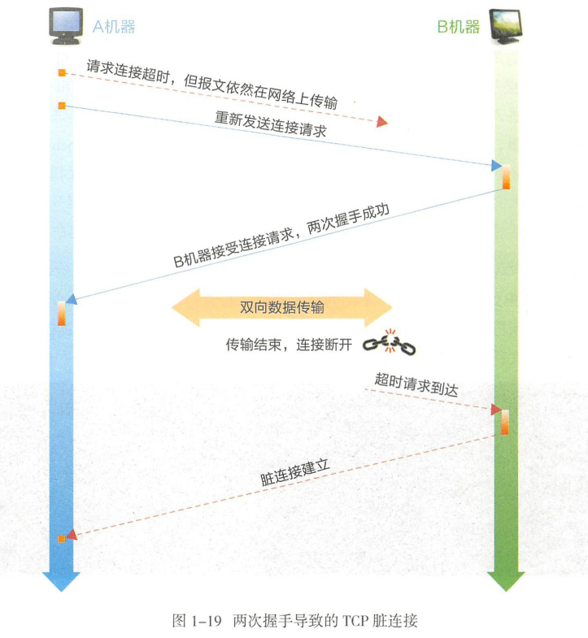
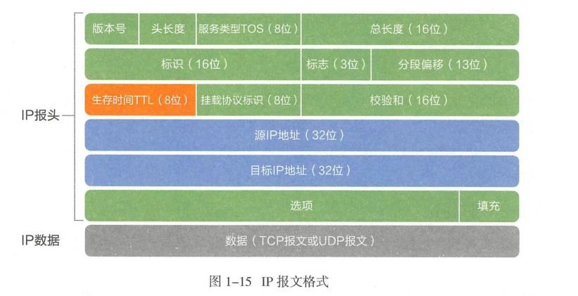
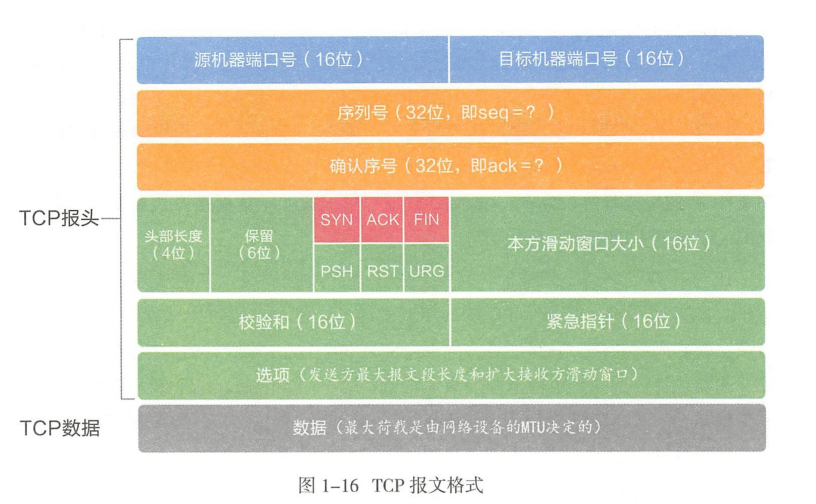
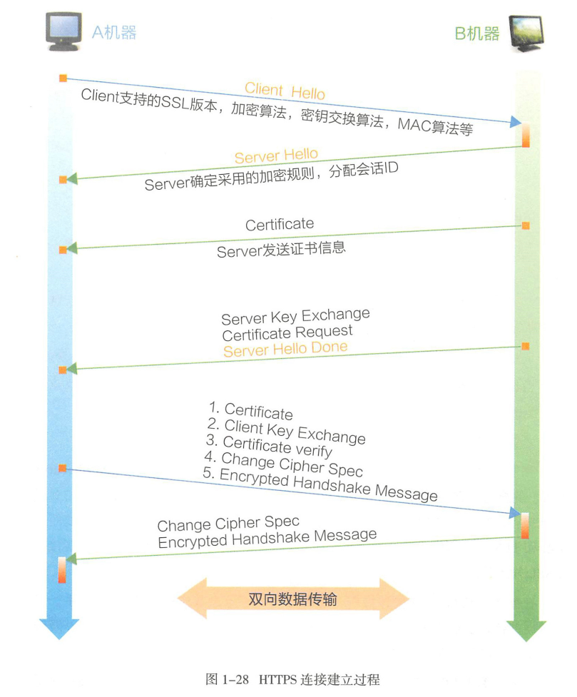

# 计算机基础
+ CPU内部结构
---

+ 计算机存储方式
---

+ TCP连接
	+ TCP三次握手建立连接
	---
	
	+ TCP四次握手断开连接
	---
	
	+ 三次握手的必要性分析
	---
	
	+ 两次握手导致脏连接
	---
	
+ TCP/IP协议
	+ IP报文格式
	---
	
	+ TCP报文格式
	---
	
+ SQL查询优化
	+ 建立高效合适的索引
	+ 排查连接资源未显式关闭的情形
	+ 合并短的请求
	+ 合理拆分多表join的sql，若是超过三个表则禁止join
	+ 使用临时表保存中间结果
	+ 应用层优化
	+ 改用其它数据库
+ HTTPS建立连接的过程
---
