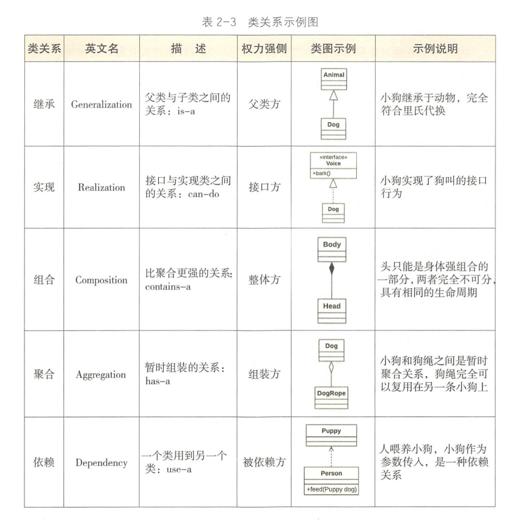
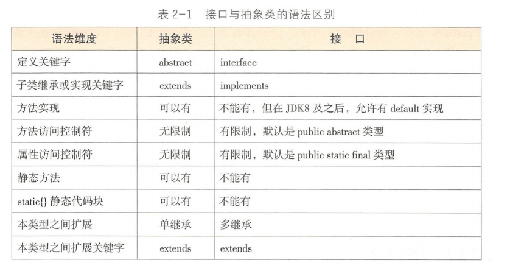
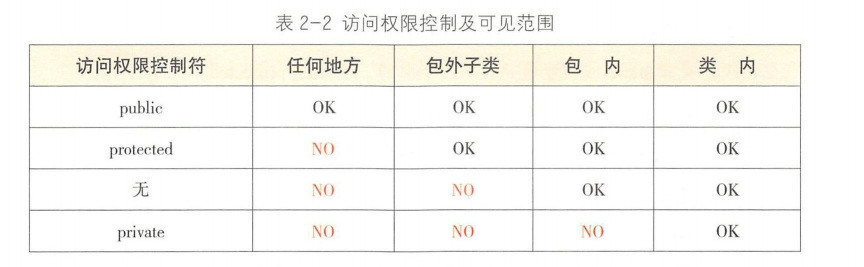
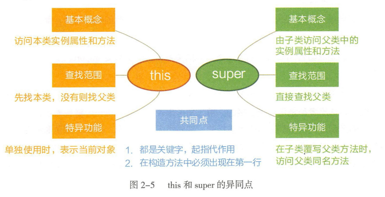
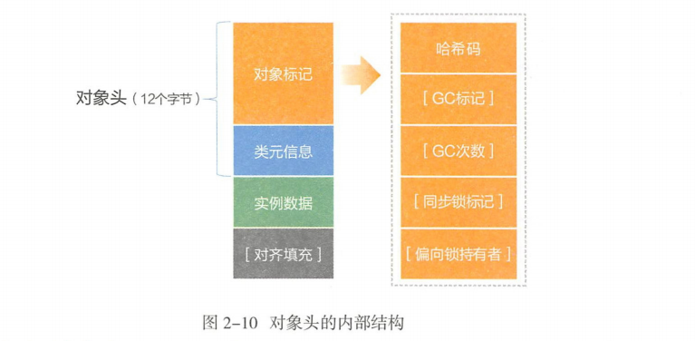
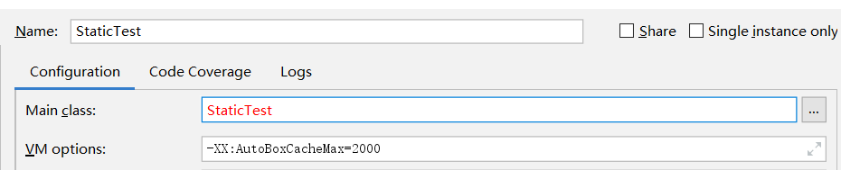

# 面向对象
+ 基本数据类型
---

+ 接口与抽象类
---

+ 访问权限控制及可见范围
---

+ this vs super
---

+ 类关系
---

+ 序列化
	+ Java原生序列化(实现 erializable接口)
	+ Hessian序列化
	+ JSON(JavaScript Object Notation)序列化
+ 对象头
---

+ 修改Integer缓存范围
---
