# 走进JVM
+ 类的二进制字节码
---
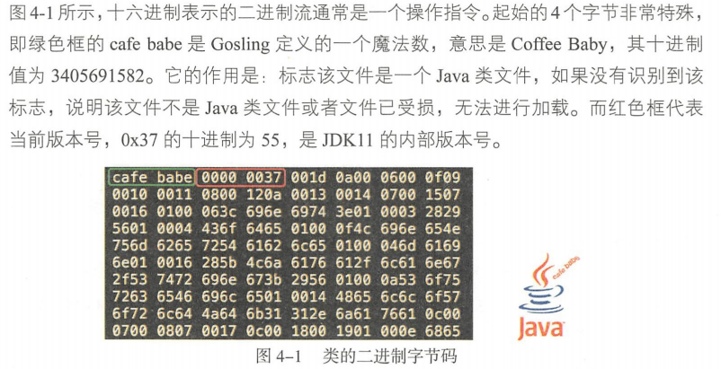
+ Java源码转字节码
---
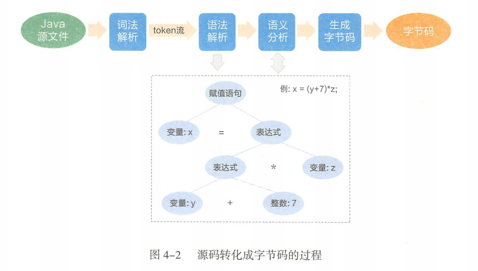
+ 即时编译流程
---
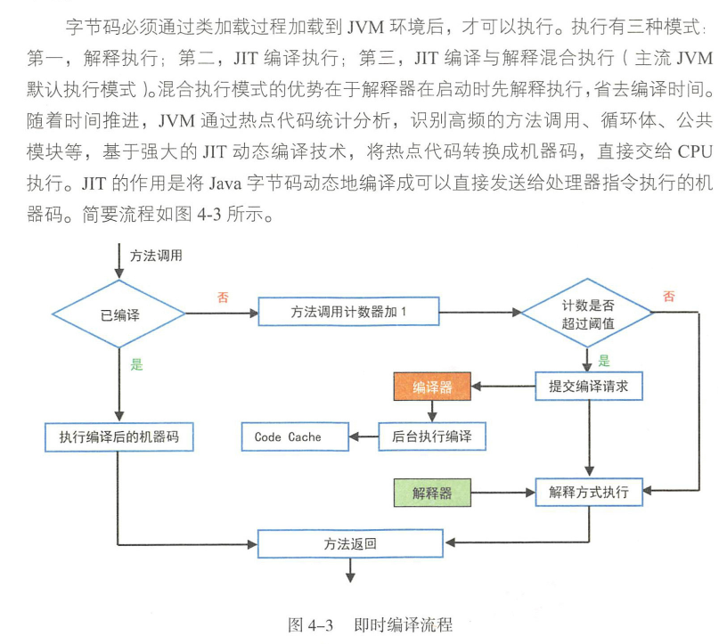
+ Java类加载过程
---
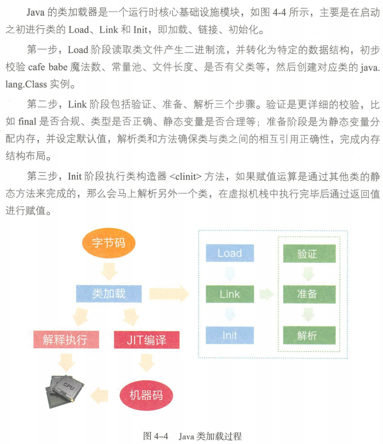
+ 类加载的双亲委派模型
---
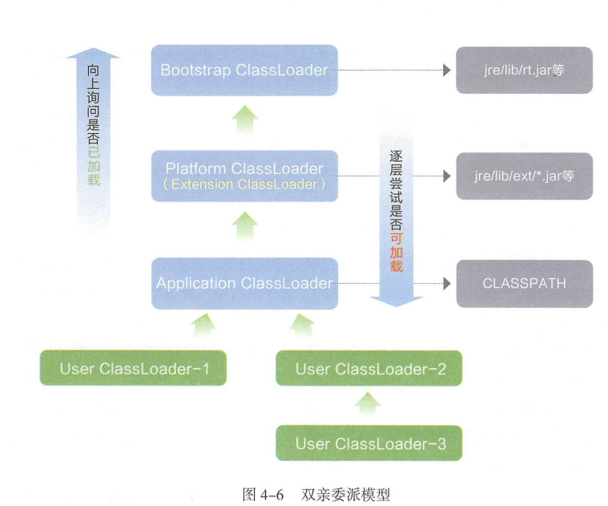
+ 需要自定义类加载器的情况
	+ 隔离加载类
	+ 修改类加载方式
	+ 扩展加载源
	+ 防止源码泄露
+ 经典JVM内存布局
---
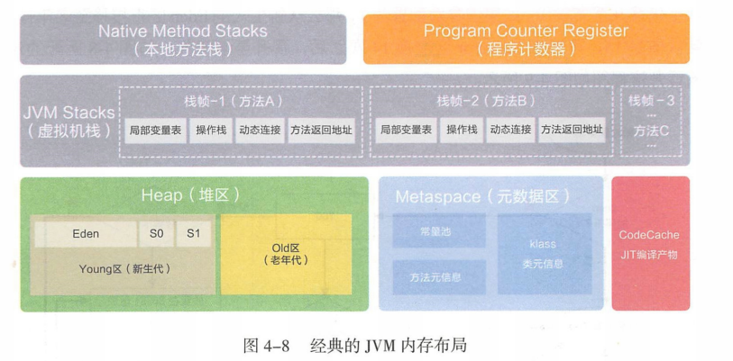
+ JVM运行参数
	+ -Xms256M(memory start,堆内存空间初始值)
	+ -Xmxl024M(memory max,堆内存空间最大值)
	+ XX:+HeapDumpOnOutOfMemoryError(让口瓜 遇到 OOM 异常时能输出堆内信息，)
+ 堆对象分配及简要GC
---
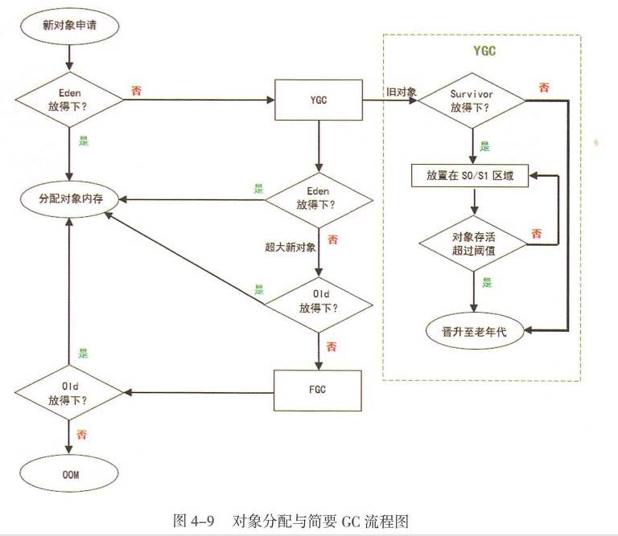
+ JVM操作栈
---
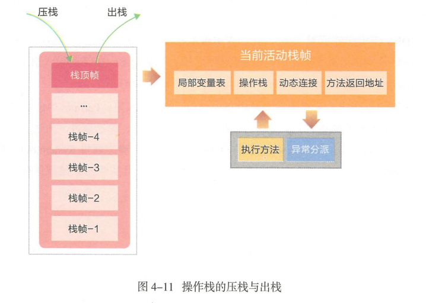
+ Java线程与内存
---
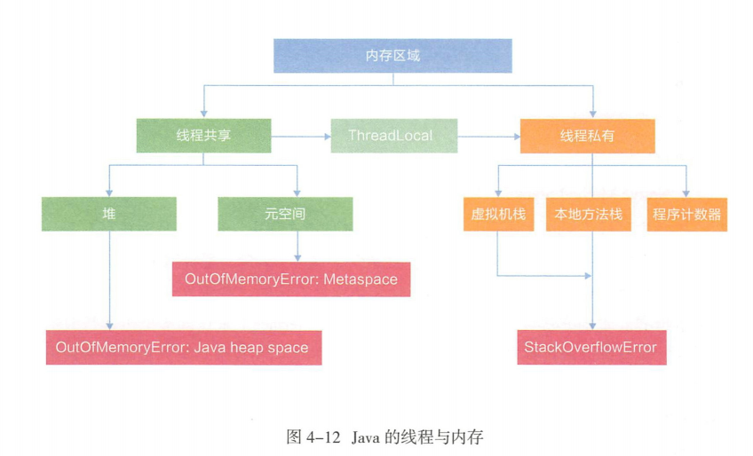
+ Java垃圾回收算法
	+ 标记-清除算法
	+ 标记-整理算法
	+ Mark-Copy算法
+ Java垃圾回收器
	+ servial垃圾回收器
	---
	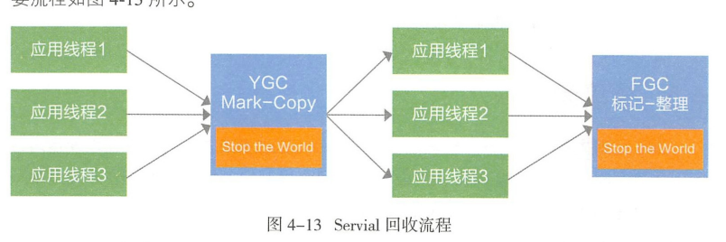
	+ CMS回收器(Concurrent Mark Sweep Collector)
	+ G1回收器(Garbage-First Garbage Collector)
	---
	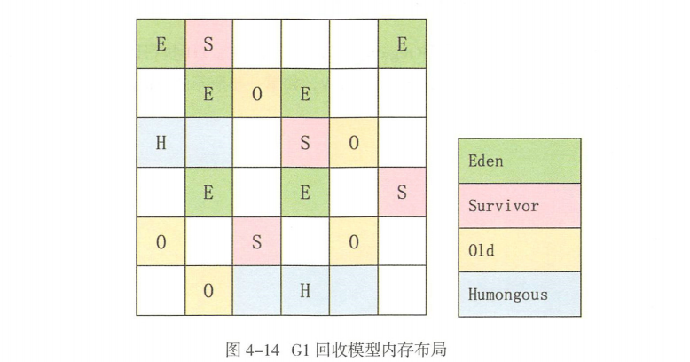