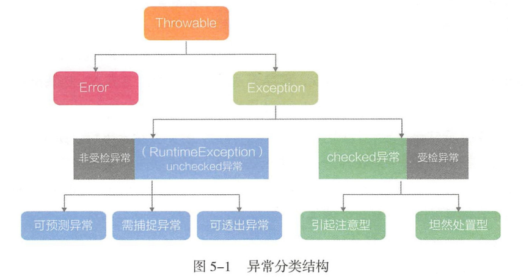
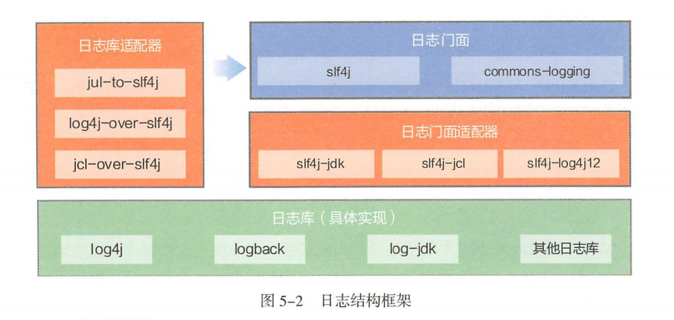

# 异常与日志
+ 异常分类
---

+ 日志结构
---

+ Maven项目日志集成
	+ pom.xml配置
		+ slf4j+logback模式(新工程)
		```xml
		<dependency> 
			<groupid>org.slf4j</groupid>
				<artifactid>slf4j-api</artifactid> 
			<version>${slf4j-api.verson}</version>
		</dependency> 
		<dependency> 
			<groupid>ch.qos.logback</groupid> 
				<artifactid>logback-classic</artifactid>
			<version>${logback-classic.version}</version>
		</dependency> 
		<dependency> 
			<groupid>ch.qos.logback</groupid> 
				<artifactid>logback-core</artifactid>
			<version>${logback-core.version)</version> 
		</dependency>
		```
		+ 根据所使用的日志库(以log4j为例)来确定门面适配器(老工程)
		```xml
		<dependency> 
			<groupid>org.slf4j</groupid> 
				<artifactid>slf4j-api</artifactid>
			<version>${slf4j-api.version}</version> 
		</dependency> 
		<dependency> 
			<groupid>org.slf4j</groupid> 
				<artifactid>slf4j-log4j12</artifactid> 
			<version>${slf4j-log4j12.version}</version> 
		</dependency>
		<dependency> 
			<groupid>log4j</groupid> 
				<artifactid>log4j</artifactid> 
			<version>${log4j.version}</version>
		</dependency>
		```
	+ log4j.xml配置
	+ 使用
	```java
	private static final Logger logger= LoggerFactory.getLogger(ThisClass.class);
	logger.info("日志。。。");
	```