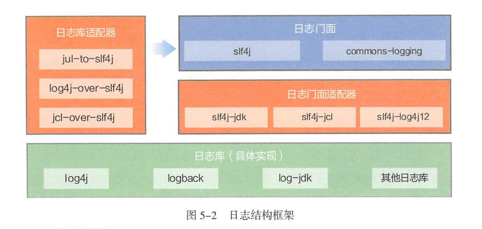
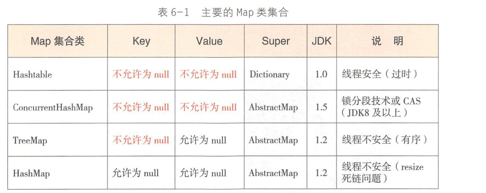
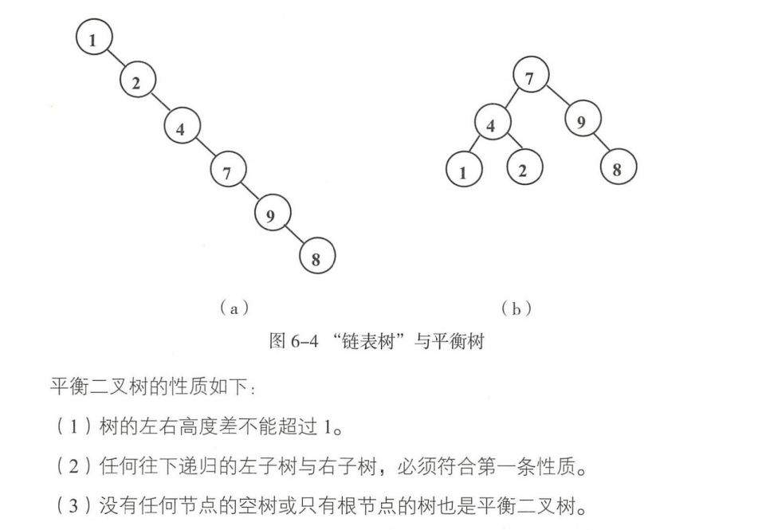
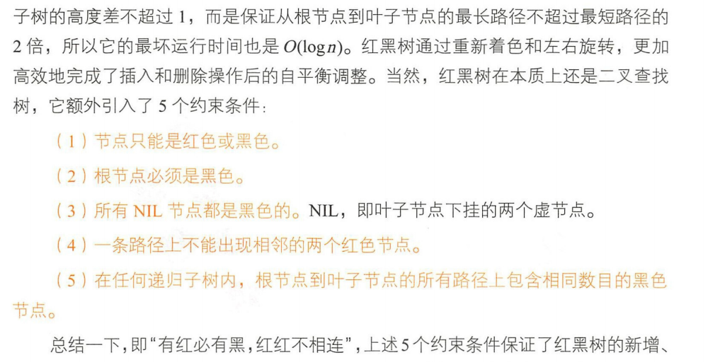
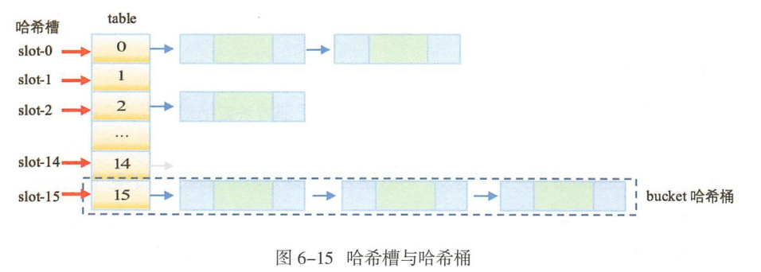
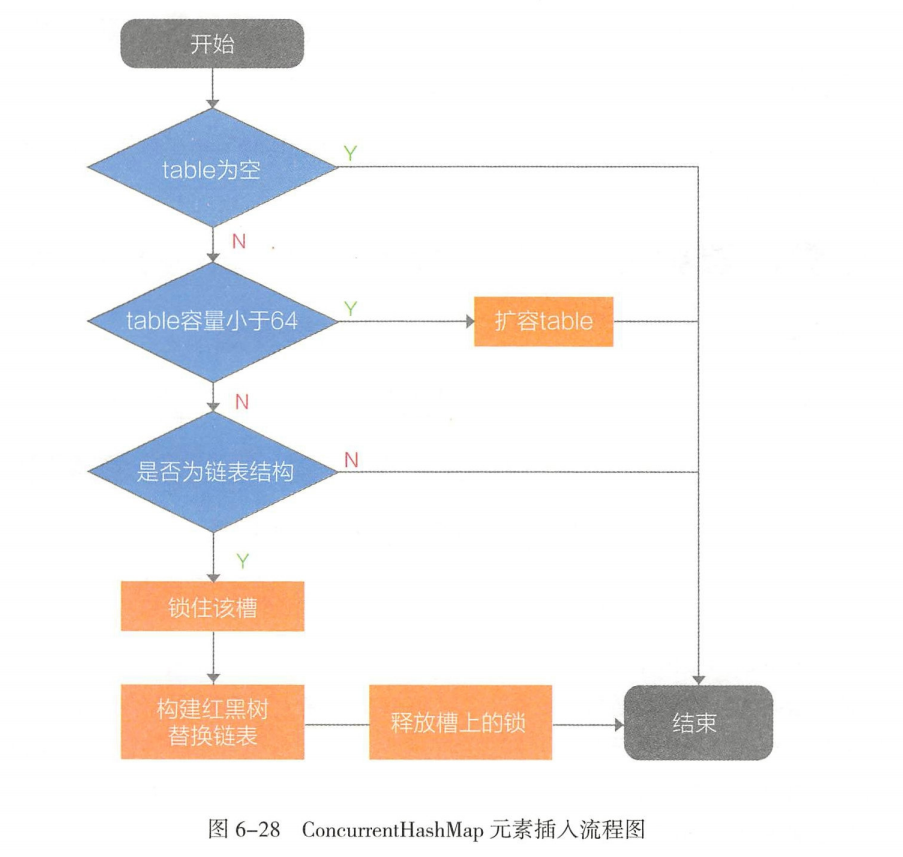
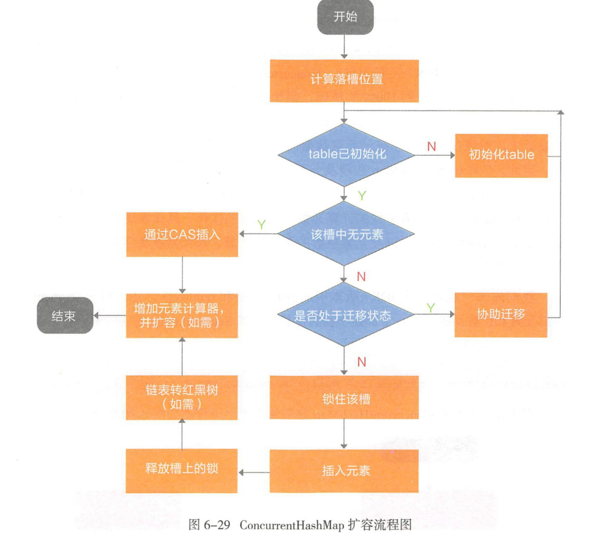
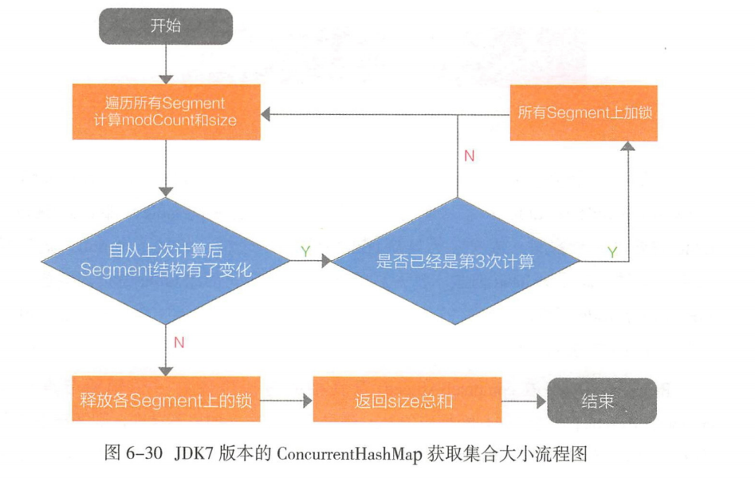

# 数据结构与集合
+ 数据结构
	+ 线性结构
	+ 树结构
		+ 二叉树平衡树
		+ 二叉查找树
		+ ALV(平衡二叉查找)树
		+ 红黑树
	+ 图结构
	+ 哈希结构
+ Java集合框架图
---

+ 集合初始化时，指定合适的集合容量初始值大小(如果容量太小，不断扩容很影响性能)
+ 主要Map类集合
---

+ 平衡二叉树
---

+ 红黑树
---

+ 哈希槽与哈希桶
---

+ ConcurrentHashMap元素插入流程
---

+ ConcurrentHashMap扩容流程图
---

+ JDK7版本 ConcurrentHashMap获取集合大小流程图
---
