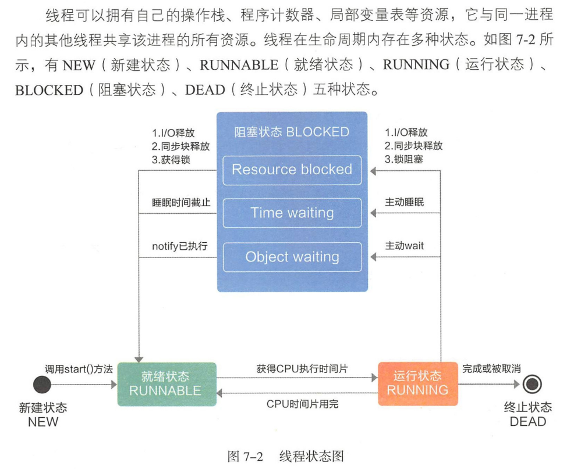
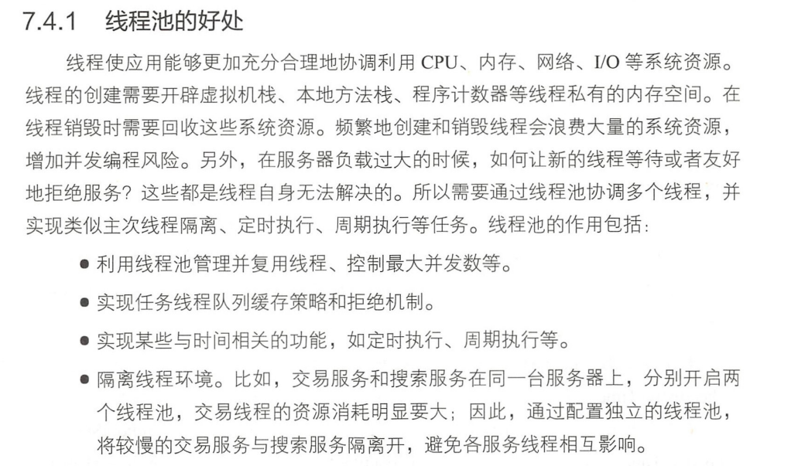

# 并发与多线程
+ 线程状态图
---

+ 保证线程安全
	+ 数据单线程内可见
	+ 只读对象
	+ 线程安全类
	+ 同步与锁机制
+ 并发包
	+ 线程同步类(CountDownLatch、Semaphore、CyclicBarrier)
	+ 并发集合类(ConcurrentHashMap、CopyOnWriteArrayList、BlockingQueue)
	+ 线程管理类(Executors、ThreadPoolExecutor、ScheduledExecutorService)
	+ 锁相关类(ReetrantLock)
+ 线程池的好处
---

+ 对象的引用类型
---

+ ThreadLocal的弱引用路线图
---

+ ThreadLocal使用
---
