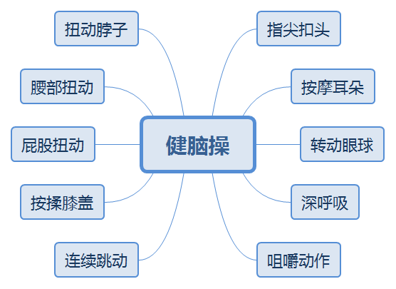
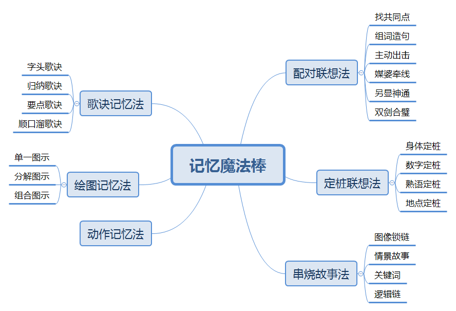

# 记忆魔法书(记忆无定法)
### 健脑操
1.  指尖扣头(头部)
2.  按摩耳朵(耳朵)
3.  转动眼球(眼睛)
4.  深呼吸(鼻子)
5.  咀嚼动作(嘴巴)
6.  脖子扭动(脖子)
7.  腰部扭动(腰)
8.  屁股扭动(屁股)
9.  按柔膝盖(膝盖)
10. 连续跳动(脚)
+ (对身体各个部位进行编号，进行对应记忆)
---

### 记忆魔棒
+ 配对联想法
	1. 找共同点法
	2. 组词造句法
	3. 主动出击法
	4. 媒婆牵线法
	5. 另显神通法
	6. 双剑合璧法
+ 定桩联想法
	+ 身体定桩法
	+ 数字定桩法
	+ 熟语定桩法
	+ 地点定桩法(地点就像是磁带，
				我们记忆就是用磁带来录音。
				对于需要长期保存的东西，
				我们要通过复习来使之持久。
				对于以后不会再用的信息，
				我们可以把磁带上的信息抹掉，
				继续记新的信息)
+ 串烧故事法
	+ 图像锁链串烧法
	+ 情景故事串烧法
	+ 关键词串烧法
	+ 逻辑链串烧法
+ 歌诀记忆法
	+ 字头歌诀法
	+ 归纳歌诀法
	+ 要点歌诀法
	+ 顺口溜歌诀法
+ 绘图记忆法
	+ 单一图示法
	+ 分解图示法
	+ 组合图示法
	+ 图的种类
		+ 组织结构图
		+ 循环图
		+ 射线图
		+ 金字塔图
		+ 鱼骨图
		+ 思维导图
		+ 坐标系图
		+ 韦恩图
		+ 卡诺图
		+ 时间轴
		+ 平衡图
		+ 树状图
		+ 逻辑图
		+ ...
+ 动作记忆法
---

### 其它
+ 联想记忆
	+ 谐音联想
	+ 增减倒字
	+ 拆合联想
	+ 相关联想
	+ 
+ 学习的三种类型
	+ 视觉学习型
	+ 听觉学习型
	+ 动觉学习型
+ 单词记忆
	+ 绘画记单词
	+ 编码串烧法
	+ 词根词缀法
	+ 配对联想法
	+ 谐音记单词
	+ 单词串烧法
+ 数字记忆
	+ 联想记忆
	+ 特征观察
	+ 谐音联想法
	+ 编码记忆法
	+ 以熟记新法
	+ 串烧记忆法
+ 地理记忆
	+ 形象联想法
	+ 浓缩记忆法
	+ 歌诀记忆法
	+ 模拟旅游法
